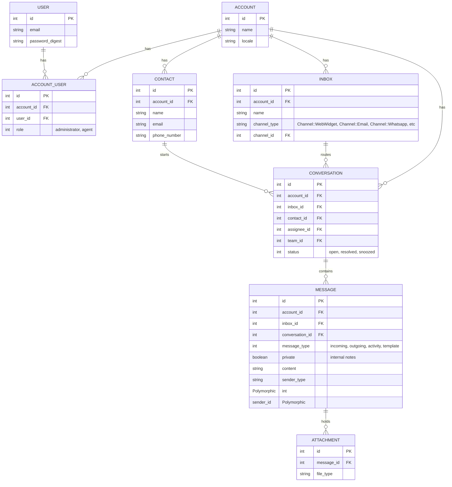

# DakshAI / Chatwoot Technical Design Document

This document outlines the technical design, architectural patterns, database schema, and frontend systems of **DakshAI** (built on top of Chatwoot). It is designed to serve as a comprehensive reference guide for developers and system maintainers working on this codebase.

---

## 1. System Overview & High-Level Architecture

DakshAI is an open-source, multi-tenant customer support platform that aggregates messages from various communication channels (Live Chat Widget, Email, WhatsApp, SMS, Telegram, Facebook, etc.) into a unified agent inbox.

The system is constructed as a decoupled multi-layer web application:
- **Backend**: A Ruby on Rails application acting as a REST API server, ActionCable WebSocket host, and background worker manager.
- **Frontend SPA**: A single-page application built with Vue 3 and Vite, containing an Agent Dashboard, a customer Live Chat Widget, and a Help Center Portal.
- **Data Stores**: PostgreSQL for relational data storage and pg_search full-text search; Redis for queuing (Sidekiq), rate limiting (Rack::Attack), round-robin agent routing, and real-time presence indicators.

### Architecture Diagram

The diagram below illustrates how external channels, the frontend, backend components, and data layers interact:

```mermaid
graph TD
    %% Clients
    Agent[Agent Browser / Dashboard SPA]
    Customer[Customer Website / Widget SPA]
    ChannelHook[External Channels: WhatsApp, SMS, FB, Telegram]

    %% Ingress & Routing
    subgraph Web Server Layer
        Puma[Puma Web Server]
        ActionCable[ActionCable WebSockets]
    end

    %% Application Core
    subgraph Rails Backend Application
        Controllers[API & Web Controllers]
        Services[Service Objects / Builders / Finders]
        Dispatchers[Sync & Async Event Dispatchers]
        ActiveJob[ActiveJob Workers / Sidekiq]
        Enterprise[Enterprise Edition Module Overlays]
    end

    %% Data Stores & Caching
    subgraph Data & Cache Layer
        Postgre[(PostgreSQL DB)]
        RedisCache[(Redis Cache & Queues)]
        ActiveStorage[(Active Storage / S3 / Local)]
    end

    %% Data flows
    Agent <-->|REST API / ActionCable| Puma
    Customer <-->|REST API / ActionCable| Puma
    ChannelHook -->|Webhooks / API Requests| Puma
    
    Puma --> Controllers
    Controllers --> Services
    Services --> Dispatchers
    
    Dispatchers -->|Synchronous| ActionCable
    Dispatchers -->|Asynchronous| ActiveJob
    
    ActiveJob <-->|Queue / Process Jobs| RedisCache
    Services <-->|Read / Write| Postgre
    Services <-->|Store Files| ActiveStorage
    Services <-->|Rate Limit / Round Robin / Presence| RedisCache
    
    Enterprise -.->|Dynamic prepending / overrides| Rails Backend Application
```

---

## 2. Backend Architecture & Core Design Patterns

The Rails backend is clean and follows standard Rails conventions while utilizing specific design patterns to modularize business logic and handle high-throughput event processing.

### Custom Design Patterns
Rather than putting complex logic in controllers or models, DakshAI delegates responsibilities to specialized directories under `app/`:

| Directory | Pattern / Responsibility | Examples |
| :--- | :--- | :--- |
| **`app/services/`** | Implements core business logic and workflows. Avoids bloated controllers. | `AutoAssignment::AssignmentService`, `WebsiteBrandingService` |
| **`app/builders/`** | Responsible for assembling, processing, and validating complex objects before database persistence. | `Messages::MessageBuilder`, `Onboarding::WebWidgetCreationService` |
| **`app/finders/`** | Encapsulates query logic, scopes, filtering parameters, and database pagination. | `ConversationFinder`, `MessageFinder`, `ContactFinder` |
| **`app/policies/`** | Pundit authorization policies mapping user roles (Admin, Agent) to permitted actions. | `ConversationPolicy`, `ArticlePolicy`, `ContactPolicy` |
| **`app/channels/`** | ActionCable WebSockets channel interfaces allowing agents and visitors to maintain real-time updates. | `RoomChannel`, `ApplicationCable::Connection` |
| **`app/jobs/`** | Sidekiq ActiveJob background workers that run slow or deferred tasks asynchronously. | `EventDispatcherJob`, `Internal::SeedAccountJob` |

### Event-Driven System (Sync vs Async Dispatchers)
DakshAI implements a pub-sub model utilizing a unified `Dispatcher` class (`app/dispatchers/dispatcher.rb`) to process events (e.g. `conversation_created`, `message_created`).

The `Dispatcher` splits actions into two streams:
1. **`SyncDispatcher`**: Triggers immediate, synchronous updates (e.g. ActionCable broadcasts, Bot webhook triggers) in the request-response thread.
2. **`AsyncDispatcher`**: Enqueues an `EventDispatcherJob` to Sidekiq, which processes listeners in the background.

```
                  ┌──────────────┐
                  │  Dispatcher  │
                  └──────┬───────┘
                         │
        ┌────────────────┴────────────────┐
        ▼                                 ▼
 ┌──────────────┐                  ┌───────────────┐
 │SyncDispatcher│                  │AsyncDispatcher│
 └──────┬───────┘                  └──────┬────────┘
        │                                 │ (ActiveJob)
        ▼                                 ▼
 ┌──────────────────────┐          ┌───────────────────────────────────┐
 │ ActionCableListener  │          │ AutomationRuleListener            │
 │ AgentBotListener     │          │ NotificationListener              │
 └──────────────────────┘          │ HookListener (Integrations)       │
                                   │ WebhookListener (Outgoing Webhook)│
                                   │ ReportingEventListener            │
                                   │ ...                               │
                                   └───────────────────────────────────┘
```

### Dynamic Enterprise Edition Module Overlays
DakshAI supports an Enterprise overlay directory (`enterprise/`) that extends and overrides OSS code without hard forks.
- This is achieved using the custom initializer `config/initializers/01_inject_enterprise_edition_module.rb` which prepends Rails classes and modules dynamically via `prepend_mod_with`, `include_mod_with`, or `extend_mod_with`.
- If an enterprise module exists under the `Enterprise` namespace matching the class name, the class-level loader prepends the module. This places the Enterprise module before the original OSS class in the Ruby ancestor chain.

*Example pattern in OSS classes (`app/services/search_service.rb`):*
```ruby
class SearchService
  # OSS implementation logic...
end

SearchService.prepend_mod_with('SearchService')
```

---

## 3. Database & Cache Layer

### Primary Database Entities (PostgreSQL)
DakshAI relies on PostgreSQL for its relational database layer. Below are the core entities:



### Redis Caching, Rate Limiting & Pipelines
DakshAI splits Redis usage into two separate ConnectionPool pipelines defined in `config/initializers/01_redis.rb`:

1. **`$alfred` (Namespace: `alfred`)**: 
   - **Agent Availability & Presence**: Tracks online/offline statuses for real-time agent presence monitoring.
   - **Round Robin Routing**: Manages the queue pointers for distributing conversations to active agents inside queues.
   - **Conversation Email Context**: Correlates inbound email threads to existing conversation records.
2. **`$velma` (Namespace: `velma`)**:
   - **Rate Limiting / Request Throttling**: Used exclusively by `Rack::Attack` to protect API endpoints and authenticate routes from abuse.

---

## 4. Frontend Architecture & Design System

The frontend is built as a single-page app framework running inside Rails via Vite (`vite-plugin-ruby`).

### Code Organization (`app/javascript/`)
The frontend contains several isolated sub-applications:
* **`dashboard/`**: The core portal for support agents, managing active conversations, canned replies, contact listings, reports, and settings.
* **`widget/`**: The embeddable customer live-chat widget application. Optimized for minimal package footprint and loaded inside an iframe.
* **`sdk/`**: Light wrapper loaded directly on websites. It builds the container iframe, appends bubble triggers, and controls position and responsive resizing.
* **`portal/`**: The Help Center portal client, serving self-service documentation pages.
* **`shared/`**: Common reusable composables, utilities, and components shared between the widget and dashboard.

### Design System & Styling
DakshAI relies entirely on a modern utility-first CSS layout.

* **Tailwind CSS Utility Classes**: Written exclusively with Tailwind classes. No custom/scoped CSS or inline styling is allowed.
* **Radix UI Color System**: Integrated directly with `@radix-ui/colors` inside `theme/colors.js`.
  - Maps colors like `woot`, `slate`, `green`, `yellow`, `red`, and `violet` directly to Radix's dynamic light/dark scale values.
  - Dynamically switches palettes for light and dark modes through a CSS variable mapping system (e.g. `--slate-1` to `--slate-12`).
  - Supports white-labeling portal colors by referencing dynamic variables like `var(--dynamic-portal-color)`.
* **Animations**: Embedded directly within Tailwind's config with custom effects such as `wiggle`, `fade-in-up`, and `loader-pulse` for fluid visual feedback.

---

## 5. Standard Developer Workflows & Guidelines

When working on this repository, developers must adhere to the rules documented in `AGENTS.md` and standard project guidelines.

### Command Reference
* **Local Setup**: `bundle install && pnpm install`
* **Development Server**: `pnpm dev` or `overmind start -f ./Procfile.dev`
* **Local Seeding**: `bundle exec rails db:seed`
* **Ruby Linter**: `bundle exec rubocop -a` (Max line limit: 150 characters)
* **Frontend Linter**: `pnpm eslint` / `pnpm eslint:fix`
* **Backend Tests**: `bundle exec rspec spec/path/to/file_spec.rb`
* **Frontend Tests**: `pnpm test` (Uses Vitest)

### Localization Restrictions
All user-visible strings must be localized using:
- **Backend**: `config/locales/en.yml` (do not add bare strings in controller/services).
- **Frontend**: `app/javascript/dashboard/i18n/en.json` (use standard vue-i18n helpers in templates).
- Modifications are made only to **English** (`en.yml`/`en.json`) assets; community translations are synced automatically.

### Enterprise vs. OSS Checklist
When introducing new models or controller actions:
1. Search across both folder spaces (`app/` and `enterprise/`) to check for overrides.
2. If modifying or adding endpoints, verify if Enterprise needs an overlay or if we can use hooks to prevent hard forks.
3. Place enterprise-only features and specs directly under `enterprise/app` or `spec/enterprise`.
