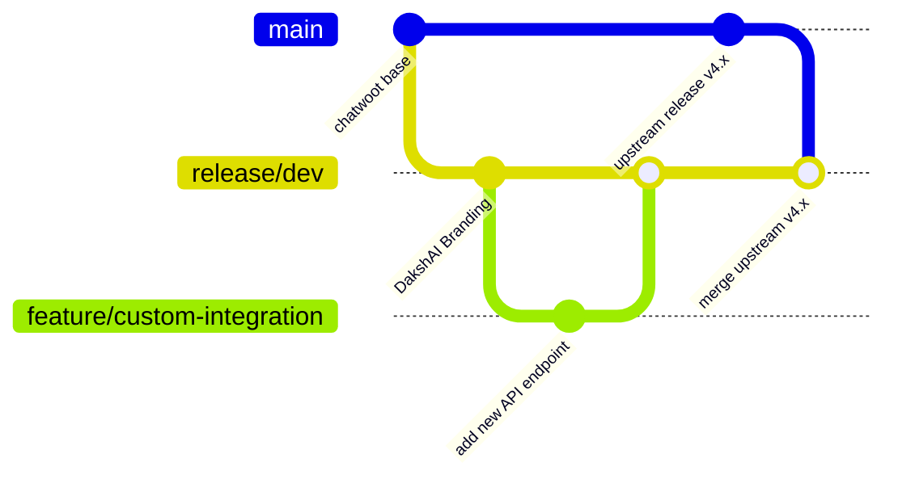

# Developer Maintenance Workflow Guide: DakshAI

This guide details best practices and workflows for maintaining **DakshAI** as a custom fork of Chatwoot, implementing new features, and keeping your repository aligned with upstream Chatwoot updates.

---

## 1. Branch Strategy & Upstream Syncing

To easily leverage new Chatwoot releases (bugfixes, security patches, new features) without breaking your custom branding and additions, follow this branch model:



### Git Remotes Config
Keep the original Chatwoot repository configured as `upstream` and your repository configured as `origin`:
- **`origin`**: `https://github.com/chandresh-ship-it/DakshAI.git` (Your repository)
- **`upstream`**: `https://github.com/chatwoot/chatwoot.git` (Official Chatwoot repository)

### Standard Workflow for Upstream Syncing
When Chatwoot releases updates, sync them into your repository using:
1. Fetch official updates:
   ```bash
   git fetch upstream
   ```
2. Checkout your base development branch:
   ```bash
   git checkout release/dev
   ```
3. Merge Chatwoot updates:
   ```bash
   git merge upstream/develop
   ```
4. Resolve any merge conflicts (usually minor branding configs in `installation_config.yml` or translations), test locally, and push:
   ```bash
   git push origin release/dev
   ```

---

## 2. Implementing New Features

When writing new features, adhere to these developer guidelines to ensure clean code and easy maintenance:

### A. Git Branching
- Always create a separate, short-lived branch for new features:
  ```bash
  git checkout release/dev
  git checkout -b feature/your-feature-name
  ```
- After verifying and testing the feature, merge it back into `release/dev` using a Pull Request or a merge commit:
  ```bash
  git checkout release/dev
  git merge feature/your-feature-name
  git push origin release/dev
  ```

### B. Coding Conventions (Ruby & Rails)
- **Compact definitions**: Use compact definitions (e.g. `module Account` rather than nested module blocks).
- **Strong Parameters**: Always enforce type safety and white-listed strong parameters in controllers.
- **Enterprise Edition Compatibility**: 
  - Chatwoot uses an overlay system. OSS code resides under `app/` and Enterprise-exclusive code resides under `enterprise/app/`.
  - If you need to extend OSS models or controllers for custom logic, use `prepend_mod_with` or Rails Concerns rather than hard-coding or heavily modifying the core OSS file. This minimizes merge conflicts when pulling upstream.

### C. Coding Conventions (Vue & JS Frontend)
- **Composition API**: Always use the Vue 3 Composition API with `<script setup>` for new components.
- **Tailwind CSS Only**: 
  - Do not write custom CSS or scoped CSS.
  - Do not use inline styling.
  - Exclusively use Tailwind utility classes mapping to values in `tailwind.config.js`.
- **Branding Compose**: Use `replaceInstallationName` from `shared/composables/useBranding` for any custom text strings referencing the product name to allow it to dynamically resolve to `DakshAI` or whatever `INSTALLATION_NAME` is configured.
- **PascalCase Components**: Component file names and imports must use PascalCase.

---

## 3. Database Migrations Safety

When updating the database schema:
- **Never modify existing migrations**: Once a migration is committed and pushed, do not edit it. Instead, generate a new migration:
  ```bash
  bundle exec rails generate migration add_custom_field_to_accounts custom_field:string
  ```
- **Safe Migrations**:
  - Add database indexes for any new foreign keys or query-heavy attributes.
  - Use `disable_ddl_transaction!` and `algorithm: :concurrently` for adding indexes in production to avoid table locks.

---

## 4. Linting and Testing Checklist

Before committing any feature code, run local formatting and tests to align with Chatwoot code quality standards:

### Ruby (RuboCop)
Run the auto-formatter to format backend code (maximum line length limit is 150 characters):
```bash
bundle exec rubocop -a
```

### JS/Vue (ESLint)
Lint and auto-fix frontend code:
```bash
pnpm eslint:fix
```

### Run Tests
- **Ruby Backend Specs**:
  ```bash
  bundle exec rspec spec/path/to/modified_spec.rb
  ```
- **JS/Vue Frontend Tests**:
  ```bash
  pnpm test
  ```
