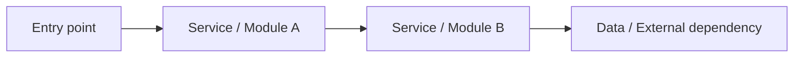
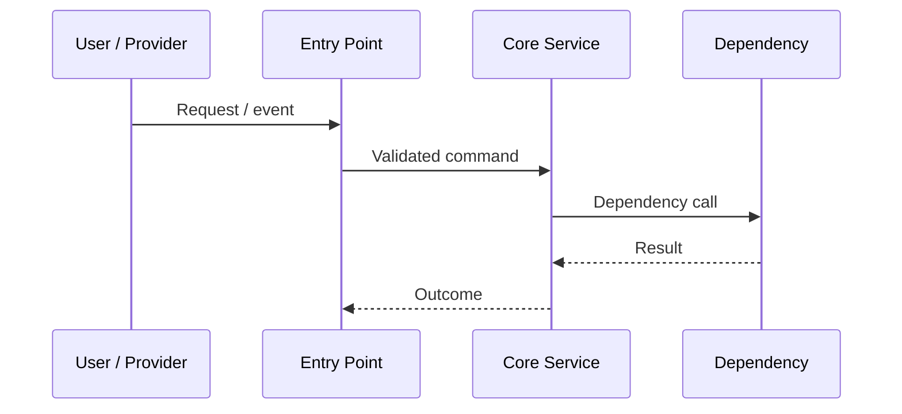
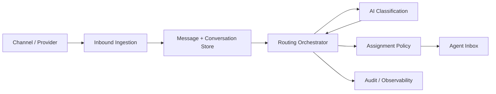
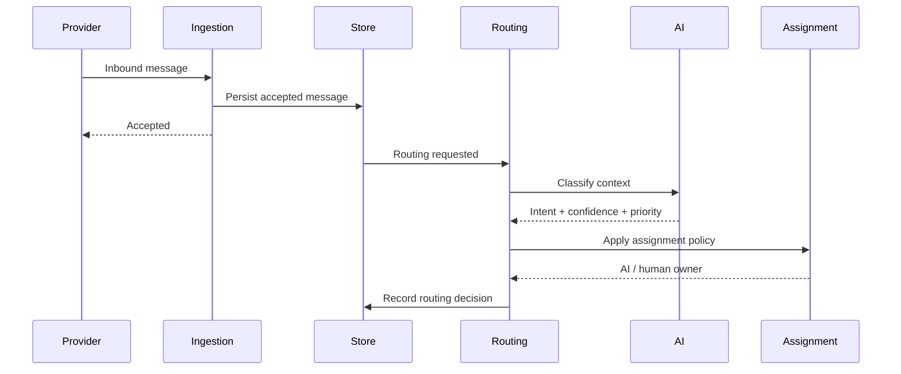
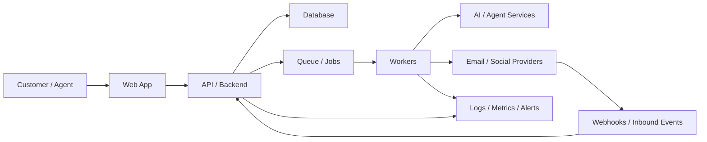
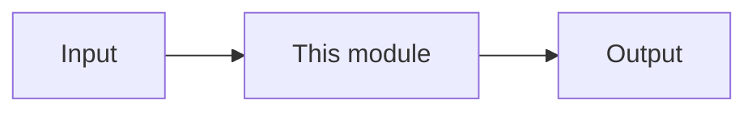
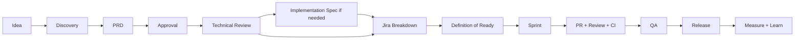

# Playground — New Relay HQ

Offline export of the Newrelay Notion **Playground** teamspace.

- **Source:** [Playground](https://app.notion.com/p/3db818aa51a481ae94e1d7ca4fa8872d)
- **Workspace:** Newrelay
- **Exported:** 15 Sep 2026
- **Last reviewed in Notion:** 14 Sep 2026

This file is a snapshot. Notion remains the live source of truth.

---

## Contents

1. [Home](#home--new-relay-hq)
2. [01 · Product & Strategy](#01--product--strategy)
3. [02 · Delivery & Jira](#02--delivery--jira)
4. [03 · Engineering Wiki](#03--engineering-wiki)
5. [04 · Team Handbook](#04--team-handbook)
6. [05 · Operating System & Decisions](#05--operating-system--decisions)

---

## Home — New Relay HQ

**The single starting point for product, delivery, engineering, and team operations.**

You should not need to browse the library to understand where something belongs. Use the five sections below and only go deeper when your task requires it.

| I want to… | Go to |
| --- | --- |
| Understand the product, roadmap, PRDs, scope or requirements | **01 · Product & Strategy** |
| Work on sprint planning, Jira, bugs, estimation or delivery process | **02 · Delivery & Jira** |
| Understand architecture, codebase, Git/PRs, infrastructure or incidents | **03 · Engineering Wiki** |
| Understand communication, onboarding, meetings or team expectations | **04 · Team Handbook** |
| Find decisions, workspace rules or company-wide operating principles | **05 · Operating System & Decisions** |

### Simple rule

**Teamspace = durable knowledge the core team repeatedly needs.** Shared pages are for deliberately limited collaboration. Private is for personal, sensitive, or unfinished material.

> Jira owns work status. GitHub owns code and reviews. Figma owns design. Slack owns coordination. Notion owns durable context and decisions.

---

## 01 · Product & Strategy

Source: https://app.notion.com/p/3db818aa51a4815a9822d5c5720fcf3f

The product source of truth for what New Relay is, what we are building, why it matters, and how meaningful features are defined before engineering starts.

**Start here when**

- You need product context or roadmap reasoning
- You are writing or reviewing a PRD
- You need feature scope, acceptance criteria, or implementation-spec guidance

> Jira owns execution status. This section owns product context, requirements, scope, and durable product decisions.

### 00 · Start Here — Product Home

Source: https://app.notion.com/p/3db818aa51a481a68471e4d47ba1fb83

> **Read this first if you are new to NR.** This page explains the product, terminology, ownership, systems, and where to find everything else.

#### Product snapshot

**NewRelay (NR)** is an omnichannel SaaS product designed to bring customer conversations into one operational inbox and use AI agents to help teams route, prioritize, assign, respond, automate, and escalate work.

**Core product ideas**

- Unified inbox across communication channels.
- AI-assisted routing, prioritization and response.
- Human ownership and handoff when automation should stop.
- Clear team assignment and accountability.
- Automation that turns conversations into actions rather than simply collecting messages.

**Who this handbook is for**

Product/PM, engineering, design, QA, marketing contributors, and anyone joining the product team.

#### Source-of-truth map

| System | Owns | Does not own |
| --- | --- | --- |
| Notion | Product context, PRDs, implementation specs, SOPs, durable decisions | Live sprint/task status |
| Jira | Ownership, backlog, sprint, estimate, priority, bugs, delivery status | Long-form product thinking |
| GitHub | Code, branches, PR review, CI, deployable history | Product scope |
| Figma | UX/UI source of truth | Delivery status |
| Slack | Coordination, questions, blockers, async updates | Permanent decisions |

#### Product architecture & links

Fill these once the team finalizes the stack and environments.

- **Frontend repo:** TBD
- **Backend repo:** TBD
- **Production:** TBD
- **Staging:** TBD
- **Figma:** TBD
- **Jira:** TBD
- **Monitoring / error tracking:** TBD
- **Analytics:** TBD

#### Product modules

- Inbox & conversations
- Channels / integrations
- Contacts / customers
- Team, roles & assignment
- AI agents / automation
- Knowledge / data sources
- Analytics & reporting
- Settings / workspace administration
- Billing / plans

#### Glossary

- **Workspace:** customer/company account in NR.
- **Conversation:** a customer interaction thread received through a connected channel.
- **Agent:** human teammate unless explicitly written as AI Agent.
- **AI Agent:** automated NR capability that can interpret or act on conversations.
- **Handoff:** transfer of control from AI to a human agent.
- **Owner:** single accountable person for a Jira item or product decision.

#### New joiner reading order

1. This page.
2. Product Planning & Specs.
3. Delivery & Jira.
4. Engineering Handbook.
5. Communication & Team Rhythm.
6. Onboarding & Team Expectations.

> Keep this page short. Deep feature knowledge belongs in PRDs, not here.

### 01 · Product Planning & Specs

Source: https://app.notion.com/p/3db818aa51a4813b9338e18944e1be89

This section defines how an idea becomes a clear, approved and buildable feature.

**Use the lightest process that protects the team**

- **Tiny bug/chore:** Jira only.
- **Simple change:** Jira story + acceptance criteria.
- **Meaningful user-facing feature:** PRD.
- **Technically complex but contained change:** PRD + Technical Implementation Spec when the build plan, migration, failure handling or rollout needs review.
- **Complex / cross-module feature:** PRD + Architecture Design + Technical Implementation Spec.
- **Expensive-to-reverse architecture decision:** add an ADR and link it from the Architecture Design.

**Architecture Design is mandatory when any of these are true**

- The feature changes **two or more major modules/services** or introduces a new shared boundary.
- It creates or materially changes a **database model, ownership model, tenant boundary or migration strategy**.
- It introduces or changes a **shared API/event contract**, webhook flow, queue/job contract or external integration boundary.
- It changes **authentication, authorization, security, reliability, scaling or critical failure behaviour**.
- The technical choice is expensive to reverse or likely to constrain future features.

**Planning rule:** A developer should never need to reconstruct the intended behaviour from Slack messages, old calls, and assumptions.

**Approval rule:** A document marked **Draft** or **In Review** is not permission to start coding unless an explicit exception is made.

## Feature Lifecycle — Idea to Release

Source: https://app.notion.com/p/3db818aa51a48106b839da0e3f886347

> **Default path:** Idea → Discovery → PRD → Approval → Technical Review → Architecture Design for complex/cross-module work → ADR(s) for major decisions → Technical Implementation Spec if needed → Jira Breakdown → Ready → Sprint → PR/CI → QA → Release → Measure.
## Stage gates
| Stage | Question | Exit condition |
| --- | --- | --- |
| Idea | Is this worth understanding? | Owner assigned for discovery |
| Discovery | Is the problem real and worth solving now? | Evidence + rough impact + decision |
| PRD | What should the product do and what is excluded? | Approved scope, success metric, acceptance criteria |
| Technical review | Can we build it safely, and what documentation depth is required? | Complexity, dependencies and architecture-document requirement understood |
| Architecture Design | How should the system be shaped for this complex/cross-module change? | Component boundaries, data ownership, API/event contracts, failure behaviour and major trade-offs approved |
| ADR(s) | Are there expensive-to-reverse decisions that need a durable record? | Material architecture decisions accepted and linked |
| Technical Implementation Spec | How will the approved product and architecture be implemented safely? | Concrete implementation, migration, test and rollout plan approved |
| Jira breakdown | Can the work be delivered in small owned pieces? | Stories/tasks created and estimated |
| Ready | Can someone start without a blocking question? | Definition of Ready passed |
| Delivery | Is implementation progressing against scope? | PR reviewed + CI green + QA complete |
| Release | Can users safely receive it? | Production verification complete |
| Measure | Did it solve the intended problem? | Metric reviewed and follow-up decision recorded |
## When to skip documents
- **Bug:** no PRD unless it exposes a deeper product change.
- **Small UI copy/layout adjustment:** Jira ticket with acceptance criteria is enough.
- **Complex backend change with no visible UI:** may still require Architecture Design and/or a Technical Implementation Spec because risk and system impact—not UI size—determine technical documentation.
- **Cross-module / shared-contract change:** Architecture Design is not optional even if the individual code changes look small.
## Rules
1. Slack discussion never equals product approval.
2. A Draft PRD may be discussed but is not sprint-ready.
3. Any material scope change after approval updates the PRD and the Jira epic.
4. If implementation changes an approved architecture decision, update the Architecture Design/ADR before treating the new approach as accepted.
5. If implementation diverges from the approved Technical Implementation Spec, document the divergence before marking Done.
6. Do not create implementation tickets until the feature can pass the Definition of Ready.

---

## Feature Discovery & Roadmap SOP

Source: https://app.notion.com/p/3db818aa51a481e88ce2f1526e7df847

## When to use
Use this for uncertain ideas, customer requests, competitor-inspired features, large UX changes, or anything that could consume more than a few days.
## Owner
Founder/PM or explicitly assigned product owner.
## Discovery note template
### 1. Problem
What is happening today? State the problem without proposing the solution.
### 2. Evidence
Use the strongest available evidence:
- Customer request / quote
- Support volume
- Usage or funnel data
- Revenue or retention risk
- Internal operational pain
- Competitive expectation
### 3. Users affected
Who experiences the problem? Name roles/personas, not “users.”
### 4. Current workaround
How do people solve it today? Manual steps, another product, shared login, spreadsheet, etc.
### 5. Why now
What changed? Why is this more important than other roadmap work?
### 6. Expected outcome
What should improve if we solve it?
### 7. Alternatives considered
Include “do nothing” when reasonable.
### 8. Rough effort / uncertainty
**Effort:** S / M / L. **Confidence:** Low / Medium / High.
### 9. Decision
- Build / move to PRD
- Research more
- Park
- Reject
## Roadmap rule
The roadmap communicates **intent and priority**, not sprint commitment. Only Delivery Jira contains sprint commitments.
## Done when
The team can explain the problem and why it matters without discussing implementation details.

---

## PRD Template — Product Requirements

Source: https://app.notion.com/p/3db818aa51a481d3bc61cf87cf992395

> **Owner:** Founder/PM. The PRD defines **why + what + boundaries**. Keep implementation mechanics out unless they are product constraints.
## Header
| Field | Value |
| --- | --- |
| Status | Draft / In Review / Approved / Shipped |
| Owner |  |
| Initiative / Roadmap |  |
| Target release |  |
| Jira epic |  |
| Figma |  |
| Implementation Spec | Required / Not required / Link |
## 1. Context / Problem
What is broken or missing today? State facts and evidence. Avoid solution language.
## 2. User / Job to be done
Who has the problem and what are they trying to accomplish?
## 3. Objective
What outcome are we trying to create?
## 4. Success metric
**Primary:** one measurable result with a threshold and timeframe when possible.
**Guardrails / secondary:** metrics that must not degrade or are useful to watch.
## 5. User flow
Describe the expected high-level journey from entry point to completed outcome.
## 6. Requirements
Use numbered requirements so Jira stories and tests can trace back to them.
**PRD-01 — Requirement title**
What the product must allow, prevent, display, calculate, or trigger.
## 7. Acceptance criteria
Write observable behaviour, not development tasks.
Example:
- Given \[state\], when \[action\], then \[observable result\].
- Error/empty/loading behaviour is defined.
- Permissions are defined where relevant.
## 8. Use cases / examples
Add realistic examples where behaviour could otherwise be interpreted differently.
## 9. Edge cases
List important failure, empty, duplicate, timeout, permission, retry, and unusual-state behaviour at product level.
## 10. In scope
Capabilities required for this version to be shippable.
## 11. Explicitly out of scope
Adjacent things the team could reasonably assume are included but are intentionally excluded.
## 12. Analytics / instrumentation
Events or measures required to answer whether the feature is used and whether it worked.
## 13. Dependencies & constraints
Deadlines, existing systems, vendors, data rules, compliance, backwards compatibility, design dependencies.
## 14. Rollout
All users / beta / selected workspaces / feature flag. Product-level sequence only.
## 15. Open questions
Number each question. Give the owner’s current lean so the team is not unnecessarily blocked.
## 16. Decisions / approvals
| Decision / Gate | Owner | Date |
| --- | --- | --- |
| PRD approved |  |  |
## PRD quality check
- [ ] Problem is supported by evidence or clearly marked as a hypothesis.
- [ ] Scope and non-scope are explicit.
- [ ] Requirements can be tested.
- [ ] No blocking TBD remains before Approved.
- [ ] Figma is linked for UI work.
- [ ] Success can be measured.

---

## PRD Example — AI Chatbot & Human Handoff

Source: https://app.notion.com/p/3db818aa51a481e980aadbe1d92b28f8

> **Example based on the existing NR chatbot planning material.** It demonstrates structure and clarity; unresolved values from the source remain open rather than being invented.
| Field | Value |
| --- | --- |
| Status | Example / In Review |
| Owner | Product |
| Initiative | AI-assisted customer support |
| Target release | TBD |
| Implementation Spec | Required — AI confidence, handoff state, integrations and automation add technical risk |
## 1. Context / Problem
The inbox currently requires manual handling for customer support. NR needs an AI chatbot that can answer common questions continuously, use approved business/product information, recommend products where relevant, and transfer control to a human when the AI should not continue.
## 2. Users / JTBD
**Merchant / Admin:** configure what the bot knows, how it communicates, what it is allowed to handle, and when it must hand off.
**Support Agent:** receive escalated conversations with clear ownership and without competing with continued AI auto-replies.
**Customer:** get quick, contextual support and a predictable handoff when human judgment is required.
## 3. Objective
Reduce manual handling of routine customer conversations while preserving safe and understandable human takeover.
## 4. Success metrics
Source material identifies these analytics; numeric targets are still TBD:
- Number of chats handled by AI.
- % of conversations resolved without human escalation.
- Sales/conversions attributed to product recommendations.
## 5. High-level flow
1. Merchant enables AI Chatbot under Settings → AI.
2. Merchant configures business profile, language/voice, response preferences and knowledge/data sources.
3. Merchant selects supported use cases and recommendation behaviour.
4. Customer sends a message.
5. AI interprets intent and uses available connected knowledge/data.
6. AI responds when allowed and sufficiently confident.
7. AI hands off when an escalation rule is triggered.
8. Human agent owns the conversation until AI is explicitly allowed again.
## 6. Requirements
### PRD-AI-01 — Enable / disable
Admin can enable or disable the chatbot globally.
### PRD-AI-02 — Business & response configuration
Admin can configure business name/description, primary/additional languages, tone, custom greeting, and brief/detailed response preference.
### PRD-AI-03 — Knowledge and product data
The chatbot can use connected Shopify product/order/policy data, FAQs, and manual product CSV data where configured.
### PRD-AI-04 — Use cases
Merchant can determine which supported jobs the bot may handle, including FAQs, order tracking, refunds where permitted, and product recommendations.
### PRD-AI-05 — Recommendations
Merchant can enable/disable recommendations and choose strategies such as bestsellers, new arrivals and discounted products. Display limits are configurable where defined.
### PRD-AI-06 — Human handoff
Merchant can configure when conversations must leave AI handling, including low confidence and specified intents.
### PRD-AI-07 — Assignment
Human handoff supports manual assignment and automatic round-robin assignment.
### PRD-AI-08 — AI interruption
AI must stop responding when a human agent takes over, the bot is disabled for that conversation, an escalation fires, or the conversation is resolved.
### PRD-AI-09 — Customer handoff message
When escalation occurs, the customer receives one clear handoff message rather than continued AI responses.
### PRD-AI-10 — Visibility
Agents can identify conversations being handled by the AI as a distinct team member/handler concept. Exact tab/location remains an open product decision.
## 7. Acceptance criteria — handoff example
- Given AI confidence is below the configured threshold, when a response candidate is generated, then the conversation is escalated rather than continuing normal AI replies.
- When escalation succeeds, the customer receives a single handoff message.
- After escalation, AI does not send another reply until explicitly re-enabled for the conversation.
- When a human agent sends a message, AI pauses for that conversation.
- Global disable prevents new AI responses across conversations.
## 8. Example use cases
**Product search:** Customer asks for kids’ sneakers under \$50 → AI searches configured catalogue constraints and returns matching products with relevant information.
**Order + cross-sell:** Customer asks for order status → AI returns status and, only when merchant settings allow it, may suggest relevant products.
## 9. Handoff triggers from current planning
- Low AI confidence.
- Negative sentiment.
- Complex multi-step issue requiring judgment.
- Policy restriction / exception.
- Intents configured to always escalate, e.g. refunds or complaints.
## 10. In scope
- Chatbot enable/disable.
- Business/brand voice configuration.
- Knowledge/data sources described above.
- Product recommendations and merchant controls.
- Order-related queries using connected data.
- Escalation/handoff controls.
- Manual and round-robin assignment.
- Automatic resolution configuration.
- Core chatbot analytics listed above.
## 11. Out of scope / deferred
Current source material explicitly defers implementation of unanswered-question suggestions beyond backend logging. Any additional deferred items should be added before approval.
## 12. Open questions
1. What is the default confidence threshold? Existing material gives 70% only as an example.
2. How frequently should Shopify product data auto-refresh?
3. What is the default/max number of products shown per response?
4. Under which inbox tab/state should AI-handled tickets appear?
5. Is FAQ management part of the chatbot settings or the existing FAQ section?
6. Exact auto-resolution default and allowed range?
## 13. Approval
This example should not be treated as implementation approval until open questions, Figma, target release and success thresholds are finalized.

---

## Architecture & System Design Template — Complex / Cross-Module

Source: https://app.notion.com/p/3db818aa51a48164a880ee12106e823d

> Use this for **complex, cross-module, architecture-sensitive or expensive-to-reverse changes**. It is written by the responsible engineer/technical owner after the PRD is approved and before detailed implementation begins.
## What this document is for
This document defines the **system shape and important technical decisions** before code is written. It should make component boundaries, data ownership, API/event contracts, failure behaviour and trade-offs reviewable.
> **Do not duplicate the Technical Implementation Spec.** Architecture Design decides *how the system should be shaped*. The Technical Implementation Spec explains *how the approved design will be implemented, tested, migrated and rolled out*.
## Header
| Field | Value |
| --- | --- |
| Status | Draft / In Review / Approved / Superseded |
| Technical owner |  |
| Reviewers |  |
| Source PRD |  |
| Technical Implementation Spec |  |
| Related ADRs |  |
| Last updated |  |
## 1. Context & problem
Describe the technical problem created by the approved product requirement. State why existing architecture is insufficient or why the change deserves system-level review.
## 2. Scope, constraints & non-goals
- Systems/modules affected
- Hard constraints
- Compatibility requirements
- Explicit non-goals
## 3. Current state
Describe the relevant current flow, boundaries and limitations. Add a diagram when useful.
## 4. Proposed architecture
Show the proposed component/system design and explain each responsibility.

### Component responsibilities
| Component | Owns | Does not own | Key dependencies |
| --- | --- | --- | --- |
## 5. Critical flows
Document the important end-to-end paths, especially those crossing modules or external systems.

## 6. Data architecture & database decisions
For every material data change, document:
- Source of truth / data owner
- New or changed entities
- Relationships and tenant/workspace boundaries
- Required constraints, uniqueness and indexes
- Data lifecycle / retention where relevant
- Migration/backfill compatibility at architecture level
- Read/write ownership and consistency expectations
| Decision | Choice | Reason | Consequence |
| --- | --- | --- | --- |
| Data ownership |  |  |  |
| Schema / model |  |  |  |
| Consistency |  |  |  |
## 7. API, event & integration contracts
Capture contracts that other modules or services will depend on. Avoid implementation-level code; define stable behaviour.
| Interface | Producer / caller | Consumer / owner | Auth / scope | Idempotency | Failure behaviour |
| --- | --- | --- | --- | --- | --- |
For each important contract define request/event shape, response/outcome, error semantics, versioning/compatibility, retries/timeouts and ownership.
## 8. Authorization, security & tenant isolation
Document trust boundaries, permission checks, sensitive data, tenant/workspace scoping, secrets handling and abuse considerations.
## 9. Failure modes & reliability
| Failure | User/system impact | Detection | Fallback / recovery |
| --- | --- | --- | --- |
Include partial failure, duplicate delivery, timeout, retry storms, stale state, downstream outage and recovery behaviour where relevant.
## 10. Performance & scalability
Only where material: volume assumptions, latency-sensitive paths, queueing/batching, pagination, caching, indexing, rate limits, concurrency and capacity boundaries.
## 11. External dependencies
List providers, APIs, queues, AI/model providers or other systems introduced/changed. State the failure and ownership implications.
## 12. Architecture decisions & alternatives
Important decisions should not disappear inside prose.
| Decision | Options considered | Chosen approach | Why | ADR required? |
| --- | --- | --- | --- | --- |
Create a separate ADR when a choice is expensive to reverse, changes a shared platform contract, introduces a new architectural pattern, or will matter beyond this feature.
## 13. Compatibility, rollout & rollback architecture
State backward/forward compatibility, feature-flag or dual-read/write needs, deployment ordering and architectural rollback constraints.
## 14. Observability
Define what must be observable: key logs, metrics, traces/events, dashboards and alerts needed to prove the design works and diagnose failures.
## 15. Risks & open questions
| Risk / question | Owner | Resolution / mitigation | Status |
| --- | --- | --- | --- |
## 16. Approval
| Gate | Who | Date |
| --- | --- | --- |
| Architecture approved |  |  |

---

## Architecture Design Example — AI Routing & Human Handoff

Source: https://app.notion.com/p/3db818aa51a481bdb106fbc8d38ffdec

> **Illustrative example, not NR production architecture.** This exists only to show the expected depth and decision quality for a cross-module feature.
## Context
Assume a feature where inbound customer messages must be accepted from multiple channels, classified by AI, prioritized, routed to a human or AI workflow, and handed off safely when confidence is low or an agent joins.
The change crosses ingestion, conversation storage, AI classification, assignment, agent inbox behaviour and observability, so it deserves an Architecture Design before implementation details are finalized.
## Proposed architecture

### Responsibilities
| Component | Responsibility | Boundary |
| --- | --- | --- |
| Inbound Ingestion | Authenticate provider input, deduplicate and accept message | Does not decide assignment |
| Message Store | Durable message/conversation state | Does not contain routing policy |
| Routing Orchestrator | Coordinate classification and routing decision | Does not own agent UI state |
| AI Classification | Intent, confidence, priority signals | Advisory; cannot bypass policy |
| Assignment Policy | Human/AI ownership and escalation rules | Single source for assignment decisions |
## Critical flow

## Data architecture decisions
Illustrative entities:
- **Conversation** — workspace-scoped customer thread.
- **Message** — immutable inbound/outbound message record.
- **Routing Decision** — decision inputs, outcome and policy/model version used.
- **Assignment** — current owner plus assignment history.
- **Handoff Event** — explicit AI → human or human → AI transition record.
Key decisions:
1. Persist the inbound message **before** AI classification so provider acceptance is not coupled to model latency.
2. Keep routing decisions auditable instead of only storing the resulting owner.
3. Scope every entity to the workspace/tenant boundary.
4. Treat assignment history as durable state so handoff behaviour can be reconstructed.
## API / event contracts
| Interface | Owner | Purpose | Important contract |
| --- | --- | --- | --- |
| InboundMessageAccepted | Ingestion | Durable acceptance | Idempotent by provider message identity |
| RoutingRequested | Conversation domain | Start routing | References persisted conversation/message |
| RoutingDecisionRecorded | Routing | Audit final decision | Includes decision reason/version |
| AssignmentChanged | Assignment | Update inbox ownership | Workspace scoped and ordered |
## Failure behaviour
| Failure | Design response |
| --- | --- |
| Duplicate provider webhook | Deduplicate at ingestion; never create a second message |
| AI timeout | Use deterministic fallback policy and flag decision for review |
| Assignment dependency unavailable | Keep message accepted and visible as pending/unassigned |
| Human agent joins conversation | Human ownership overrides automated response until policy allows otherwise |
| Provider outage on outbound send | Preserve send intent and surface retry/failure state |
## Security / tenancy
- Every lookup and command is workspace scoped.
- Provider credentials are handled outside feature data.
- AI output cannot directly assign across workspace boundaries.
- Audit records should identify the policy/model version involved in a routing decision.
## Alternatives considered
**Synchronous provider → AI → assignment → acceptance:** simpler sequence but couples provider acknowledgement to model/dependency latency and increases duplicate/retry risk.
**Durable acceptance then routing:** slightly more orchestration, but isolates ingestion reliability from AI latency and makes retries/recovery safer.
Illustrative decision: choose durable acceptance then routing.
## Rollout
Start in shadow mode where routing decisions are computed and logged but do not change ownership. Compare against current/manual assignment, then enable for a limited cohort, then expand with rollback by disabling automated assignment while preserving recorded events.
## What to learn from this example
A good Architecture Design does not list every class or endpoint implementation. It makes **boundaries, data ownership, contracts, failure behaviour, trade-offs and irreversible decisions explicit before implementation starts**.

---

## Architecture Decision Record (ADR) Template

Source: https://app.notion.com/p/3db818aa51a4815bae32e816ab5bd6b9

> Use an ADR for **one architectural decision that will matter beyond the immediate implementation**. Keep it short. Link it from the Architecture Design and Decision Log where appropriate.
## Header
| Field | Value |
| --- | --- |
| Status | Proposed / Accepted / Superseded |
| Date |  |
| Owner |  |
| Architecture Design / PRD |  |
| Supersedes / Superseded by |  |
## Decision
State the decision in one or two sentences.
## Context
What constraint, risk or architectural question forced this decision?
## Options considered
### Option A
What it is, benefits and costs.
### Option B
What it is, benefits and costs.
### Option C
Only when it was a serious alternative.
## Why this option
Explain the trade-off. Do not write “best practice” without the specific reason it is right here.
## Consequences
### Positive
-
### Negative / cost accepted
-
### Operational implications
- Migration / compatibility
- Monitoring / incident impact
- Ownership / maintenance
## Reversibility
What would make us revisit this decision? How difficult is reversal?
## Follow-up
Link implementation tasks, migrations, documentation or deprecation work created by this decision.

---

## ADR Example — Persist Inbound Message Before AI Routing

Source: https://app.notion.com/p/3db818aa51a481ec963ce2b53d48b15e

> **Illustrative example, not NR production architecture.**
## Status
Accepted for this example.
## Decision
Persist and acknowledge an inbound message before invoking AI classification or assignment. Perform routing after durable acceptance rather than making provider acknowledgement depend on the full routing pipeline.
## Context
Inbound channel providers may retry when acknowledgement is slow. AI/model calls and assignment dependencies have variable latency and can fail independently. If durable persistence happens only after those dependencies succeed, a transient downstream failure can cause duplicate provider deliveries or lost customer messages.
## Options considered
### A. Fully synchronous ingestion and routing
Provider request waits for persistence, AI classification, assignment and final routing.
**Benefit:** simple request flow and immediate routing result.
**Cost:** provider acknowledgement inherits all downstream latency and availability; retry/duplicate behaviour becomes harder to reason about.
### B. Durable acceptance first, asynchronous routing second
Authenticate/deduplicate, persist message, acknowledge provider, then route from durable state.
**Benefit:** protects message acceptance from AI/assignment outages and gives retries a durable source of truth.
**Cost:** introduces an intermediate pending-routing state and requires orchestration/observability.
## Why this option
Choose **B** because preserving customer messages is more important than completing routing in the provider request path. AI latency should degrade routing speed, not message durability.
## Consequences
### Positive
- Provider retries can be handled idempotently.
- AI or assignment outages do not lose accepted messages.
- Routing can be retried from durable state.
### Negative / cost accepted
- The UI/system must represent a short pending-routing state.
- Routing workers/events need monitoring and recovery behaviour.
- Ordering and duplicate event handling must be explicit.
## Reversibility
Revisit if the routing path becomes strictly local, deterministic and bounded enough that asynchronous orchestration creates more cost than reliability value. Reversal would change a shared ingestion contract and therefore requires architecture review.
## Follow-up
The Technical Implementation Spec must define idempotency keys, retry policy, pending-state behaviour, monitoring and rollout details.

---

## Technical Implementation Spec Template

Source: https://app.notion.com/p/3db818aa51a481c38740c9de49101d0b

> Use this when implementation complexity or risk justifies a written build plan. It is written by the implementing engineer **after the PRD is approved**. For complex/cross-module work, the Architecture Design must be approved first. This document turns the approved product + architecture decisions into a concrete implementation, migration, test, rollout and Jira plan.
> **Boundary:** do not re-decide shared architecture here. Link the Architecture Design and ADRs, then document the concrete implementation details and any justified deviations.
## Header
| Field | Value |
| --- | --- |
| Status | Draft / In Review / Approved / Shipped |
| Author / implementer |  |
| Reviewer |  |
| Source PRD |  |
| Architecture Design | Required for complex / cross-module work |
| Related ADRs | Link accepted decisions that constrain implementation |
| Estimate | Dev-days / range |
## 1. Restatement of the requirement
In your own words, explain what is being built and why. **If this is wrong, stop the review here.** Do not copy the PRD.
## 2. Implementation approach
Summarize how the approved design will be implemented. If an Architecture Design exists, link it and describe only implementation-specific choices or deltas. Use a diagram only when it adds clarity rather than duplicating the architecture document.
## 3. Data model
New/changed entities, nullability/defaults, indexes and database-level constraints where applicable.
## 4. Migration & backfill
How production data changes safely. Backfills must be batched, idempotent and resumable. State rollback.
## 5. Authorization & security
Who can call/do what, where checks live, tenant isolation, sensitive data concerns, default-deny behaviour where relevant.
## 6. Interfaces / endpoints / events
| Method / Event | Interface | Permission | Notes |
| --- | --- | --- | --- |
## 7. Business rules & edge cases
Number them. Include duplicates, empty states, expiry, retry, partial failure, concurrency, permissions, stale data and third-party outage behaviour.
## 8. Background jobs & external calls
Queue/task, retry policy, timeout, idempotency, rate limits and outage behaviour.
## 9. Performance / scalability
Only where material: expected volume, latency, batching, pagination, indexing, caching or limits.
## 10. Observability & instrumentation
Logs, metrics, events, alerts, Sentry/error context, and how the PRD success metric can be measured.
## 11. Test plan
Explicitly identify required layers and high-risk cases. Include authorization and migration tests where relevant.
## 12. Rollout & rollback
Feature flag, staged release, data compatibility, rollout sequence, production verification and flag-removal task.
## 13. Jira task breakdown
Map implementation tasks back to PRD / spec sections. Aim for work items at ≤2 dev-days where practical.
## 14. Open questions / recommendations
Answer PRD questions, add technical questions, and include a recommendation rather than only asking.
## 15. Approval
| Gate | Who | Date |
| --- | --- | --- |
| Implementation Spec approved |  |  |

---

## Technical Implementation Spec Example — Team Invitations

Source: https://app.notion.com/p/3db818aa51a48167b28cc1e642f86ac2

> **Illustrative reference, not NR architecture.** This example is retained from the supplied reference material to show the expected depth for a risky multi-tenant/auth/data migration change.
## Restatement
Convert a single-user ownership model into account memberships. An Account has Users through Memberships, membership carries a role, invitations are pending memberships with expiring signed tokens, and authorization changes from ownership checks to membership permission checks.
## Why this deserves architecture + implementation documentation
This change affects tenant scoping, authentication/authorization, database constraints, data migration, sessions and production rollout. Under the NR process, a real change with this blast radius would normally require an **Architecture Design first**, followed by this **Technical Implementation Spec**. The architecture document decides the shared boundaries and durable choices; this document demonstrates the concrete migration, authorization, testing and rollout depth expected from the implementing engineer.
## Data model example
**accounts**: id, name, owner_id, timestamps.
**memberships**: account_id, user_id, invited_email, role, invited_by_id, invitation token digest, sent/accepted/last-seen timestamps.
Important database constraints include uniqueness for account/user membership and pending invitation email, integrity requiring either a user or invited email, and restrictions around ownership.
## Migration approach example
1. Add new tables and nullable account references without behaviour change.
2. Run an idempotent, batched, resumable backfill and reconcile row counts.
3. Enforce required constraints and switch reads to account scoping behind a feature flag.
Rollback leaves additive schema/backfill in place while the behaviour flag is disabled.
## Authorization example
Centralize role decisions in policy code. Controllers do not independently reinterpret roles. Default deny for undefined actions.
## Business-rule examples
1. Re-inviting a pending email resends rather than duplicates.
2. Existing member invite returns a clear error.
3. Expired invite shows a recovery path rather than a generic 404.
4. Removing a member revokes access promptly.
5. Owner cannot remove themselves until ownership is transferred.
6. Raw invitation tokens are not persisted.
## Observability example
Track invitation sent/accepted, member removed and ownership transferred. Audit membership changes. Ensure the success metric can be queried directly.
## Test strategy example
- Database/model constraint tests.
- Role × policy matrix.
- Authorized and unauthorized request tests.
- End-to-end invite acceptance for existing and new users.
- Migration/backfill reconciliation against representative data.
## Rollout example
Release behind a feature flag: internal → small named customer cohort → wider release → 100%. Create a tracked task to remove the flag after stability is proven.
## What to learn from this example
The value is not the exact schema. The value is making **risk, integrity, failure behaviour, tests and rollout reviewable before code is written**. For cross-module or architecture-sensitive work, do not use this document as a substitute for the Architecture Design; the two documents answer different questions.

---

## Definition of Ready

Source: https://app.notion.com/p/3db818aa51a4817b89f9e1ca298eda06

> A Jira item may enter an active sprint only when it can be started without a blocking product/design/technical question.
## Ready checklist
- [ ] Requirement is traceable to an approved PRD/spec or is fully described in the Jira ticket for small work.
- [ ] Observable acceptance criteria are written.
- [ ] UI/design link is attached where required.
- [ ] Important edge cases are named or explicitly deferred.
- [ ] Dependencies are identified.
- [ ] If the change is complex/cross-module, an **approved Architecture Design** is linked.
- [ ] Any material ADR required by the Architecture Design is accepted and linked.
- [ ] A **Technical Implementation Spec** is approved when implementation risk/complexity requires one.
- [ ] No unanswered question prevents starting.
- [ ] One clear owner is assignable.
- [ ] Work is estimated.
- [ ] Work is ideally ≤2 dev-days; larger work has been challenged/split where practical.
- [ ] Test expectation is understood.
## If it fails
Move it back to refinement/backlog. Do **not** put not-yet-ready work into a Blocked column—the sprint has not started for that work yet.
## Exception
Critical S1/S2 incidents may bypass normal planning gates. The incident/hotfix SOP applies instead.

---

## Definition of Done

Source: https://app.notion.com/p/3db818aa51a481169b31de59d8eee0d6

> **Done never means “the code is written” or “the PR is merged.”**
## Done checklist
- [ ] PR merged to the protected main branch.
- [ ] Required CI checks are green.
- [ ] Acceptance criteria are satisfied.
- [ ] Tests required by the spec/risk are present and passing.
- [ ] QA/staging verification completed by someone other than the author where practical.
- [ ] Product/Figma behaviour matches approved scope.
- [ ] Logging / events / analytics are emitting where required.
- [ ] Documentation/spec updated if implementation materially diverged.
- [ ] Feature flag is configured appropriately and a removal task exists if temporary.
- [ ] Production release/verification is complete where the Jira workflow defines Done as released.
## Recommended Jira interpretation
Use **Ready for QA / Testing** for merged-but-not-verified work. Reserve **Done** for work that passed the agreed release gate.

---

---

## 02 · Delivery & Jira

Source: https://app.notion.com/p/3db818aa51a481858ea6c75eabb80ea4

This section defines how approved work enters Jira, becomes sprint-ready, moves through delivery, and gets protected from uncontrolled scope changes.

**Default cadence**

- Two-week sprint.
- Design can happen inside the sprint when appropriately scoped.
- Async daily updates instead of unnecessary status meetings.
- Weekly bug triage.
- Demo + retrospective at sprint end.

**Core principle:** Jira is the source of truth for **who owns what, what state it is in, and what is committed in the sprint**.

## Jira Setup & Workflow

Source: https://app.notion.com/p/3db818aa51a48196bd36f6098350b77e

## Recommended Jira structure
Use **three projects/spaces** so work is separated by purpose without fragmenting the delivery team.
### 1. Product Roadmap
For ideas, discovery and future product direction. No sprint board.
**Workflow:** Idea → Discovery → Validated → Approved → Ready for PRD → Committed → Shipped
### 2. Product Delivery
The main software delivery project. Use one Scrum board for the shared team and a second filtered bug/QA board over the same project.
**Primary workflow:** To Do → In Progress → Code Review → Ready for QA → Testing → Done
**Blocked is a flag, not a status.**
Recommended issue hierarchy:
- Initiative — optional for larger themes
- Epic — meaningful product module/feature
- Story — user-facing behaviour
- Task — technical/operational work
- Bug — defective behaviour
- Sub-task — only when it helps split execution inside one ticket
### 3. Product Marketing
For marketing site, launch and product-marketing execution.
**Workflow:** Backlog → Planned → In Progress → Review → Scheduled → Live
Examples: landing pages, launch assets, release communication, SEO, campaigns, product videos.
## Delivery board columns
| Column | Meaning |
| --- | --- |
| To Do | Sprint-committed and Ready, not started |
| In Progress | Actively being implemented |
| Code Review | PR open and review required |
| Ready for QA | Merged/deployed to testable environment |
| Testing | QA/product verification in progress |
| Done | Definition of Done satisfied |
## Required Jira fields
- Clear title
- One owner/assignee
- Issue type
- Epic where relevant
- Context / description
- Acceptance criteria
- Estimate
- Priority
- Sprint when committed
- PRD/spec link for meaningful features
- Figma link for UI changes
- PR link once development starts
## Naming examples
**Epic:** AI Chatbot — Human Handoff
**Story:** Escalate low-confidence AI conversations to a human
**Task:** Add conversation-level AI pause state
**Bug:** AI continues replying after agent takeover
## Automation worth enabling
- PR opened → optionally move item to Code Review.
- PR merged → move to Ready for QA, not Done.
- Item flagged Blocked → surface visibly on board.
- Critical bug created → notify the bug channel.
- Release → update Jira release/version where used.
## Avoid
- Separate frontend/backend Jira projects for one small shared team.
- A status for every possible state.
- Using due dates as decoration on every ticket.
- Moving unfinished tickets to Done to close a sprint.
- Storing requirements only in Jira comments.

---

## Jira Ticket Writing Standard

Source: https://app.notion.com/p/3db818aa51a481c3b9d2c5e7e96aed7d

## Purpose
A Jira ticket should contain enough information to execute and verify one piece of work without rewriting the whole PRD.
## Story / task template
### Context
Why this piece exists. Keep this short and link to the source PRD/spec.
### Requirement
What behaviour or outcome this ticket delivers.
### Acceptance criteria
- Given [starting state], when [action], then [observable result].
- Include error, empty and permission states that belong to this ticket.
### Design / reference
Figma, PRD section, Implementation Spec section.
### Dependencies
Other tickets, APIs, migrations, decisions or external access.
### Test notes
Anything QA/reviewer specifically needs to verify.
## Ticket sizing
Prefer tickets deliverable within roughly **two developer-days or less** where practical. The goal is not arbitrary micro-tasks; it is visible progress, reviewable PRs and earlier blocker detection.
## Owner rule
Every active Jira item has **one accountable assignee**. Multiple contributors are fine; ambiguous ownership is not.
## Traceability
For meaningful features, maintain this chain:
**Roadmap / PRD → Epic → Story/Task → Branch → Pull Request → Release**
## Bad ticket
“Build Shopify integration.”
## Better ticket
“Import Shopify product catalogue for AI product search” with source spec, explicit behaviour, refresh acceptance criteria, error state and test notes.

---

## Sprint Planning & Execution SOP

Source: https://app.notion.com/p/3db818aa51a481a2a2bcc83b63a0d063

## Cadence
**Sprint length:** 2 weeks.
## Before sprint planning
Backlog refinement should leave candidate items passing the Definition of Ready. Planning is not the meeting where unresolved requirements are discovered for the first time.
### Product owner / PM
- Rank candidate work.
- Confirm PRD/design readiness.
- Identify dependencies.
- Remove or resolve blocking questions.
### Engineers
- Review technical complexity.
- Flag hidden dependencies/risks.
- Split oversized work.
- Estimate.
## Sprint planning
1. Review previous carry-over and why it happened.
2. Confirm team availability/capacity.
3. Protect capacity for bugs/unplanned work.
4. Select a sprint goal.
5. Pull only Ready items into the sprint.
6. Confirm owner and estimate for every selected item.
7. Check dependency ordering.
8. Confirm the sprint is realistically achievable.
## Capacity starting point
Use **80% planned feature capacity / 20% unplanned support & bug capacity** as an initial assumption. Review actuals after two sprints and adjust from evidence.
## During the sprint
- One primary active coding ticket per developer where practical.
- Update Jira before EOD.
- Raise blockers early.
- Use the Blocked flag for genuine external/blocking conditions.
- Code review is part of delivery time.
- QA happens continuously as items become testable.
## Scope change rule
If a non-critical item is added after sprint commitment, remove work of comparable effort or explicitly acknowledge the changed commitment.
Critical incidents may interrupt the sprint under the incident policy.
## Sprint end
### Demo
Show completed user behaviour, not slides about progress.
### Incomplete work
Do not mark Done. Re-estimate/replan remaining work rather than automatically dragging everything forward unchanged.
### Retrospective
Keep to 20–30 minutes:
- What helped delivery?
- What caused delay/rework?
- What one process change will we try next sprint?
Record only actionable changes.

---

## Estimation, Capacity & Scope Change

Source: https://app.notion.com/p/3db818aa51a481ab9d48d6d7dfefbea3

## Estimation purpose
Estimates support planning and trade-offs. They are not performance scores.
## Recommended small-team method
Use either **dev-days** or a small point scale consistently. Do not mix multiple systems in one sprint.
A practical dev-day model:
- **0.5 day:** small contained change
- **1 day:** clear single-flow change
- **2 days:** meaningful but bounded implementation
- **>2 days:** challenge the breakdown and split when it creates independently reviewable work
## Include the whole delivery cost
Estimate implementation + tests + review fixes + integration work. Do not estimate only coding time.
## Unknowns
If work cannot be estimated because of material unknowns, create a short **spike/research task** with a specific question and timebox rather than assigning a false estimate.
## Capacity
Before commitment, subtract:
- Leave / holidays
- Known internal commitments
- Expected support/bug allowance
- Known release/migration work
## Scope change after planning
1. Is it a genuine critical issue? If yes, use the incident/bug process.
2. If not critical, default to the next sprint.
3. If it must enter now, identify which planned work leaves or explicitly accept the delivery-date impact.
## Timeline communication
Do not make an unqualified delivery commitment while important requirements, dependencies or access are unresolved.

---

## Bug Reporting & Triage SOP

Source: https://app.notion.com/p/3db818aa51a4812bb1def32ac6042677

## Bug report template
**Title:** what breaks, written from the user’s perspective.
**Severity:** S1 / S2 / S3 / S4
**Environment:** production / staging, browser/device where relevant, workspace/account reference where appropriate.
**Steps to reproduce:** numbered and deterministic where possible.
**Expected:** what should happen.
**Actual:** what happens instead.
**Evidence:** screenshot/video, error-monitoring link, request ID or relevant logs.
**First seen / frequency:** when known.
**Regression?:** did this previously work?
## Severity
| Severity | Definition | Routing |
| --- | --- | --- |
| S1 | Total outage or material data-impacting failure | Interrupt current work; incident/hotfix process |
| S2 | Core user flow broken with no reasonable workaround | Top priority in current sprint |
| S3 | Broken behaviour with workaround or moderate impact | Weekly triage / normal prioritization |
| S4 | Cosmetic/minor issue with limited user impact | Weekly triage; may be closed Won’t Fix |
## Bug board
Keep bugs inside the **Product Delivery project** but expose them through a dedicated Bug & QA board/filter.
Suggested workflow:
**New → Triaged → Selected → In Progress → Ready for QA → Done**
Resolution options: Duplicate, Cannot Reproduce, Won’t Fix, Expected Behaviour.
## Weekly triage
For each new S3/S4 issue decide:
- Confirmed bug or expected behaviour
- Severity
- Current sprint / next sprint / backlog
- Owner if selected
- Duplicate / close
## Critical rule
A reported bug does **not automatically become sprint work**. This protects planned delivery while allowing genuinely critical defects to interrupt.

---

---

## 03 · Engineering Wiki

Source: https://app.notion.com/p/3db818aa51a481fdabb6c4ffcb0e34a9

**NR Engineering Wiki** — the practical source of truth for how NR is built, operated, recovered and evolved.

Use this space for durable engineering knowledge. Product requirements remain in Product Planning, delivery/status remains in Jira, and code remains in GitHub.

The wiki answers four questions:

1. **Where does this live?** — architecture, repositories, services and ownership.
2. **How do we build it?** — Git, PR, review, testing and release standards.
3. **How does it run?** — infrastructure, environments and deployment.
4. **What do we do when it breaks?** — observability, incidents, runbooks and recovery.

### Documentation types

| Type | Answers | Example |
| --- | --- | --- |
| Standard | What rules do we follow? | Git Branching & Commit Standards |
| SOP / Process | How does work flow? | Pull Request SOP |
| Guide | How do I perform a known task? | CI/CD & Deployment |
| Runbook | What do I do when X is broken? | Queue backlog / provider outage |

### Documentation rules

- Document the current production reality, not an aspirational architecture.
- Link to code/configuration instead of copying large implementation details.
- Do not store secrets here.
- Every critical runbook needs an owner and a last-verified date.
- Update documentation in the same PR/change when existing guidance becomes materially false.

### 01 · Start Here

Source: https://app.notion.com/p/3db818aa51a48112a919d574b2d0ad4d

Start here if you are new to NR engineering or need a quick map of how the system is organized.

- Engineering overview
- Tech stack
- Repositories and environments
- System architecture overview
- Ownership map

### 02 · How We Build

Source: https://app.notion.com/p/3db818aa51a481cfb542c4cd31f26640

The default engineering path for taking work from Ready to production safely and predictably.

### 03 · Codebase

Source: https://app.notion.com/p/3db818aa51a48138b7f1ee8d0bad239a

Living documentation for how the NR codebase is structured and how its major domains work. These pages should describe the **current codebase**, not an ideal future architecture.

## Engineering Overview

Source: https://app.notion.com/p/3db818aa51a48107b042cff192ff1230

## Purpose
A concise technical orientation for NR engineers.
## Product context
NR is an omnichannel SaaS product focused on bringing customer conversations into one unified operational surface with AI-assisted routing, prioritization, assignment, response and automation.
## Engineering principles
- Prefer simple architecture over premature abstraction.
- Keep interfaces between product domains explicit.
- Make critical flows observable.
- Automate repeatable operational work.
- Keep `main` deployable.
- Design for recoverability, not just happy-path execution.
## Primary system areas
- Web application
- API/backend services
- Database and persistence
- Background jobs / queues
- AI and agent services
- Email and social integrations
- Notifications and webhooks
- Analytics and monitoring
## Use this page as a map
Link to the architecture, stack, repositories, environments and ownership pages below. Keep detailed implementation knowledge in the Codebase and Infrastructure sections.

---

## Tech Stack

Source: https://app.notion.com/p/3db818aa51a481e6b09ee6abdef0b72b

## Purpose
Single reference for the technologies actively used by NR.
> Fill this page with the current stack only. Avoid speculative/future technologies.

| Layer | Technology | Notes / Owner |
| --- | --- | --- |
| Frontend | TBD | Confirm current framework and deployment model |
| Backend | TBD | Confirm service framework/runtime |
| Database | TBD | Primary transactional store |
| Queue / jobs | TBD | Background processing |
| Cache | TBD | If used |
| AI | TBD | Models/providers/orchestration |
| Hosting | TBD | Cloud/runtime |
| CI/CD | TBD | Build/test/deploy tooling |
| Monitoring | TBD | Logs, metrics, alerts |

## Review rule
Update this page whenever a technology becomes production-critical or is fully retired.

---

## Repositories, Environments & Ownership

Source: https://app.notion.com/p/3db818aa51a481a18163c4595779df05

## Repositories

| Repository | Purpose | Primary owner |
| --- | --- | --- |
| TBD | Frontend / web app | TBD |
| TBD | Backend / API | TBD |
| TBD | Infrastructure / deployment | TBD |

## Environments

| Environment | Purpose | Deployment source | Access |
| --- | --- | --- | --- |
| Local | Developer execution | Developer branch | Engineering |
| Staging | Integration + QA | TBD | Engineering + QA/Product |
| Production | Customer traffic | `main` / release pipeline | Restricted |

## Ownership rule
Every production-critical service should have a clear primary owner and at least one backup person who knows how to operate or recover it.

---

## System Architecture Overview

Source: https://app.notion.com/p/3db818aa51a481a9868bca1dc90d5fdb

## Purpose
High-level map of how requests and events move through NR.

## What to document here later
- Authentication boundary
- Tenant/workspace boundary
- Message ingestion path
- AI processing path
- Message sending path
- Retry/dead-letter strategy
- Data ownership
- External dependencies
> This is intentionally a system map, not a detailed design. Deeper component decisions belong in Codebase or Implementation Specs.

---

## Git Branching & Commit Standards

Source: https://app.notion.com/p/3db818aa51a48104ab0bece78a581b50

## Branching model
Use a simple **main-first / GitHub Flow** model. `main` stays deployable. Avoid long-lived `develop` branches unless the release architecture later gives a concrete reason.
## Branch naming
Use the Jira key so code is traceable to work.
- `feature/NR-142-ai-handoff`
- `bugfix/NR-198-chat-crash`
- `hotfix/NR-221-login-issue`
- `chore/NR-240-dependency-upgrade`
## Branch rules
1. Create from the latest `main`.
2. One Jira item should normally map to one branch/PR.
3. Keep branches short-lived.
4. Rebase/update before merge when required by repository settings.
5. Never use a personal name as the branch purpose.
6. Delete merged branches.
## Commit standard
Prefer small logical commits that explain intent.
Recommended format:
`NR-142: pause AI after human takeover`
Good commits:
- Change one coherent behaviour.
- Leave the repository in a valid state where practical.
- Explain **why** when the code itself cannot.
Avoid:
- `fix`
- `final-final`
- `changes`
- Large unrelated formatting/refactor mixed into feature work
## Repository hygiene
- No credentials or tokens in code/history.
- No debug output left behind.
- No commented-out dead code unless there is a clear temporary reason.
- Do not bundle unrelated cleanup into a time-sensitive feature PR.
- Generated files/lockfiles should change only when expected.
## Protected main
Direct pushes to `main` are not allowed. Merge through reviewed pull requests with required CI checks.

---

## Pull Request SOP & Template

Source: https://app.notion.com/p/3db818aa51a4810889d6d8f8d2a0318f

> A PR is the engineering review package: **what changed, why, how it was tested, what is risky, and what spec/ticket it implements.**

## Before opening a PR
- Jira ticket is linked.
- PRD / Implementation Spec section is linked when relevant.
- Self-review the diff.
- Remove debug output and unrelated changes.
- Run required local checks.
- Add/adjust tests.
- For UI changes, prepare screenshot or short recording.
## PR size
Prefer reviewable changes, roughly **under ~400 changed lines** when practical, excluding generated files/migrations where the count is misleading. If a PR is large, explain why splitting would create more risk or complexity.
## Standard PR description
### What & why
Jira: [link] · Spec: [link]
One or two sentences explaining the behaviour and reason.
### Spec sections implemented
Example: PRD §6 PRD-AI-08 · Implementation Spec §7 rules 2–4.
### How I tested
- [ ] Unit / component tests where relevant
- [ ] API / integration tests where relevant
- [ ] End-to-end/happy-path verification where relevant
- [ ] Manually verified in test environment where required
### Risk
- [ ] Changes data/schema
- [ ] Includes a backfill/migration
- [ ] Changes authorization/permissions
- [ ] Touches billing/payments
- [ ] Calls an external integration
- [ ] Behind feature flag: 
### Rollback / failure note
Required for higher-risk work. Explain how the change can be disabled or safely reverted.
### Screenshots / recording
Required for user-visible UI changes.
## Merge rules
- Required CI passes.
- At least one appropriate reviewer approves.
- Blocking review threads resolved.
- Material spec deviation is documented.
- Squash merge is preferred unless repo history requires another method.
## After merge
Move Jira to **Ready for QA**, not automatically to Done.

---

## Code Review SOP

Source: https://app.notion.com/p/3db818aa51a4819c9240d633ca581d87

## Reviewer objective
Review against the agreed requirement and engineering quality bar—not personal style preference.
## Review order
1. **Correctness:** does it implement the intended behaviour?
2. **Scope:** is anything missing or added that was not approved?
3. **Risk:** permissions, data integrity, concurrency, failure/retry behaviour, external calls.
4. **Tests:** do tests protect the important business and edge cases?
5. **Maintainability:** is the design understandable and appropriately simple?
6. **Performance:** obvious query/load risks where relevant.
7. **Style:** last, and normally non-blocking if tooling handles it.
## Reviewer checklist
- [ ] Behaviour matches PRD/spec and Jira acceptance criteria.
- [ ] Edge cases are handled or explicitly deferred.
- [ ] Relevant data integrity is enforced at the correct layer.
- [ ] Errors are observable and not silently swallowed.
- [ ] No obvious inefficient loops/queries introduced.
- [ ] Tests cover the risk, not only the happy path.
- [ ] No secrets, debug output or unrelated code.
- [ ] Incomplete user-visible behaviour is appropriately gated.
## Comment convention
Use clear intent:
- **blocker:** must change before merge
- **question:** reviewer needs context/clarification
- **suggestion:** recommended improvement, discuss if trade-off exists
- **nit:** style/minor preference; never blocks merge
## Review SLA
For a small team, PR review is active sprint work. Aim to review open PRs before starting another non-urgent piece of work when the delay would block a teammate.
## Author responsibility
Respond to every blocking thread. If you disagree, explain the trade-off; do not silently resolve the comment.

---

## Testing & CI Standards

Source: https://app.notion.com/p/3db818aa51a4816e8b81cf2d99528cfd

## Principle
Testing depth follows risk. We do not chase coverage percentage for its own sake; we protect business rules, permissions, data integrity and critical user flows.
## Test layers
### Unit / component
Use for deterministic business logic, validation, utilities, state and component behaviour.
### API / integration
Use for endpoint contracts, database behaviour, permissions, third-party boundaries and important failure cases.
### End-to-end / system
Use selectively for the highest-value flows: authentication, core inbox flow, critical AI handoff, billing, major integration setup, etc.
## Every feature should ask
- What would be expensive if it broke?
- What edge case is easy to regress?
- What permission boundary must never be bypassed?
- What external failure must degrade safely?
## CI minimum
Repository CI should eventually include the stack-appropriate equivalent of:
- Automated test suite
- Lint / formatting checks
- Type checks where applicable
- Build/compile check
- Migration/schema safety checks where applicable
- Dependency/security scanning appropriate to the stack
## Flaky tests
Do not normalize recurring flaky tests. A flaky test either gets fixed, quarantined with a tracked ticket and owner, or removed if it provides no value.
## QA handoff
The Jira ticket is the QA contract. QA should receive:
- Acceptance criteria
- Test environment/build
- Relevant test data/setup
- Known limitations/deferred behaviour
- PR/feature-flag context when useful
## Regression
For a bug fix, add a regression test when the bug is deterministic and the test provides durable protection.

---

## Release & Rollback SOP

Source: https://app.notion.com/p/3db818aa51a481c9b95cdbecab615792

## Before release
- [ ] Jira items meet Definition of Done up to the release gate.
- [ ] Required CI is green.
- [ ] QA/product verification completed.
- [ ] Migrations/backfills reviewed and sequenced safely.
- [ ] Feature flags/defaults confirmed.
- [ ] Monitoring/logging needed for the change exists.
- [ ] Rollback or disable path is understood for risky work.
## Release approach
Prefer small, frequent releases over large batches. Separate **deployment** from **feature exposure** using flags when staged rollout or rapid disable is valuable.
## Production verification
After deployment, verify the few behaviours that prove the release is healthy:
1. Application loads / core health checks pass.
2. Changed flow works in production-safe verification.
3. Error/monitoring signals are normal.
4. Important background jobs/integrations are processing if affected.
## Rollback decision
Rollback/disable when impact is material and a safe fix is not immediately obvious. Do not keep production degraded to protect sunk engineering effort.
## Data changes
Schema/data migrations require an explicit safe sequence. Prefer backwards-compatible/additive changes before destructive changes.
## Feature flags
Every temporary flag needs:
- Named owner
- Jira task for removal
- Removal condition/date expectation
Flags are not permanent architecture by accident.
## Release note
For meaningful releases, post a short message in the release Slack channel:
- What shipped
- Jira/epic link
- User impact
- Flag/cohort if staged
- Known limitation if any
- Owner for follow-up

---

## Developing a New Feature — Engineering Flow

Source: https://app.notion.com/p/3db818aa51a48199a2a5e687035fd183

## Before coding
- Jira item is Ready and linked to the PRD when required.
- Acceptance criteria are observable and testable.
- Figma is linked for UI work.
- Dependencies/open questions are resolved.
- An Implementation Spec exists when the change has meaningful technical risk.
## During implementation
1. Create a branch using the Jira key.
2. Keep the change focused on the ticket scope.
3. Add/update tests for changed behaviour.
4. Add logging/metrics for production-critical behaviour.
5. Open a draft PR early when feedback on direction will reduce rework.
6. Update Jira if scope/ETA materially changes.
## Before review
- Self-review the diff.
- Remove debug code, secrets and unrelated changes.
- Verify acceptance criteria locally/staging as appropriate.
- Fill PR context, test evidence, risk and rollback notes.
- Update docs if existing guidance became false.
## Before Done
- Required review approved.
- CI green.
- QA/product verification complete where required.
- Deployment completed or explicitly scheduled per release process.
- Critical monitoring/analytics verified.
> Do not use “development complete” as a substitute for Done.

---

## Service / Module Documentation Template

Source: https://app.notion.com/p/3db818aa51a4811fa237dbea6d0bb730

## Purpose
[What problem does this module/service solve?]
## Responsibility
What this module **owns**:
- [Responsibility]
What it **does not own**:
- [Boundary]
## Entry points
- API/routes: [links]
- Events/queues: [links]
- Scheduled jobs: [links]
## Dependencies
- Internal: [services/modules]
- External: [providers]
- Datastores: [tables/collections]
## Data flow

## Important business rules
- [Rule + why]
## Failure behaviour
- Retries: [behaviour]
- Idempotency: [behaviour]
- Timeouts: [behaviour]
- Dead-letter/fallback: [behaviour]
## Observability
- Logs: [where]
- Metrics: [where]
- Alerts: [where]
## Testing
- Unit: [approach]
- Integration: [approach]
- E2E: [approach]
## Owner
Primary: [TBD]
Backup: [TBD]
## Last reviewed
[Date]

---

## Frontend Architecture

Source: https://app.notion.com/p/3db818aa51a481b78206f34e9c48f30a

## Scope
Document how the current frontend is structured so a new engineer can find the correct place to make a change without reverse-engineering the whole repository.
## Keep updated
- App/framework structure
- Routing and page composition
- State/data fetching
- Auth/session handling
- Shared component/design-system location
- Error/loading states
- Analytics instrumentation
- Testing approach
- Build/deploy assumptions
## Module map

| Area | Location | Responsibility |
| --- | --- | --- |
| App shell | TBD | Navigation/layout/session boundary |
| Inbox | TBD | Conversation UI and actions |
| AI settings | TBD | AI configuration |
| Integrations | TBD | Channel/provider setup |

> Prefer links to code over copying implementation details into Notion.

---

## Backend Architecture

Source: https://app.notion.com/p/3db818aa51a481d3823efad36b7d6f91

## Scope
Explain the current backend boundaries, request flow and ownership of business logic.
## Keep updated
- Runtime/framework
- Service/module boundaries
- API conventions
- Auth + authorization
- Multi-tenant isolation
- Background jobs
- Domain events/webhooks
- Error handling
- Observability
- Testing
## Domain map

| Domain | Responsibility | Code location |
| --- | --- | --- |
| Conversations | Conversation lifecycle and state | TBD |
| Messages | Inbound/outbound messages | TBD |
| Integrations | Provider/channel connectivity | TBD |
| Assignments | Routing/ownership | TBD |
| AI | AI processing and actions | TBD |

---

## Database & Data Model

Source: https://app.notion.com/p/3db818aa51a481b19915eafefca2d10b

## Purpose
Give engineers a reliable map of important persistent entities and data ownership without duplicating the entire schema.
## Document
- Primary datastore(s)
- Tenant isolation strategy
- Core entities and relationships
- Migration process
- Indexing/performance conventions
- Soft delete / retention behaviour
- Backups and restore links
- Sensitive-data handling
## Core entities

| Entity | Purpose | Important relationships |
| --- | --- | --- |
| Workspace | Tenant/account boundary | TBD |
| User / Agent | Human team member | Workspace, assignments |
| Contact | Customer identity | Conversations, channels |
| Conversation | Customer interaction thread | Messages, assignment |
| Message | Inbound/outbound content | Conversation, provider metadata |

> Add exact table/model links once repository details are known.

---

## Integrations & External Services

Source: https://app.notion.com/p/3db818aa51a4813c94fcef7bd394a0c4

## Purpose
Inventory production dependencies and define where integration-specific knowledge lives.

| Integration | Purpose | Inbound | Outbound | Owner |
| --- | --- | --- | --- | --- |
| Email | Customer communication | TBD | TBD | TBD |
| Social channels | Customer communication | TBD | TBD | TBD |
| AI provider(s) | AI inference/actions | No | Yes | TBD |
| Analytics | Product telemetry | Events | Yes | TBD |

## Each integration page should answer
- Authentication method
- API/webhook flow
- Rate limits
- Retry/idempotency behaviour
- Error states
- Sandbox/test setup
- Data stored by NR
- Monitoring
- Provider-status link
- Recovery procedure

---

## Code Documentation Standard

Source: https://app.notion.com/p/3db818aa51a4817e99c8d64c30077e74

## Principle
Document **why, contract, and non-obvious constraints**. Do not narrate self-explanatory code.
## Required documentation
- Public APIs/interfaces: purpose, inputs, outputs and notable errors.
- Complex business rules: why the rule exists.
- Non-obvious algorithms: tradeoffs and constraints.
- Integration quirks: provider behaviour that would surprise another engineer.
- Migration/backfill scripts: assumptions and rerun safety.
- TODOs: create/link Jira work when action is genuinely required; avoid permanent vague TODO comments.
## README expectation
A service/module README should explain how to run/test it, required dependencies, important configuration and links to deeper architecture docs.
## Update rule
If a PR makes existing docs materially false, documentation is part of the PR's Definition of Done.

---

### 04 · Infrastructure & Operations

Source: https://app.notion.com/p/3db818aa51a48101b252c348a05315a5

How NR runs outside a developer laptop: environments, deployment, cloud services, configuration and operational dependencies.

### 05 · Reliability & Runbooks

Source: https://app.notion.com/p/3db818aa51a481dfb382daa94bc1a1fa

Everything needed to detect, diagnose, mitigate and learn from production problems.

> During an incident, this section should be usable without needing to ask who knows the system best.

## Environment & Service Inventory

Source: https://app.notion.com/p/3db818aa51a4817fa34feb61ef800099

## Purpose
Inventory the production surfaces the team depends on so ownership and recovery do not depend on memory.
| Service | Environment | Purpose | Owner | Dashboard / Console |
| --- | --- | --- | --- | --- |
| Web app | Production | Customer/agent UI | TBD | TBD |
| API | Production | Application API | TBD | TBD |
| Primary DB | Production | Transactional data | TBD | TBD |
| Queue / workers | Production | Async processing | TBD | TBD |
| Storage | Production | Files/media | TBD | TBD |

## Rules
- Never store credentials in this page.
- Link to provider consoles/access instructions instead.
- Every critical service needs an owner and backup owner.
- Remove decommissioned services promptly.

---

## CI/CD & Deployment

Source: https://app.notion.com/p/3db818aa51a481f4bdc5c8662acf3e03

## Purpose
Describe how code goes from a branch to production and what controls prevent unsafe deployment.
## Expected pipeline
1. Developer opens PR linked to Jira.
2. CI runs linting, tests and build checks.
3. Required review is approved.
4. Code merges to `main` using the agreed merge strategy.
5. Deployment pipeline promotes the build to the target environment.
6. Deployment health is verified.
7. Release is announced when customer-impacting.
## Document when configured
- CI provider
- Required checks
- Build artifacts
- Staging deployment trigger
- Production deployment trigger
- Approval requirements
- Database migration order
- Feature-flag handling
- Rollback method
- Deployment dashboard
## Principle
The deployment process should be reproducible by more than one engineer and should not require undocumented shell commands on a person's laptop.

---

## Secrets & Configuration

Source: https://app.notion.com/p/3db818aa51a481b18828e33fbc8a9b20

## Principles
- Never place production secrets in Notion, Jira, Slack, source code or PR descriptions.
- Use the approved secret-management mechanism.
- Grant least-privilege access.
- Separate production credentials from lower environments.
- Rotate credentials after suspected exposure or personnel/access changes where appropriate.
## Document here
- Where secrets are managed
- Who can grant access
- Environment variable naming conventions
- Local development approach
- Rotation process
- Emergency revocation process
## Configuration changes
Configuration that changes product behaviour should be reviewed and traceable. Critical configuration must have a rollback path.

---

## Operational Guide Template

Source: https://app.notion.com/p/3db818aa51a48188b9f5f7d1a96476c5

## Use this template for
Routine engineering operations such as provisioning an environment resource, reconnecting an integration, cleaning safe transient data, or rotating a non-secret configuration.
## Goal
[What outcome does this procedure achieve?]
## When to use
[Trigger / scenario]
## Prerequisites
- Access required
- Tools required
- Safety checks
## Procedure
1. [Step]
2. [Step]
3. [Step]
## Verification
- [How to prove it worked]
## Rollback / recovery
- [How to undo or recover]
## Risks
- [What can go wrong]
## Owner
[Primary team/person]
## Last verified
[Date]
> Do not document destructive commands without an explicit verification and rollback/safety section.

---

## Incident & Hotfix SOP

Source: https://app.notion.com/p/3db818aa51a481229c5edcc6a5a7b897

## When to use
Use for production issues that require immediate coordination outside normal sprint flow.
## Trigger
- S1: broad outage or material data-impacting failure.
- S2: critical core flow unusable with no reasonable workaround.
## First actions
1. Name one incident owner/coordinator.
2. Confirm impact and affected flow.
3. Create/upgrade the Jira bug and link evidence.
4. Post one Slack incident thread; keep updates there.
5. Decide: disable feature, rollback, or hotfix.
6. Stop unrelated deployment activity if it increases risk.
## Hotfix rules
- Create from current production/main state.
- Keep change minimal and directly related to the incident.
- Review is still required; urgency changes speed, not accountability.
- Run the smallest sufficient automated/manual verification before merge.
- Deploy and verify the affected production behaviour.
## Communication
Post updates when there is a meaningful state change, not every few minutes with no new information.
Recommended format:
**Impact:**
**Current status:**
**Action:**
**Owner:**
**Next decision/update:**
## After recovery
For S1 and meaningful S2 incidents, capture a lightweight review within 1–2 working days:
- What happened?
- User/business impact
- Why detection/prevention failed
- What fixed it?
- Concrete prevention actions with owners
The goal is system improvement, not blame.

---

## Incident Review / Postmortem Template

Source: https://app.notion.com/p/3db818aa51a481ebad02e4da58ff5e00

## Use this for
S1 incidents and meaningful S2 incidents where the team can learn something useful about prevention, detection or response.
## Header
| Field | Value |
| --- | --- |
| Incident |  |
| Date / duration |  |
| Severity | S1 / S2 |
| Incident owner |  |
| Related Jira |  |

## 1. Summary
What happened in plain language? Keep it factual and short.
## 2. User / business impact
Who was affected, for how long, and what could they not do? Include known data/revenue/support impact where relevant.
## 3. Detection
How did we first learn about it? Customer report, monitoring, alert, QA, internal observation?
## 4. Timeline
List only meaningful state changes: first impact, detection, mitigation decision, fix/rollback, recovery, verification.
## 5. Root cause
Describe the technical/process condition that allowed the incident. Avoid stopping at “developer mistake.” Ask what system guardrail was absent or ineffective.
## 6. Contributing factors
Examples: missing test, weak alert, unsafe migration sequence, unclear ownership, incomplete rollout, undocumented dependency.
## 7. What worked
What reduced impact or helped recovery?
## 8. What failed / was slow
Where did the response, tooling or process make recovery harder?
## 9. Corrective actions
Every action needs an owner and Jira task.
| Action | Owner | Jira | Priority |
| --- | --- | --- | --- |
|  |  |  |  |

## 10. Decisions
Record any expensive-to-reverse decision in the NR Decision Log.
## Review principle
This document exists to improve the product-development system, not to assign blame.

---

## Observability & Production Health

Source: https://app.notion.com/p/3db818aa51a48142affed735005d13f7

## Purpose
Define what NR monitors in production, what an alert means, where it goes and who responds.
## Monitoring model
Notion explains **why we monitor something and how to respond**. Exact thresholds should live in the monitoring platform/configuration whenever possible.
| Area | What to monitor | Alert intent |
| --- | --- | --- |
| API | Latency, error rate, uptime | Detect user-impacting degradation |
| Database | CPU, connections, storage, slow queries | Detect saturation/failure risk |
| Runtime | CPU, memory, disk/container health | Detect unhealthy instances |
| Queues | Depth, oldest job age, failure rate | Detect backlog/stalled processing |
| Cache | Memory, evictions, connectivity | Detect degraded cache dependency |
| Workers | Heartbeat, exceptions, retry rate | Detect lost background processing |
| External providers | Error/timeout/rate-limit rate | Detect channel or AI provider failure |
| Critical product flows | Message receive/send success, sync delay | Detect broken customer journeys |

## Every production alert should have
- Severity
- Clear alert name
- Affected service/environment
- Link to dashboard/logs
- Likely first checks
- Owner/escalation path
- Runbook link where needed
## Slack alerting
Route alerts by severity and avoid noisy low-value alerts. Repeated ignored alerts should be tuned or removed.

---

## Incident Response

Source: https://app.notion.com/p/3db818aa51a4814a9923dc848ff713c9

## Trigger
Use this process for production issues that materially affect users, data integrity, security, availability or a critical product flow.
## Response flow
1. **Acknowledge** — confirm someone owns the incident.
2. **Classify** — severity and affected scope.
3. **Create coordination thread/channel** — one place for facts and decisions.
4. **Mitigate first** — reduce customer impact before chasing root cause.
5. **Communicate** — keep internal stakeholders updated when impact is material.
6. **Verify recovery** — confirm the critical flow works again.
7. **Close** — record duration, impact and follow-up work.
8. **Review** — postmortem for significant incidents.
## Roles
- **Incident lead:** coordinates response and decisions.
- **Technical responder(s):** investigate and mitigate.
- **Communicator:** can be incident lead for a small team unless workload requires separation.
## Severity guide
- **S1:** outage, serious security/data integrity issue, or critical system unavailable.
- **S2:** core feature broken for meaningful users with no reasonable workaround.
- **S3:** degraded/broken behaviour with workaround.
- **S4:** minor/cosmetic issue.
## During the incident
- Prefer facts over assumptions.
- Timestamp meaningful changes.
- Do not make unrelated changes.
- Link dashboards, logs, PRs and rollback/deploy actions.
- Escalate if mitigation is not progressing.
## Done when
Customer impact is removed, system health is verified, temporary mitigations are understood, and follow-up work is captured.

---

## Production Runbook Template

Source: https://app.notion.com/p/3db818aa51a481489313d3e46099d301

## Use this template when
A recurring operational failure has a known diagnostic path, such as message delivery failure, queue backlog, provider outage or storage saturation.
## Symptom
[What alert/user behaviour indicates this issue?]
## Impact
[What users/flows are affected?]
## First checks
1. [Dashboard/log]
2. [Dependency/provider status]
3. [Recent deployments/config changes]
## Diagnosis
1. [Check]
2. [Expected signal]
3. [What to do based on result]
## Safe mitigation
- [Action]
## Escalation
- Owner: [TBD]
- Escalate when: [condition]
## Verification
- [Critical flow to retest]
- [Metric that should recover]
## Follow-up
- Jira bug/incident link
- Postmortem if required
## Last verified
[Date]

---

## Backup, Restore & Disaster Recovery

Source: https://app.notion.com/p/3db818aa51a481db8a0cdf61715d966e

## Purpose
Ensure NR can recover from major infrastructure, data or provider failure without relying on undocumented knowledge.
## Recovery objectives
Record agreed targets once the production architecture is confirmed.
- **RPO (Recovery Point Objective):** TBD
- **RTO (Recovery Time Objective):** TBD
## Backup inventory
| Asset | Backup mechanism | Frequency | Retention | Restore tested? |
| --- | --- | --- | --- | --- |
| Primary database | TBD | TBD | TBD | TBD |
| Object/file storage | TBD | TBD | TBD | TBD |
| Configuration/IaC | Version control where applicable | Continuous | Repository history | TBD |

## Disaster scenarios to plan for
- Primary database unavailable or corrupted
- Region/runtime unavailable
- Queue/worker system unavailable
- Critical provider outage
- Credential compromise
- Accidental destructive deployment/migration
- Object storage loss or access failure
## Recovery plan template
1. Declare incident and owner.
2. Stop further destructive writes if necessary.
3. Identify last known-good recovery point.
4. Restore critical dependencies in dependency order.
5. Validate data integrity.
6. Test critical flows.
7. Restore customer traffic.
8. Monitor closely after recovery.
9. Complete incident review.
## Testing
A backup that has never been restored is not a proven recovery mechanism. Schedule periodic restore testing appropriate to the system's risk.

---

### 06 · Engineering Team

Source: https://app.notion.com/p/3db818aa51a4813a9060f5f0f63edf26

How the engineering team operates, onboards people, assigns ownership and measures engineering health. Team metrics exist to improve the system, not to rank individual engineers.

## Engineering Onboarding

Source: https://app.notion.com/p/3db818aa51a481999ec6f3945c874ee9

## First-week goal
A new engineer should understand the product context, architecture, local setup, delivery process and one production-critical path well enough to make a safe contribution.
## Day 1
- Read Engineering Overview and System Architecture.
- Review Tech Stack and repository map.
- Get access to GitHub, Jira, Slack, staging and required provider consoles.
- Run the application locally.
## Days 2–3
- Read How We Build: branching, PR, review, testing, release.
- Follow one existing feature end-to-end: PRD → Jira → code → PR → deployment.
- Review one production runbook and observability dashboard.
## First task
Choose a low-risk but real task that touches the normal delivery path. Avoid artificial onboarding-only exercises if a safe production contribution is available.
## Before independent ownership
The engineer can explain:
- where core application logic lives;
- how tenant/auth boundaries work;
- how to find logs and alerts;
- how to deploy/rollback safely;
- when to escalate a production issue.
## Existing onboarding material
Also use the team-level onboarding checklist and working agreements in the NR workspace.

---

## Engineering Health Scorecard

Source: https://app.notion.com/p/3db818aa51a48107a18edeae520ba01f

## Why
Use a small set of signals to understand whether the engineering system is getting healthier. These metrics are for process improvement, not individual ranking.
## Start with these four
| Signal | Definition | Why it matters |
| --- | --- | --- |
| Sprint commitment reliability | % of committed planned work completed without hiding scope changes | Planning quality and predictability |
| Median cycle time | Work start → Done | Delivery speed and queueing |
| Escaped production defects | Customer/production bugs caused by shipped changes | Quality signal |
| Critical incidents + restore time | S1/S2 count and time to restore service | Reliability/recovery |

## Add later only when useful
- PR review turnaround
- PR age/size
- Deployment frequency
- Change failure rate
- Onboarding time to first meaningful production contribution
## Guardrails
- Never optimize a metric in isolation.
- Prefer trends over single-sprint judgment.
- Record material scope changes so reliability is not gamed.
- Review monthly or quarterly, not daily.

---

## Engineering Ownership Model

Source: https://app.notion.com/p/3db818aa51a481a2a43ce4572561b34b

## Principle
Every critical area needs a clear owner, but ownership does not mean only one person may touch it.
## Owner responsibilities
- Understand current architecture and operational risks.
- Review significant changes in the area when practical.
- Keep critical documentation/runbooks current.
- Ensure at least one backup engineer can operate the area.
- Surface known debt/risk during planning.
## Ownership table
| Area | Primary | Backup | Key docs |
| --- | --- | --- | --- |
| Frontend | TBD | TBD | Frontend Architecture |
| Backend/API | TBD | TBD | Backend Architecture |
| Database | TBD | TBD | Database & Data Model |
| Integrations | TBD | TBD | Integrations & External Services |
| Infrastructure | TBD | TBD | Infrastructure & Operations |
| Reliability | TBD | TBD | Reliability & Runbooks |

> Update this when team responsibilities change; do not let ownership exist only in someone's head.

---

---

## 04 · Team Handbook

Source: https://app.notion.com/p/3db818aa51a4813f9c2ee35b7a2e7aae

The shared operating handbook for everyone working on New Relay.

**Lives here**

- Slack and communication rules
- Morning / EOD update expectations
- Team rhythm and meetings
- New-joiner onboarding
- Working agreements
- Access and ownership guidance

> Keep this section short, practical and team-wide. Role-specific technical material belongs in the Engineering Wiki.

## Slack Setup & Communication Rules

Source: https://app.notion.com/p/3db818aa51a481de8af9e5aed7992513

## Recommended channels
Keep the channel set intentionally small.
| Channel | Purpose |
| --- | --- |
| #prod-delivery | Daily delivery coordination, blockers, sprint discussion |
| #prod-bugs | QA/production bugs and triage coordination |
| #prod-roadmap | Discovery, product questions, roadmap discussion |
| #prod-marketing | Marketing website, launch and product-marketing work |
| #prod-releases | Release/deployment announcements and production follow-up |

## Rules
1. **Use threads.** Keep one topic in one thread instead of starting parallel conversations.
2. **Link the work.** When discussing a task, include its Jira link/key.
3. **Slack is not the permanent record.** If a discussion changes scope, requirement or architecture, update the PRD/spec/Jira/Decision Log.
4. **Blockers are explicit.** Write what is blocked, what you need, who can unblock it and the impact.
5. **Prefer async by default.** Call/meeting is appropriate when back-and-forth is faster than a long thread or a decision is genuinely stuck.
6. **Summarize decisions.** After a call or long thread, one person posts the decision and updates the source of truth.
7. **Avoid status DMs.** Delivery information belongs where the team can see it unless sensitive.
## Blocker format
**Blocked:** NR-123 — [short description]
**Need:** [specific access/decision/input]
**From:** [person/team]
**Impact:** [what cannot proceed / timeline impact]
## Decision rule
A 👍 or “sounds good” in Slack is not enough for important product/technical decisions. Update the durable document and link it back into the thread.

---

## Morning & EOD Update SOP

Source: https://app.notion.com/p/3db818aa51a4815f8a27da1d4bc1c479

## Why
The goal is lightweight accountability and early visibility—not writing reports.
Post in one daily thread in `#prod-delivery`.
## Morning update
Keep to 3–5 lines.
**Yesterday:** NR-145 API completed
**Today:** NR-146 UI integration
**Blocker:** Waiting on Shopify sandbox access
**PR:** #214 awaiting review
### Rules
- Link Jira/PR instead of repeating long detail.
- If no blocker, write “None.”
- If a blocker can change the sprint commitment, call that out explicitly.
- Jira should reflect the same current status.
## EOD update
**Completed:** what reached a meaningful end state
**Carry forward:** what remains
**Blocker:** unresolved blocker, if any
**ETA impact:** None / describe impact
**Links:** Jira / PR
## What EOD is not
- A timesheet.
- A paragraph explaining every activity.
- A replacement for updating Jira.
- A place to hide incomplete work behind “90% done.”
## Practical rule
Before logging off, active Jira items should have the correct status and the EOD note should explain any material difference from the morning plan.

---

## Team Rhythm & Meetings

Source: https://app.notion.com/p/3db818aa51a48148aa72df82a323c9f1

## Default two-week rhythm
| When | Activity | Purpose | Target time |
| --- | --- | --- | --- |
| Before sprint | Backlog refinement | Get candidate work Ready | As needed / short |
| Day 1 | Sprint planning | Commit scope and sprint goal | 45–60 min |
| Daily | AM + EOD async updates | Visibility and blockers | ~5 min each |
| Weekly | Bug triage | Prioritize S3/S4 issues | 15–20 min |
| Sprint end | Demo | Show shippable behaviour | 20–30 min |
| Sprint end | Retro | Improve one thing | 20–30 min |

## Meeting rule
Every recurring meeting should have a decision/output that cannot be achieved more cheaply async. Remove meetings that become status reporting.
## Product / technical review
Schedule only when a PRD or Implementation Spec has substantive questions requiring group discussion. Reviewers should read beforehand.
## Decision capture after a meeting
The owner writes:
- Decision
- Why
- Consequence
- Link to updated PRD/spec/Jira
For expensive-to-reverse choices, also add a Decision Log entry.
## Escalation
Do not wait for a scheduled meeting if a blocker threatens sprint scope, release quality or a customer-facing critical path.

---

## New Joiner Onboarding Checklist

Source: https://app.notion.com/p/3db818aa51a4817485ecfd8ca8491904

Goal: a new contributor should understand the product, tools, workflow and ownership model without depending on tribal knowledge.

## Day 1 — Access & orientation
- [ ] Read **00 · Start Here — Product Home**.
- [ ] Get access to Notion, Jira, GitHub, Slack, Figma and required environments.
- [ ] Confirm local development prerequisites.
- [ ] Review active roadmap and current sprint.
- [ ] Read the most relevant current PRD for the area you will work on.
- [ ] Review Jira workflow and Definition of Ready / Done.
- [ ] Review Git branching, PR and code-review standards.
## Day 2–3 — Product & codebase
- [ ] Run the product locally.
- [ ] Understand major modules and key data flows.
- [ ] Review one recently shipped feature from PRD → Jira → PR → release.
- [ ] Review current monitoring/error tracking tools.
- [ ] Understand staging vs production access and release restrictions.
- [ ] Meet/identify owners for product, engineering, design and QA decisions.
## First task
Choose a small real task that exercises the normal process.
- [ ] Jira ticket is Ready.
- [ ] Create branch using Jira key.
- [ ] Implement + test.
- [ ] Open PR using template.
- [ ] Address review.
- [ ] Move through QA/release workflow.
## First week check
New joiner should be able to answer:
- What problem does NR solve?
- Where are product requirements stored?
- How do I know if a Jira ticket is ready?
- What counts as Done?
- What should I do if scope changes?
- How do I report a bug?
- How do I raise a blocker?
- What requires a PRD vs just a Jira ticket?
- What requires an Implementation Spec?
## Owner responsibility
The onboarding buddy/lead should not manually explain information that belongs in the handbook without also fixing the handbook gap.

---

## Team Working Agreements

Source: https://app.notion.com/p/3db818aa51a481179522d19a3a205961

## Ownership
- Every active work item has one accountable owner.
- Asking for help does not transfer ownership unless explicitly reassigned.
- If you discover a dependency or risk, raise it early rather than silently absorbing delay.
## Deadlines
- Commit only after scope, dependencies and capacity are understood.
- If a commitment is at risk, communicate the risk when it becomes visible—not on the due date.
- A changed estimate is acceptable; hidden slippage is not.
## Scope
- Do not quietly add adjacent improvements to a committed feature.
- If you discover useful follow-up work, create/link a separate Jira item.
- Material requirement changes update the source PRD/spec.
## Quality
- Authors test their own work before requesting review.
- Reviewers prioritize correctness and risk over style preference.
- QA is not the first person expected to discover obvious happy-path failures.
- Production shortcuts taken during an incident become explicit follow-up items.
## Communication
- Raise blockers with a specific ask.
- Use threads for focused Slack discussion.
- Keep durable decisions out of Slack-only history.
- Prefer clear written context before scheduling meetings.
## Process improvement
The handbook is allowed to evolve. Change a rule when evidence shows it is causing unnecessary friction or failing to prevent repeated problems. Document the new rule rather than allowing unofficial parallel processes.

---

## Access, Environments & Ownership Register

Source: https://app.notion.com/p/3db818aa51a481f48a89c8959a4692e3

## Purpose
Keep a simple operational reference for systems, environments and accountable owners. Do **not** store passwords, API keys, recovery codes or secrets here.
## Tool register
| System | Purpose | Owner | Access notes |
| --- | --- | --- | --- |
| Notion | Product/process documentation | TBD |  |
| Jira | Roadmap + delivery tracking | TBD |  |
| GitHub | Source code + CI | TBD |  |
| Figma | Design source of truth | TBD |  |
| Slack | Team coordination | TBD |  |
| Error monitoring | Production exceptions | TBD |  |
| Analytics | Product events / metrics | TBD |  |

## Environment register
| Environment | Purpose | Who can deploy | Notes |
| --- | --- | --- | --- |
| Local | Development | Developers |  |
| Staging | Integration / QA verification | TBD |  |
| Production | Customer environment | TBD | Restricted |

## Security rule
Secrets belong in the approved secret manager / CI environment / provider vault—not in Notion, Jira, Slack messages or source control.
## When someone leaves
- Remove access to systems promptly.
- Rotate shared credentials where unavoidable.
- Reassign owned production/runbook responsibilities.
- Review active tokens/API credentials tied to the person.

---

---

## 05 · Operating System & Decisions

Source: https://app.notion.com/p/3db818aa51a481d1a056fa31f9406132

Reference material for how New Relay makes durable decisions, governs its workspace, and keeps operating rules understandable over time.

- Decision Log
- Workspace and access rules
- Company-wide operating principles and documentation rules

> This is reference material. Most team members should spend their day in Product, Delivery, Engineering, or the Team Handbook.

## Workspace & Access Guide

Source: https://app.notion.com/p/3db818aa51a481a0b762f9180ca6052b

## Where information belongs
| Area | Use it for | Typical audience |
| --- | --- | --- |
| **Newrelay’s HQ teamspace** | Durable company/product/engineering knowledge needed by the core team | Core New Relay team |
| **Shared pages** | Specific collaboration where people do not need the whole HQ | Advisors, contractors, external collaborators, limited internal groups |
| **Private** | Founder notes, sensitive drafts, admin, finance, people matters, unfinished thinking | Owner / explicitly invited people only |

## Default rule
If most of the New Relay team needs the information repeatedly, it belongs in the teamspace. If access should be narrow, use a shared page. If nobody else needs it yet, keep it private.
## What belongs in the teamspace
- Product context, roadmap process and PRDs
- Delivery/Jira process
- Engineering Wiki and runbooks
- Team communication standards
- Onboarding and working agreements
- Decision Log
## What should stay outside
- Personal founder notes and scratchpads
- Finance / legal / HR-sensitive material unless intentionally permissioned
- Temporary external-client or vendor collaboration pages
- Draft thinking that is not yet a team decision
## Source-of-truth rule
Notion = durable context and knowledge. Jira = delivery status. GitHub = code/review history. Figma = design source. Slack = coordination, not permanent decisions.

---

## 06 · Operating Model — How We Work

Source: https://app.notion.com/p/3db818aa51a481cc8090d6f4336923be

**NR Product & Engineering Operating System**
One home for how we research, specify, build, review, ship, communicate, and improve NewRelay.

## How to use this workspace
This workspace is the permanent source of truth for product and engineering process. Keep **product context and decisions in Notion**, **work/status in Jira**, **code and reviews in GitHub**, **design in Figma**, and **coordination in Slack**.
> The goal is not more process. The goal is fewer vague requirements, fewer missed handoffs, predictable delivery, and enough documentation that a new team member can understand why a feature exists and how the team works.
## Operating principles
1. **One source of truth per type of information.** Do not duplicate Jira status in Notion or permanent decisions in Slack.
2. **Process scales with risk.** Tiny bugs need a Jira ticket; meaningful product changes need a PRD; complex technical changes also need an Implementation Spec.
3. **No silent scope growth.** New sprint work replaces comparable planned work unless it is a genuine critical incident.
4. **Merged is not Done.** Done means reviewed, tested, verified, and released where applicable.
5. **Make decisions retraceable.** Important decisions include the context and consequence, not just the outcome.
## Standard delivery path

## Documentation rule by work size
| Work type | Required documentation |
| --- | --- |
| Tiny bug / chore | Jira ticket only |
| Simple change under ~2 dev-days | Jira story + observable acceptance criteria |
| Meaningful user-facing feature | PRD + Jira |
| Schema / auth / integration / migration / architecture risk | PRD + Implementation Spec + Jira |
| Large cross-module initiative | PRD(s) + Implementation Spec(s) + decision records |

## Navigation

### Product & Strategy
[Playground](https://app.notion.com/p/3db818aa51a481ae94e1d7ca4fa8872d)
Product context, discovery, PRDs, specs, Ready/Done.
### Delivery
[Delivery](https://app.notion.com/p/3db818aa51a481858ea6c75eabb80ea4)
Sprint process, estimation, bugs and Jira operating rules.
### Engineering
[03 · Engineering Wiki](https://app.notion.com/p/3db818aa51a481fdabb6c4ffcb0e34a9)
Architecture, codebase, Git/PRs, infrastructure, reliability and runbooks.

### Team Handbook
[04 · Team Handbook](https://app.notion.com/p/3db818aa51a4813f9c2ee35b7a2e7aae)
Communication, onboarding, working agreements and team rhythm.
### Decisions
[Decision Log](https://app.notion.com/p/a6b56f726b694942a8f5f19cce748d3c)
Important decisions that should remain traceable.
### Workspace Rules
[Workspace & Access Guide](https://app.notion.com/p/3db818aa51a481a0b762f9180ca6052b)
What belongs in teamspace vs Shared vs Private.

---
*Last reviewed: 14 Sep 2026*

---

## Decision Log

Source: https://app.notion.com/p/a6b56f726b694942a8f5f19cce748d3c

Database: **Decision Log**

Data source: `collection://4e8910f5-6f93-40dc-b532-c41e116eb6e0`

### Schema

| Property | Type | Options |
| --- | --- | --- |
| Decision | title | |
| Area | select | Product, Engineering, Process, Infrastructure, Security |
| Status | select | Active, Revisited, Superseded |
| Date | date | |
| Owner | person | |
| Context | text | |
| Consequences | text | |
| Related Docs | url | |

View: Default view (table) displaying Decision, Area, Consequences, Context, Date, Owner, Related Docs, Status.

### Rows

| Decision | Area | Status | Date | Owner | Related Docs | Context | Consequences | URL |
| --- | --- | --- | --- | --- | --- | --- | --- | --- |
| Use risk-based documentation instead of requiring PRD + FRD for every change | Process | Active | 2026-09-14 | user://3dbd872b-594c-8146-b358-00029286888a |  | NR is a small SaaS team. Requiring two formal documents for every change would create process fatigue and eventually reduce documentation quality. Meaningful product features still need a PRD, while an Implementation Spec is required only when technical risk (schema, authorization, migrations, integrations, architecture, complex failure handling) justifies it. | Tiny bugs and small changes can move quickly with Jira + acceptance criteria. Meaningful features remain reviewable through PRDs. High-risk technical work receives deeper implementation review without forcing the same ceremony onto low-risk work. | https://app.notion.com/p/3db818aa51a4811c8cacc114dba170c2 |

---

---

*Exported from Notion Playground on 15 Sep 2026. Notion remains the live source of truth.*
