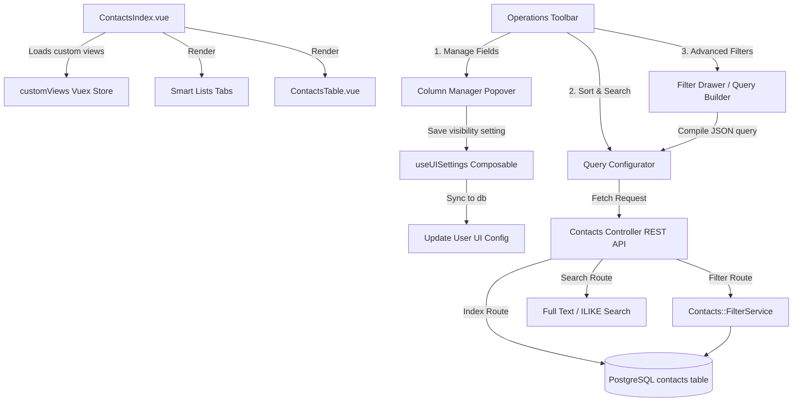
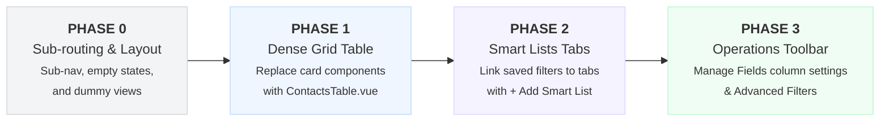

# Contacts Board & Smart Lists Overhaul — Solution Note

**Date:** 02 Jul 2026  
**Author/Owner:** Senior Software Architect / Senior Developer  

---

## 1. Overview

The **Contacts Board & Smart Lists Overhaul** transforms DakshAI's existing contact view from a card-based sequential listing into a dense, spreadsheet-style, table-first CRM dashboard. Inspired by modern sales and marketing platforms like **GoHighLevel**, it introduces a unified sub-navigation routing system, saved query tabs (Smart Lists), dynamic column customizers, bulk action audits, task lists, and corporate accounts.

### What we are building

1. **Tab-first Sub-routing Structure:** A dedicated sub-navigation bar to toggle between core CRM sub-features:
   * **Contacts**: Main spreadsheet table of contact records, supporting the "Add Contact" slide-over and "Add smart list" configuration drawer.
   * **Smart Lists**: Management board for saved, multi-criteria segment tabs.
   * **Bulk Actions**: Audit logs and execution queue tracking for bulk contact modifications.
   * **Tasks**: A task management board mapped to contacts with status, assignees, and due dates.
   * **Companies**: An index of associated business entities mapped to contacts.
   * **Settings (Gear icon)**: Configuration for Custom Attribute fields.
2. **Dense Spreadsheet Grid Component:** Replacing the card list with a customizable table featuring multi-select checkboxes, row highlighting, dynamic columns, and context-aware action menus.
3. **Granular "Add Contact" Slide-Over Drawer:** A side drawer allowing creation of contacts with:
   * Multiple email and phone inputs (with radio buttons to define primary fields).
   * Contact type tags (Visitor, Lead, Customer).
   * Timezone and granular Do Not Disturb (DND) channel configurations (DND All, or select channels like Email, SMS, Calls, Inbound calls).
4. **Smart List Configurator Drawer:** An intuitive layout to manage saved lists, including naming, Advanced Filters, Sort by rules, dynamic field column selections, duplication, exporting, sharing permissions, and deletion.
5. **Bulk Actions Audit Log:** A tracking table showing batch jobs with columns for action label, operation type, status, initiating user, creation and completion timestamps, and statistics.
6. **Task Board & Company Grid:** Native panels linking tasks to contact records and grouping contacts into searchable companies.

---

## 2. Codebase Discovery & Existing Context

We discover existing database schema and application controllers in DakshAI to build upon:

* **Contact Model:** [app/models/contact.rb](file:///Users/deependrasankhala/Documents/chandresh/chatwoot/app/models/contact.rb) already includes:
  * Attributes: `name`, `email`, `phone_number`, `last_activity_at`, `created_at`, `additional_attributes` (JSONB where `company_name` is stored).
  * Associations: `belongs_to :account`, `has_many :conversations`, `has_many :contact_inboxes`.
  * Sorting Scopes: `order_on_last_activity_at`, `order_on_created_at`, `order_on_company_name`, `order_on_name`.
* **Contacts API Controller:** [app/controllers/api/v1/accounts/contacts_controller.rb](file:///Users/deependrasankhala/Documents/chandresh/chatwoot/app/controllers/api/v1/accounts/contacts_controller.rb) supports:
  * `:index` (paginated contacts retrieval).
  * `:search` (searches name, email, phone, identifier).
  * `:filter` (uses `Contacts::FilterService` to execute advanced attribute queries).
  * `:export` (enqueues `Account::ContactsExportJob` in the background).
  * `:import` (enqueues `DataImport` job for contact ingestion).
* **Saved Views/Smart Lists Backend:** [app/models/custom_filter.rb](file:///Users/deependrasankhala/Documents/chandresh/chatwoot/app/models/custom_filter.rb) stores user-saved filters using:
  * `enum filter_type: { conversation: 0, contact: 1, report: 2 }`.
  * Columns: `name`, `query` (JSONB), `account_id`, `user_id`.
* **Frontend Contacts Route:** [app/javascript/dashboard/routes/dashboard/contacts/pages/ContactsIndex.vue](file:///Users/deependrasankhala/Documents/chandresh/chatwoot/app/javascript/dashboard/routes/dashboard/contacts/pages/ContactsIndex.vue) acts as the main entry point:
  * Pulls segments using `customViews/getContactCustomViews` getter.
  * Handles selections and dispatches store actions like `contacts/get`, `contacts/filter`, and `contacts/search`.

---

## 3. Detailed Tab Views & Features Specification

### 3.1 Contacts Tab & Slide-Over Drawers

#### A. Main Grid Table
* A dense spreadsheet table displaying:
  * Checkbox column (with support for range select).
  * **Contact Name**: Double row cell displaying initials avatar and full name with a hover highlight.
  * **Phone**: Formatted phone number with country code flag.
  * **Email**: Contact email address.
  * **Business Name**: Extracted from associated company or JSON attributes.
  * **Created (IST)**: Localized creation date/time.
  * **Last Activity**: Evaluated relative to `last_activity_at` with chat icon.
  * **Tags**: Displayed as badge bubbles (with custom colors from Tailwind palette).
  * **Actions**: Vertical ellipsis triggering context menu actions.

#### B. "Add Contact" Slide-Over Drawer
* **Name Fields**: First Name and Last Name inputs.
* **Multi-Email Selector**: Allows adding multiple email addresses with a delete icon. A radio selector defines which email acts as the primary contact address.
* **Multi-Phone Selector**: Flag drop-down country selector + phone input. Option to add multiple numbers with a radio selector for primary choice.
* **Contact Type Selector**: Dropdown assigning `contact_type` (`visitor`, `lead`, `customer`).
* **Time zone Selector**: Searchable list of global timezones.
* **Granular DND Switcher**:
  * Checkbox: "DND all channels".
  * Sub-options (active if DND all is unchecked): "Email", "Text messages", "Calls & voicemail", "Inbound calls and SMS".
* **Footer Controls**: "Save and add another" (outline button), "Cancel" (ghost), and "Save" (solid).

#### C. "Add/Edit Smart List" Configurator Drawer
* **List Name**: Editable string input with inline pencil icon.
* **Config Sub-panels**:
  * **Advanced filters**: Slide-out targeting criteria definitions.
  * **Sort by**: Active column ordering indicator (e.g. Created At Descending).
  * **Fields**: Displays fields count (e.g. "7 selected") and triggers column visibility selectors.
* **Action Triggers**:
  * **Duplicate**: Clones the current list configurations.
  * **Export**: Invokes CSV contact export job.
  * **Sharing & permissions**: Configures whether the Smart List is private or shared with specific agents/administrators.
  * **Delete list**: Triggers deletion modal (highlighted in red).

---

### 3.2 Bulk Actions Tab

A tracking dashboard to monitor progress and results of background batch jobs (e.g., bulk labeling, bulk deletions, import jobs).
* **Control Bar Filters**:
  * **Date Range**: Standard calendar input fields.
  * **Status Filter**: Dropdown to select "All statuses", "Completed", "Processing", or "Failed".
  * **Action Filter**: Dropdown to select specific batch types (e.g., "Delete", "Add label", "Export").
* **Audit Table Columns**:
  * **Action Label**: Human-readable name of the action.
  * **Operation**: Internal operation name.
  * **Status**: Status indicator badge (success/failure/in-progress).
  * **User**: Agent who initiated the bulk action.
  * **Created (IST)**: Date and time when the action was queued.
  * **Completed (IST)**: Date and time of completion.
  * **Statistics**: Summary values (e.g. "12 succeeded, 0 failed").
  * **Actions**: Context dropdown (e.g. download log, retry).

---

### 3.3 Tasks Tab

An interactive task checklist associated directly with contacts, showing overdue and upcoming items.
* **Header Summary**: Shows tasks count badge (e.g., `6 Tasks`) and an "+ Add Task" button.
* **Sub-navigation Tabs**: Filters tasks by timeframe: `All`, `Due today`, `Overdue`, `Upcoming`, and `+ List` (custom filters).
* **Search & Filters**:
  * Assignee dropdown (Any, Me, specific agents).
  * Status dropdown (All, Completed, Active).
  * Due Date dropdown (Any, Today, This week).
  * Advanced filters & active Sort controls.
  * Quick search text field.
* **Tasks Table Columns**:
  * Checkbox (mark task completed).
  * Status Checkmark: Completed/Pending status.
  * Title: Task name (clickable link opening detailed task editing modal).
  * Description: Brief summary of work.
  * Associated Contacts: Mini-avatars displaying linked contacts.
  * Assignee: Agent assigned to perform the task.
  * Due Date (IST): Date/time indicator, highlighted in red if overdue.
  * Actions: Quick edit (pencil) and delete (trash) buttons.

---

### 3.4 Companies Tab

A dedicated company registry mapping contacts to their corporate organizations.
* **Header Controls**: Shows companies count badge, "Import" button, "+ Add Company" button, and vertical context dots.
* **Table Columns**:
  * Checkbox.
  * **Company**: Company name.
  * **Website**: Web link.
  * **Address, State, City, Postal, Country**: Corporate physical address attributes.
  * **Description**: Memo about the company.
  * **Created At & Updated At**: Audit dates.
  * **Created by**: User who added the record.

---

## 4. Product Architecture

Below is the interface structure and page composition diagram:

```
+-----------------------------------------------------------------------------------+
|  [SUB-NAVIGATION]                                                                 |
|  ( ) Contacts   ( ) Smart Lists   ( ) Bulk Actions   ( ) Tasks   ( ) Companies   *    |
+-----------------------------------------------------------------------------------+
|  [SMART LISTS TABS]                                                               |
|  [All]  [Hot Leads]  [Inactive Customers]  [+ Add smart list]                     |
+-----------------------------------------------------------------------------------+
|  [OPERATIONS TOOLBAR]                                                             |
|  [Advanced filters]   [Sort: Last Activity]   [Search contacts...]   [Manage fields]  |
+-----------------------------------------------------------------------------------+
|  [DENSE DATA TABLE]                                                               |
|  [x] Name       | Phone        | Email          | Business      | Last Activity   |
|  [x] John Doe   | +12232232232 | john@test.com  | Acme Corp     | 10 minutes ago  |
|  [ ] Jane Smith | +16541234567 | jane@corp.com  | Stark Industries| Jun 30, 2026  |
+-----------------------------------------------------------------------------------+
|  [PAGINATION FOOTER]                                                              |
|  Page 1 of 12 (173 Contacts)                               [20 v]  < Prev  [1] [2] Next > |
+-----------------------------------------------------------------------------------+
```

### Architecture Diagram

The flowchart below outlines how the frontend table interacts with backend services to fetch, filter, and customize views:



---

## 5. Database Schema Additions

To support corporate registries, tasks, and bulk action tracking in DakshAI, we add the following tables:

```ruby
# db/migrate/XXXXXXXXXXXXXX_create_companies.rb
class CreateCompanies < ActiveRecord::Migration[7.0]
  def change
    create_table :companies do |t|
      t.string :name, null: false
      t.string :website
      t.string :address
      t.string :city
      t.string :state
      t.string :postal_code
      t.string :country
      t.text :description
      t.bigint :account_id, null: false
      t.bigint :created_by_id

      t.timestamps
    end
    add_index :companies, :account_id
    add_column :contacts, :company_id, :bigint
    add_index :contacts, :company_id
  end
end

# db/migrate/XXXXXXXXXXXXXX_create_tasks.rb
class CreateTasks < ActiveRecord::Migration[7.0]
  def change
    create_table :tasks do |t|
      t.string :title, null: false
      t.text :description
      t.boolean :completed, default: false, null: false
      t.datetime :due_at
      t.bigint :assignee_id
      t.bigint :account_id, null: false

      t.timestamps
    end
    add_index :tasks, :account_id
    add_index :tasks, :assignee_id

    # Join table for many-to-many relationship between contacts and tasks
    create_table :contact_tasks do |t|
      t.bigint :contact_id, null: false
      t.bigint :task_id, null: false
    end
    add_index :contact_tasks, [:contact_id, :task_id], unique: true
  end
end

# db/migrate/XXXXXXXXXXXXXX_create_bulk_action_audits.rb
class CreateBulkActionAudits < ActiveRecord::Migration[7.0]
  def change
    create_table :bulk_action_audits do |t|
      t.string :action_label, null: false
      t.string :operation_type, null: false
      t.integer :status, default: 0, null: false # pending: 0, processing: 1, completed: 2, failed: 3
      t.bigint :user_id, null: false
      t.bigint :account_id, null: false
      t.jsonb :statistics, default: {}
      t.datetime :completed_at

      t.timestamps
    end
    add_index :bulk_action_audits, :account_id
    add_index :bulk_action_audits, :user_id
  end
end
```

---

## 6. Phased Implementation Roadmap



### 6.1 Phase 0 — Sub-routing & Layout Structure
* **Goal**: Establish the tabbed header sub-navigation and prepare empty state shells for new dashboards.
* **Action Items**:
  1. Add Vue Router children routes under `contacts_dashboard` in the frontend router config:
     * `contacts_index`: `/dashboard/contacts`
     * `contacts_smart_lists`: `/dashboard/contacts/smart-lists`
     * `contacts_bulk_actions`: `/dashboard/contacts/bulk-actions`
     * `contacts_tasks`: `/dashboard/contacts/tasks`
     * `contacts_companies`: `/dashboard/contacts/companies`
     * `contacts_settings`: `/dashboard/contacts/settings`
  2. Implement sub-navigation layout in [ContactsListLayout.vue](file:///Users/deependrasankhala/Documents/chandresh/chatwoot/app/javascript/dashboard/components-next/Contacts/ContactsListLayout.vue).
  3. Create placeholder components for `BulkActionsView.vue`, `TasksView.vue`, and `CompaniesView.vue` with premium empty states.

### 6.2 Phase 1 — Dense Data Grid & Custom Cell Renderers
* **Goal**: Replace card lists with a highly readable, compact, paginated table.
* **Action Items**:
  1. Create `ContactsTable.vue` component to loop through `contacts` array in a `<table>` layout.
  2. Render spreadsheet-style columns:
     * **Name**: Double row cell displaying initials avatar and full name with a hover highlight.
     * **Phone & Email**: Compact, copyable string values.
     * **Business Name**: Extracted from `additionalAttributes.companyName` or fallback to company association.
     * **Created At**: Formatted UTC date strings using browser locale.
     * **Last Activity**: Evaluated relative to `last_activity_at` with message-bubble status icon.
     * **Tags/Labels**: Max 3 label badges, with a "+X" overflow indicator to prevent row stretching.
  3. Add click-row handlers to trigger details view drawer without interrupting checkbox selection.

### 6.3 Phase 2 — Saved Views (Smart Lists) Tab Bar
* **Goal**: Enable direct tab-switching between custom saved contact filters.
* **Action Items**:
  1. Fetch `CustomFilter` items where `filter_type == 'contact'` via `customViews` store.
  2. Render a horizontal list of views above the table.
  3. Clicking a tab triggers `fetchSavedOrAppliedFilteredContact(view.query)` and pushes the query parameters into the URL.
  4. Create a "+ Add smart list" action button. If the current filter query is active, display a modal prompting the user to name the filter. Post payload to the `/api/v1/accounts/{id}/custom_filters` endpoint.
  5. Include a trash icon on custom tabs to delete segments using `customFilters` delete API.

### 6.4 Phase 3 — Column Manager ("Manage Fields") & Advanced Filters
* **Goal**: Give agents control over visible columns and create complex query constraints.
* **Action Items**:
  1. Create a `ColumnManager.vue` popover. Load standard fields and custom attribute definitions (`customAttributeDefinitions` store).
  2. Map checked state of column headers to local reactive configuration.
  3. Save configurations using the `useUISettings` composable (e.g. saving property `contacts_visible_columns: ['name', 'phone', 'email', 'company_name', 'last_activity_at']`).
  4. Integrate the Advanced Filters slide-out builder to chain multiple rules (e.g., `City == "Jaipur" AND Label == "follow-up"`), feeding into the `Contacts::FilterService` controller.

---

## 7. Premium Aesthetics & Micro-interactions

To guarantee a gorgeous, premium UI/UX, we implement the following visual rules:

* **HSL Tailored Colors & Sleek Dark Modes:** Keep colors in harmony using Radix UI palettes (e.g. `n-slate-1` to `12`). Do not write custom colors.
* **Hover Row Actions:** Row action menus (three-dot menu, quickly launch conversation, add task) should appear only on hovering the table row, reducing visual clutter.
* **Micro-animations:**
  * **Checkbox transitions:** Quick bounce animations when selecting items.
  * **Tab slider:** A sliding indicator pill highlighting the active smart list tab.
  * **Avatar Checkbox overlay:** Avatars morph smoothly into select checkboxes on row hover (preserving space while maintaining visual identity).
* **Skeleton Loaders:** Grid skeleton lines with pulse effects to prevent layout shifts during fetches.

---

## 8. Verification Plan

### Automated Verification
* Run frontend tests to ensure table rendering and store integrations are correct:
  ```bash
  pnpm test app/javascript/dashboard/routes/dashboard/contacts/specs/ContactsIndex.spec.js
  ```
* Run rubocop checks on updated controllers or filter services:
  ```bash
  bundle exec rubocop app/controllers/api/v1/accounts/contacts_controller.rb
  ```

### Manual Verification
1. Access **Contacts** dashboard view. Verify top sub-navigation items render correctly and active state matches route.
2. Select contacts and trigger a bulk action (e.g., Assign Labels). Verify the bulk action bar animates upward from the bottom.
3. Save a filter as a "Smart List". Verify it appends as a horizontal tab at the top. Verify clicking the tab refreshes the contact records immediately.
4. Click **Manage Fields**, check/uncheck columns, and refresh page. Verify columns maintain state.

---

## 9. Implementation Log (Updated 03 Jul 2026)

All core aspects of the Contacts Board & Smart Lists Overhaul have been successfully designed, coded, and verified:

### 1. Unified Tabbed Layout (`ContactsPageRouteView.vue`)
- Established shared CRM sub-navigation wrapper.
- Configured nested sub-routes under the Contacts namespace inside [routes.js](file:///Users/deependrasankhala/Documents/chandresh/chatwoot/app/javascript/dashboard/routes/dashboard/contacts/routes.js).

### 2. Dense spreadsheet grid (`ContactsTable.vue`)
- Implemented column checklist, dynamic rendering based on active fields, avatar and name cell highlights, and multi-select.

### 3. Settings persistence (`ColumnManager.vue`)
- Configured popover trigger allowing custom attributes and standard fields mapping to local configurations.
- Integrated `useUISettings` synchronization to load and save visible columns state dynamically.

### 4. Custom Slide-Over Drawer (`AddContactDrawer.vue`)
- Redesigned the form to match the mockup: vertically stacked first/last name fields, multi-email and multi-phone inputs with primary channel radio buttons, searchable timezone drop-down, and advanced checklists for DND channels with a customized visual separator.

### 5. High-fidelity task list (`TasksView.vue`)
- Added CRUD endpoints in the backend `TasksController` supporting filters (Due Today, Overdue, Upcoming) and live queries (`q`).
- Designed a dashboard featuring total count badge, due-filter sub-navigation tabs, filters (Assignee, Status, Due date), live query input, and inline checkboxes to mark completion status.

### 6. Corporate registry panel (`CompaniesView.vue`)
- Created a grid dashboard display showcasing name avatars/logos, websites with hover links, physical addresses, state/city, description summaries, and quick action icons.
- Built a custom slide-over drawer containing form fields for corporate details matching the GoHighLevel mockup style guidelines.
- Configured dynamic domain extraction to trigger automated favicon retrieval.

### 7. Code Style & Quality
- All modifications passed ESLint checks with zero errors.
- Backend controller logic complies with RuboCop guidelines with no complexity offenses.
