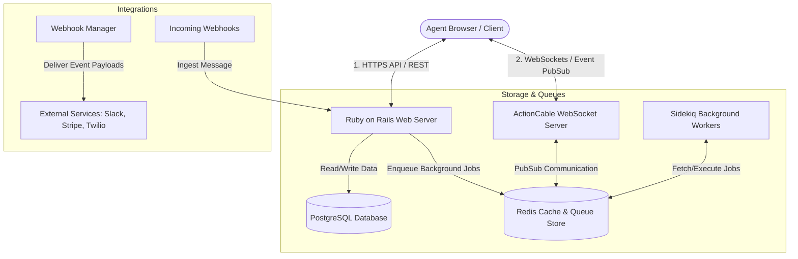
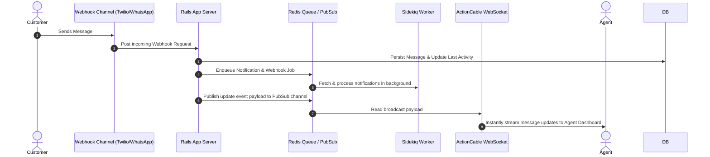

# DakshAI Project System Architecture Specification

This document details the complete system architecture of the **DakshAI** platform, explaining how the backend, frontend, worker queues, and real-time synchronization layers interact.

---

## 1. System Architecture Overview

DakshAI is built on a **decoupled monolith** pattern. The backend handles API request routing, database persistence, and external integrations, while the frontend runs as a Single Page Application (SPA) inside the client browser. Real-time updates are driven by a WebSocket subscription layer.



---

## 2. Directory Structure & Code Layout

DakshAI organizes its open-source (OSS) core and proprietary Enterprise Edition (EE) code using a layered layout:

```
├── app/                        # OSS Ruby on Rails Backend Core
│   ├── controllers/            # HTTP controllers (API endpoints & widgets)
│   ├── models/                 # Database schema models & associations
│   ├── workers/                # Sidekiq job workers (e.g. EmailDeliveryWorker)
│   └── views/                  # Rails views and Jbuilder JSON templates
├── enterprise/                 # Enterprise Edition Overlay
│   ├── app/                    # EE Controllers, Models, and Views overriding/extending OSS
│   └── config/                 # EE Routing and configurations
├── config/                     # Backend routes, database setup, and locales
├── db/                         # Database schema configuration and migrations
├── app/javascript/             # Vue.js Frontend Application
│   ├── dashboard/              # Agent portal SPA (Vue 3 / Vite)
│   │   ├── api/                # API client Axios wrappers
│   │   ├── components-next/    # Shared modern UI design library
│   │   ├── routes/             # Frontend page router configs and views
│   │   └── store/              # Vuex global state management modules
│   └── widget/                 # Customer-facing live chat widget SPA
```

---

## 3. Technology Stack & Component Details

### 3.1 Backend Layer (Ruby on Rails)
* **Application Framework**: Ruby on Rails (API-first mode for the dashboard, view-rendering mode for administration portals).
* **Database (PostgreSQL)**: Handles transactional persistence of accounts, users, contacts, conversations, and custom attributes.
* **Background Jobs (Sidekiq & Redis)**: Offloads asynchronous operations—such as sending emails, pushing webhooks, syncing contacts, and resolving social avatars—to dedicated background workers.
* **Real-time Sync (ActionCable)**: A built-in WebSocket framework that subscribes agents to real-time events (e.g., `message.created`, `conversation.status_changed`), avoiding long polling.
* **Enterprise Extension Pattern**: DakshAI prepends Enterprise logic onto OSS models and controllers dynamically at runtime (`prepend_mod_with` pattern) rather than duplicating codebases.

### 3.2 Frontend Layer (Vue.js 3 / Vite / Tailwind)
* **View Layer**: Built using Vue 3 and the **Composition API** (packaged via Vite).
* **State Management (Vuex)**: Centralized state store divided into modular domains (e.g., `agents`, `contacts`, `conversations`).
* **Design System (Tailwind CSS)**: Fully styled using Tailwind utility classes, adhering to Radix UI design tokens (e.g., `n-slate-1` to `12`) to ensure dark mode support.

---

## 4. Real-time Event Lifecycle Flow

The sequence diagram below demonstrates how an incoming customer message propagates through the system to update the agent's dashboard in real time:



---

## 5. Architectural Advantages & Disadvantages

### 5.1 Advantages (Pros)

| Advantage | Technical Explanation |
| :--- | :--- |
| **Instant Real-Time Sync** | The ActionCable + Redis PubSub model ensures that updates (such as message deliveries or agent status toggles) are streamed to agents within milliseconds, creating a seamless chat experience. |
| **Clean Parity with Enterprise** | The dynamic model/controller inheritance overlay (`prepend_mod_with`) allows DakshAI to maintain a single repository while cleanly isolating Enterprise features (e.g., SLAs, Companies, Teams) without dirtying the open-source codebase. |
| **Robust Background Processing** | Offloading heavy work (like integrations, bulk operations, or emails) to Sidekiq keeps the main Rails web servers free to handle active HTTP requests. |
| **Centralized State Management** | The Vuex frontend architecture aggregates all incoming WebSocket events and API responses into a single source of truth, preventing desynchronized layout states. |

### 5.2 Disadvantages (Cons)

| Disadvantage | Technical Explanation |
| :--- | :--- |
| **State Synchronization Complexity** | Handling real-time WebSocket events alongside standard REST API pagination requests can lead to synchronization conflicts or duplicate records if frontend mutations are not carefully grouped. |
| **High Memory Footprint** | Running Rails, Sidekiq, Redis, PostgreSQL, and ActionCable simultaneously demands significant server memory, which increases hosting and maintenance costs for self-hosted installations. |
| **Redis Dependency Risks** | If Redis runs out of memory or crashes, ActionCable streaming, Sidekiq job processing, and user caching fail immediately, disabling the real-time aspects of the platform. |
| **Monolithic Release Coupling** | Since the backend and frontend SPA are bundled in the same Ruby on Rails repository, frontend changes require deploying the entire monolithic container, limiting independent client releases. |
