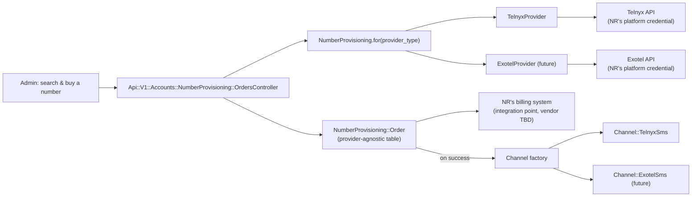
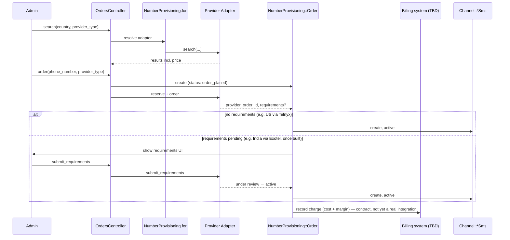

# Architecture Design — Number Provisioning & Reseller Platform (Any Provider)

> Notion note: same publishing blocker as the other Telnyx docs — this workspace has used all its free blocks and needs a plan upgrade before new Notion pages can be created. Follows the NewRelay HQ "Architecture & System Design Template — Complex / Cross-Module."
>
> **This is the document the Implementation Spec has been asking for.** [telnyx-virtual-number-purchase-implementation-spec.md](telnyx-virtual-number-purchase-implementation-spec.md) flagged three times (its header, and Open Questions 11 and the PRD-19 note) that its "no Architecture Design needed" judgment call had stopped holding — first PRD-19's reseller/billing model, then the two live-tested Telnyx blockers, then the provider-abstraction pattern itself. This formalizes that work properly instead of continuing to patch the spec piecemeal. The spec's §2b (interface sketch), §2c (Exotel), §2d (Plivo, ruled out) were real research and are folded in below, not discarded.

## Header

| Field | Value |
|---|---|
| Status | Draft |
| Technical owner | TBD |
| Reviewers | TBD |
| Source PRD | [telnyx-twilio-parity-frd.md](telnyx-twilio-parity-frd.md) §6a, PRD-18/PRD-19 |
| Technical Implementation Spec | [telnyx-virtual-number-purchase-implementation-spec.md](telnyx-virtual-number-purchase-implementation-spec.md) — partially superseded by this document, see note above |
| Related ADRs | None yet — three candidates identified in §12 |
| Last updated | 2026-09-25 |

## 1. Context & problem

PRD-19 (FRD §6a, confirmed 2026-09-24) committed to a **reseller model** for purchased numbers: NR holds its own provider account(s), marks up the wholesale cost, and bills the customer through NR's own subscription system — the customer never touches the provider directly. Separately, live testing against a real Telnyx account found two blockers a reseller platform can't route around by trying harder: Telnyx has no SMS-capable numbers in India at all (confirmed against Telnyx's own product announcement, not just the API), and the test account hit an order cap that didn't clear even after deleting the existing order. Checking two India-capable alternatives (Exotel, Plivo) confirmed one is a real fit with a caveat (Exotel: two-way SMS works, but inbound requires a manual account-manager enablement step) and one is not a fit at all (Plivo: outbound-only in India, ruled out).

Those three facts together — reseller billing, a provider with a real capability gap, a real second provider with a different shape — mean this can no longer be designed as "a Telnyx integration." It has to be designed as **a provisioning platform that can resell numbers from more than one provider**, with Telnyx as the first, proven case and Exotel as the second, partially-researched one. That's the system this document defines.

## 2. Scope, constraints & non-goals

**Systems/modules affected:** a new provider-agnostic provisioning layer (`NumberProvisioning::*`), one new database table, provider-specific Channel models (existing `Channel::TelnyxSms`, a future `Channel::ExotelSms`), a new platform-credential storage mechanism, one controller, one set of provider-specific webhook routes, one background job, the frontend purchase flow.

**Hard constraints:**
- Every provider adapter implements the same interface — callers (controller, job, frontend contract) never branch on provider type.
- NR holds its own credentials per provider (reseller model) — these are platform secrets, not customer-supplied, and must never be exposed to a customer-facing API response.
- Chatwoot's existing one-table-per-channel-type convention (`Channel::TwilioSms`, `Channel::Whatsapp`, etc.) is **not** fought here — see §6 for why the provisioning/order table stays separate from the channel table.
- BYO Telnyx (SMS/WhatsApp/Voice elsewhere in the FRD) is unaffected — this reseller platform is additive, a second, parallel path, not a replacement for BYO.

**Explicit non-goals:**
- Deciding NR's actual billing/subscription system (Stripe or otherwise) — unidentified as of this document; the billing integration point is defined as a contract (§7), not implemented against a specific vendor.
- Building the Exotel or Plivo adapters to completion — Plivo is ruled out (§11); Exotel is scoped as the second adapter but not fully spec'd here (its exact compliance-application flow, DLT registration API shape, and account-manager onboarding process are open, §15).
- A general "any CPaaS in the world" plugin system. This is built for the providers actually evaluated (Telnyx, Exotel) plus a documented extension point — not a marketplace.

## 3. Current state

Nothing production-grade exists yet. What exists is research and a first-pass sketch, all inside the (now partially superseded) Implementation Spec: Telnyx-specific services (`Telnyx::NumberSearchService`, `NumberReservationService`, `NumberOrderService`, `RequirementSubmissionService`, `WebhookSetupService`, `RegulatoryRequirementLookupService`) built and verified against Telnyx's real gem source and, for search, live-tested against a real Telnyx account. A `NumberProvisioning::Provider` interface and `TelnyxProvider` adapter were sketched (spec §2b) but not decided as the final data-layer shape — that decision is made here.

Separately, this codebase already has a precedent for platform-level (not per-customer) credentials: `Voice::Provider::Twilio::RecordingAttachmentService` reads `ENV.fetch('OPENAI_API_KEY', nil) || GlobalConfig.get_value('CAPTAIN_OPEN_AI_API_KEY')` for optional call transcription — a real, existing pattern for "NR's own secret, not the customer's," confirmed by the earlier codebase deep-read. This architecture reuses that pattern rather than inventing a new one.

## 4. Proposed architecture



### Component responsibilities

| Component | Owns | Does not own | Key dependencies |
|---|---|---|---|
| `NumberProvisioning::Provider` (interface) | The contract every adapter implements: `search`, `reserve`, `order`, `lookup_requirements`, `submit_requirements`, `configure_webhook` | Any provider-specific behavior | — |
| `NumberProvisioning::TelnyxProvider` / `::ExotelProvider` | Translating the interface into each provider's real API calls | Order/billing state, channel creation | Telnyx gem / Exotel REST client, NR's platform credential for that provider |
| `NumberProvisioning::Order` (new table, §6) | The purchase transaction itself — status, cost, margin, billing reference — independent of which provider or which eventual channel type | The channel record itself | `NumberProvisioning::Provider` |
| Provider-specific `Channel::*Sms` | The actual working inbox channel, once the order is active — same role `Channel::TwilioSms` plays today | Purchase/billing history | `NumberProvisioning::Order` (created from it, not the reverse) |
| Platform credential store | NR's own per-provider API keys (reseller model) | Customer-supplied BYO credentials (untouched, different code path) | `GlobalConfig`, existing pattern |
| Billing integration point | Recording the margin/charge against the customer's NR subscription | Not yet decided which system — this is a contract, not an implementation (§7, §15) | Unidentified |

## 5. Critical flows

**Purchase, provider-agnostic:**



## 6. Data architecture & database decisions

| Decision | Choice | Reason | Consequence |
|---|---|---|---|
| Where does the provisioning/order state live? | **New table, `number_provisioning_orders`, provider-agnostic** — not columns bolted onto `channel_telnyx_sms` | The Implementation Spec's draft schema put `provisioning_status`, `regulatory_requirements`, etc. directly on the Telnyx channel table. That doesn't generalize — a second provider would need its own copy of the same columns on its own channel table. Pulling this into one shared table is what actually makes "any provider" true, not just the service-layer interface. | The channel record is only created once an order reaches `active` — before that, only the `Order` row exists. Code that assumes every channel has a working `phone_number` from creation is wrong; that was already true under the Telnyx-only design too (spec §3), just worth restating here as the general rule. |
| Does the Channel table itself need to generalize (one polymorphic table for all provider channels)? | **No.** Keep `Channel::TelnyxSms`, add `Channel::ExotelSms` as its own table when built. | Chatwoot's existing convention is one table per channel type (Twilio, WhatsApp, FacebookPage, ...). Fighting that grain to build one mega provider-agnostic channel table is exactly the kind of premature, invasive schema change this document's own non-goals rule out. | Adding a third provider still means a new Channel table + model, same cost every provider add has always had in this codebase — the *provisioning* layer is what's reusable, not the channel storage. |
| Platform credentials | `GlobalConfig` (existing pattern, confirmed precedent: `CAPTAIN_OPEN_AI_API_KEY`) — one key per provider, e.g. `TELNYX_RESELLER_API_KEY`, `EXOTEL_RESELLER_API_KEY` | Reuses a real, already-proven mechanism in this codebase for "NR's own secret" rather than inventing encrypted-column storage for a single platform-wide value | Rotation/access is whatever `GlobalConfig`'s existing operational story is — not re-litigated here |

```ruby
create_table :number_provisioning_orders do |t|
  t.bigint :account_id, null: false                # the NR customer account buying the number
  t.string :provider_type, null: false              # 'telnyx' | 'exotel' | ...
  t.string :provider_order_id                       # external order/reference id
  t.string :phone_number
  t.string :country_code, null: false
  t.string :status, null: false, default: 'search_pending'
  # search_pending | order_placed | requirements_pending | requirements_under_review
  # | requirements_rejected | active | failed | cancelled
  t.jsonb :regulatory_requirements, default: {}
  t.datetime :requirements_deadline_at
  t.integer :provider_cost_cents                    # what NR actually pays the provider
  t.integer :margin_cents                           # NR's markup, snapshotted at purchase time
  t.string :billing_reference                       # opaque pointer into NR's billing system, contract only
  t.string :provisioning_error
  t.references :channel, polymorphic: true, null: true  # set once the channel is created
  t.timestamps
end
add_index :number_provisioning_orders, :account_id
add_index :number_provisioning_orders, [:provider_type, :provider_order_id], unique: true, where: 'provider_order_id IS NOT NULL'
```

## 7. API, event & integration contracts

| Interface | Producer / caller | Consumer / owner | Auth / scope | Idempotency | Failure behaviour |
|---|---|---|---|---|---|
| `NumberProvisioning::Provider` (internal Ruby interface) | Controllers, jobs | Provider adapters | N/A (in-process) | Adapter-specific | `NotImplementedError` if an adapter is incomplete — fails loud, not silently |
| Purchase API (`Api::V1::Accounts::NumberProvisioning::OrdersController`) | Admin frontend | `NumberProvisioning::Order` + adapter | Admin-only, same Pundit pattern as existing channel controllers | Client `Idempotency-Key` header, per-order | Provider error → `Order#status = 'failed'`, surfaced with the provider's own message |
| Provider webhooks (one route family per provider, e.g. `/telnyx/number_order_status`, future `/exotel/number_order_status`) | Provider | `Order` status transitions | Signature-verified per provider's own scheme (Telnyx: Ed25519; Exotel: TBD, not yet researched) | Idempotent by `provider_order_id` | Invalid signature → reject, log distinctly (Voice Architecture Design's established pattern) |
| **Billing integration point** | `Order` reaching `active` | NR's billing system | **Not yet defined — contract only.** Expected shape: something is told "charge account X, `provider_cost_cents + margin_cents`, reference `billing_reference`" — the actual vendor/API is unidentified (FRD Open Question 10) | Must be idempotent — an order transitioning to `active` should never double-charge on a webhook retry | Undefined until the vendor is known; flagged as a real risk in §9 |

## 8. Authorization, security & tenant isolation

- **Platform credentials are the single highest-blast-radius secret this document introduces.** One Telnyx key (or Exotel key) now acts on behalf of every NR customer using the reseller flow — compromise affects everyone, not one customer's own account, the inverse of BYO's isolation properties. `GlobalConfig` storage inherits whatever access control already exists there; this document doesn't invent new protection beyond using an existing mechanism, and that's worth a second look during review, not assumed sufficient by default.
- **Tenant isolation is enforced entirely in NR's own code**, not by any property of the provider account — Telnyx/Exotel see one NR-owned account holding numbers for many different customers, so every query against `number_provisioning_orders` must scope by `account_id` explicitly, the same discipline already established for `Call` lookups in the Voice Architecture Design.
- **Webhook auth differs per provider** (Ed25519 for Telnyx, unconfirmed for Exotel) — the webhook controller for each provider owns its own verification, not shared logic, since the schemes aren't interchangeable.
- **Billing reference is opaque** — `Order#billing_reference` should be treated as a pointer, not a place to store anything about the payment method itself.

## 9. Failure modes & reliability

| Failure | User/system impact | Detection | Fallback / recovery |
|---|---|---|---|
| Provider API failure mid-purchase (any provider) | Order stuck or `failed`, no channel created | Provider error response, or poll-job timeout | `Order` stays queryable in `failed` state, admin can retry with a new order — no orphaned partial state, since the channel isn't created until `active` |
| **Billing integration fails or doesn't exist yet** | An order could reach `active` and create a working channel with no corresponding charge recorded | Not yet designed — this is a real gap, not just an edge case, since the vendor itself is unknown | Until a real billing system is wired in, this architecture should **not** be used to actually activate paid production orders — the contract in §7 is a placeholder, not a working safeguard |
| Duplicate webhook delivery (any provider) | Double-processing a status transition | Idempotent lookup by `provider_order_id` | Standard terminal-state-is-sticky guard, same pattern already proven in the Voice work |
| A provider's adapter is incomplete (e.g. `ExotelProvider#reserve` raises `NotImplementedError` because Exotel's reservation concept was never confirmed to exist) | Purchase flow breaks loudly for that provider | Exception surfaces immediately, not swallowed | Don't route real traffic to a provider whose adapter isn't fully implemented — feature-flag per provider, not just per feature |

## 10. Performance & scalability

Not material — same low-frequency, admin-driven action as the rest of this feature area. No change from the Implementation Spec's assessment.

## 11. External dependencies

| Provider | Status | Notes |
|---|---|---|
| **Telnyx** | Search confirmed live-working. Reservation and order both blocked by account-tier limits on the account tested — not confirmed to complete a purchase end-to-end on any account yet. No SMS capability in India at all (confirmed, not account-specific). | First adapter, most mature, still has open blockers (FRD Open Questions 15, 16) |
| **Exotel** | Research-only, one docs pass deep. Confirmed two-way SMS capability for India exists, gated behind manual account-manager enablement for inbound. Search/order API shape confirmed at the docs level, not live-tested. Reservation concept, DLT registration API shape, and regional endpoint choice (Singapore vs. Mumbai cluster) all unconfirmed. | Second adapter, not yet built |
| **Plivo** | Checked and ruled out for the India-SMS use case (inbound not supported) | Not building an adapter for this use case |
| **NR's billing system** | Unidentified | Blocks turning §7's billing contract into a real integration |

## 12. Architecture decisions & alternatives

| Decision | Options considered | Chosen approach | Why | ADR required? |
|---|---|---|---|---|
| Provisioning state storage | (A) Provider-agnostic `number_provisioning_orders` table. (B) Duplicate provisioning columns on each provider's channel table (the Implementation Spec's original design). | (A) | (B) doesn't generalize — it was discovered to be wrong specifically because "any provider" is now a real requirement, not hypothetical | No — corrects an early draft, doesn't reverse a shipped decision |
| Channel storage | (A) Keep one table per provider (`Channel::TelnyxSms`, `Channel::ExotelSms`, ...). (B) One polymorphic provider-agnostic channel table. | (A) | Matches this codebase's existing, deeply-embedded convention; (B) would be a much larger, riskier change to a pattern used across every existing channel type, not just this feature | **Yes if ever revisited** — but not chosen here, so no ADR needed now |
| Platform credential storage | (A) `GlobalConfig` (existing pattern). (B) New encrypted-column mechanism specific to this feature. | (A) | Reuses a real, proven precedent (`CAPTAIN_OPEN_AI_API_KEY`) instead of inventing parallel infrastructure for the same kind of secret | No — additive use of an existing pattern |
| Which second provider to build | Exotel vs. Plivo vs. others unresearched | Exotel (pending the account-manager gate being acceptable) | Plivo concretely ruled out (no inbound SMS); Exotel is the only checked candidate that actually solves the problem | **Yes — written:** [adr-exotel-india-sms-provider.md](adr-exotel-india-sms-provider.md), Status: Proposed (gated on Product's India-SMS-scope decision, FRD Open Question 14) |

## 13. Compatibility, rollout & rollback architecture

Feature-flagged per provider, not just per feature — Telnyx and Exotel (once built) should be independently enable-able, since Telnyx's blockers (account tier, India) and Exotel's (account-manager gate) are unrelated and may resolve on different timelines. All schema is additive (`create_table`, no destructive migration on existing tables). Rollback is flag-off; an `Order` stuck mid-flow when a flag is disabled stays as historical record, same rollback posture already established for the Voice work.

**Explicit gate before any provider goes live for real customers:** the billing integration point (§7) must be a working implementation, not the placeholder contract this document defines — activating paid orders without it is a real risk (§9), not a theoretical one.

## 14. Observability

- Every `Order` state transition logged/tagged with `account_id`, `provider_type`, `provider_order_id` — extends the `channel_provider` tagging convention already established in the FRD.
- Cost/margin tracking per order (`provider_cost_cents`, `margin_cents`) is itself an observability requirement, not just a data field — this is how the FRD's cost-savings hypothesis (Appendix B) actually gets measured once real orders exist, and how anyone would notice if the reseller model isn't actually profitable per-provider.
- Distinct alerting for webhook signature failures, per provider (same principle as the Voice Architecture Design, applied per-adapter here since each provider's scheme differs).

## 15. Risks & open questions

| Risk / question | Owner | Resolution / mitigation | Status |
|---|---|---|---|
| NR's billing system is unidentified — the entire billing contract in §7 is a placeholder | TBD | Needs Product/Eng to name the actual system before this architecture can support real paid orders (FRD Open Question 10) | Open, blocking for production use |
| Telnyx account-tier blockers (order cap, reservation gate) — root cause and required plan tier unconfirmed | TBD | FRD Open Question 16 | Open |
| Exotel's reservation concept, DLT API shape, and regional endpoint choice are unconfirmed | TBD | Needs the same live-testing treatment Telnyx got, once an Exotel account is available | Open |
| Exotel's manual account-manager gate for inbound SMS — is this acceptable for NR's onboarding story, or a dealbreaker? | Product | FRD Open Question 14(c) | Open |
| Margin config (flat vs. percentage, set where) | Product | FRD Open Question 11 | Open |
| Number lifecycle on customer subscription lapse/cancellation | Product | FRD Open Question 12 | Open |
| Should the Channel-table-per-provider decision (§12) be revisited if a third or fourth provider is ever added? | TBD | Not blocking now — revisit only if it actually happens | Deferred, not urgent |

## 16. Approval

| Gate | Who | Date |
|---|---|---|
| Architecture approved | TBD | TBD |
