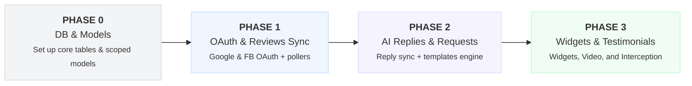
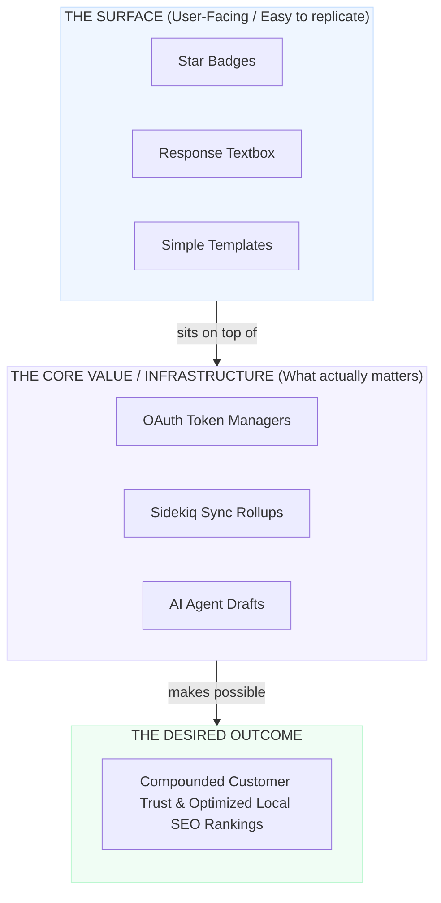
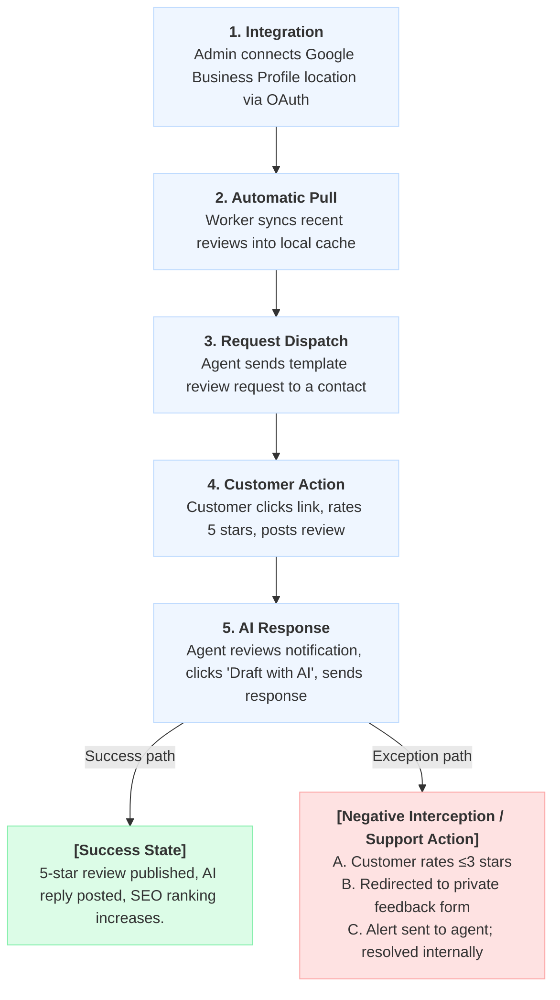

# Reputation Management Module — Solution Note

**Date:** 09 Jul 2026  
**Author/Owner:** Lead Product Architect / Developer

---

## 1. Overview

The **Reputation Management** module lets businesses (`accounts`) collect, monitor, and respond to customer reviews from Google Business Profile (GBP) and Facebook, request reviews via automated/manual SMS and Email templates, and showcase their social proof on their website using embeddable widgets. Additionally, it intercepts low ratings (1-3 stars) for private resolution and facilitates video testimonials collection.

### What we are building

* **Client/Dashboard Workspace**: An interface integrated into the Newrelay dashboard (using the approved vertical navigation sidebar from Tab 2) allowing business owners to respond to reviews, trigger campaigns, and configure settings.
* **Review Widgets & Collectors**: Public-facing embeddable JS widgets (carousel/grid) to showcase star ratings, plus custom video review collector pages.
* **Integrations Engine**: OAuth connection portals for Google Business Profile and Facebook Pages, backed by Sidekiq periodic pollers.

### Phased Roadmap



* **Phase 0 Outcome:** Core database migrations and ActiveRecord models successfully defined and verified.
* **Phase 1 Outcome:** Functional read-only reviews dashboard showing synced listings.
* **Phase 2 Outcome:** Ability to compose/AI-draft replies and dispatch automated SMS/Email request templates.
* **Phase 3 Outcome:** Live embeddable widgets, negative review private routing, and video collector portals.

---

## 2. Business Understanding

| Core Rule / Constraint | Business Implication / Rationale |
| :--- | :--- |
| **Multi-Tenancy** | Every review, integration, template, and request MUST be scoped by `account_id` (tenant) to prevent data leaks. |
| **Encrypted Credentials** | Google and Facebook access/refresh tokens must be encrypted in the database (`Rails.encrypts`) to prevent exposure. |
| **Negative Interception** | Ratings $\le 3$ stars are routed to private feedback lists, allowing businesses to resolve customer complaints before they affect public SEO rankings. |

---

## 3. The Core Problem We Are Solving

Many businesses struggle to maintain active customer review streams, leading to low local SEO search rankings and drop-offs. Manually managing replies across Google Maps and Facebook Pages is highly inefficient. 



---

## 4. Product Architecture Block Diagram

```
                  ┌──────────────────────────────────────────────┐
                  │              [USER FRONTEND]                 │
                  │             (Newrelay Dashboard)             │
                  └──────────────┬────────────────┬──────────────┘
                                 │                │
                  ┌──────────────▼──────┐  ┌──────▼──────────────┐
                  │   Public Widgets    │  │  Sidebar Navigation │
                  │  (Grid / Carousel)  │  │  (Overview/Reviews) │
                  └──────────────┬──────┘  └──────┬──────────────┘
                                 │                │
   ┌─────────────────────────────┼────────────────┼──────────────────────────────┐
   │                             ▼                ▼                              │
   │                 ┌────────────────────────────────────────┐                  │
   │                 │             [BACKEND API]              │                  │
   │                 │   (Reputation Controllers & Workers)   │                  │
   │                 └────────────────────────────────────────┘                  │
   └─────────────────────────────────────┬───────────────────────────────────────┘
                                         │
 ┌───────────────────────────────────────▼───────────────────────────────────────┐
 │                     BEHIND THE SCENES / SHARED SERVICES                       │
 │    [Sidekiq] · [ActiveRecord / PG] · [OpenAI/Claude API] · [OAuth Providers]  │
 └───────────────────────────────────────────────────────────────────────────────┘
```

1. **User Frontend**: Houses public embed widgets (Grid/Carousel formats) and the private sidebar accordion menu containing the 8 Reputation Management sections.
2. **Backend API**: Processes sync polling, replies publishing, and triggers review request webhook notifications.
3. **Behind the scenes**: Encrypted token storage, Sidekiq background workers, and AI completion services.

---

## 5. User Roles

* **Business Owner / Account Admin** *(Uses Dashboard Interface)*
  * Installs Google Business Profile & Facebook Pages integrations.
  * Manages settings, default templates, and widget configurations.
  * Accesses analytics.
* **Support Agent** *(Uses Dashboard Interface)*
  * Reviews incoming reviews, resolves feedback, and drafts responses (manually or via AI).
  * Sends manual review/video testimonial requests.
* **End Customer** *(Uses Widgets/Collector Pages)*
  * Submits ratings, public reviews, or records/uploads video testimonials.

---

## 6. The Happy Path — Sequential User Journey



---

## 7. Capability Matrix by Phase

| Capability / Feature Area | Phase 0 | Phase 1 | Phase 2 | Phase 3 |
| :--- | :---: | :---: | :---: | :---: |
| **Migrations & Models** | Yes | Yes | Yes | Yes |
| **GBP & Facebook OAuth** | — | Yes | Yes | Yes |
| **Periodic Reviews Polling** | — | Yes | Yes | Yes |
| **Responses / AI reply drafting** | — | — | Yes | Yes |
| **SMS/Email Templates & requests** | — | — | Yes | Yes |
| **Grid/Carousel Widgets** | — | — | — | Yes |
| **Negative Interceptor Routing** | — | — | — | Yes |
| **Video Testimonials Builder** | — | — | — | Yes |

---

### 7.1 Phase 0 — DB & Models (Multi-Tenancy)
* **Goal**: Establish the secure Postgres database tables and Rails ActiveRecord definitions.
* **What gets built**: Migrations and active models for `Integration`, `Review`, `ReviewReply`, `Template`, `ReviewRequest`, `Widget`, and `FeedbackSubmission`.
* **What does NOT get built in Phase 0**: OAuth controllers, sync pollers, widgets, and frontend interfaces.

### 7.2 Phase 1 — Integrations & Sync
* **Goal**: Enable Google and Facebook page linking and initiate background pulling of reviews.
* **What gets built**: OAuth connection callback flows, Sidekiq synchronization workers.

### 7.3 Phase 2 — Responses & Outbound Requests
* **Goal**: Enable reply publishing (including AI drafting) and dispatching request templates.
* **What gets built**: AI prompts service, Google/Facebook reply publisher job, email/SMS template composers.

### 7.4 Phase 3 — Public Widgets & Video Testimonials
* **Goal**: Enable public review display widgets, private routing, and video collector portals.
* **What gets built**: Embed widget generator, 1-3 star feedback routing interceptor, video testimonial recording setup pages.

---

## 8. Complete Solution Architecture

Once all phases are complete:
* **The Newrelay App**: Integrates the vertical navigation sidebar accordion, holding Onboarding checklists, Responses feeds, templates dispatch logs, and settings tabs.
* **Public Testimonials**: Web pages displaying carousel review widgets and smartphone testimonial recorders.
* **API Worker Layer**: Background workers executing cron sync tasks, OAuth token renewals, and NLP sentiment analysis.

---

## 10. Conclusion

This phased approach guarantees early value validation (database and reviews polling setup first), limits scope creep, ensures OAuth security, and scales up to a complete Reputation Management solution.

---

## 11. Step-by-Step Implementation Approach

Below is the step-by-step build sequence that we will follow to implement the Reputation Management module:

### 🗄️ Phase 1: Database & Models (Multi-Tenancy)
1. **Migrations**: Create core tables scoped by `account_id` for multi-tenant data isolation:
   - `reputation_integrations`: Credentials for Google Business Profile and Facebook Pages.
   - `reputation_reviews`: Cache of customer reviews (ratings, text, sentiment, platform source).
   - `reputation_review_replies`: Tracks business responses synced to external APIs.
   - `reputation_templates`: Outbound SMS and Email request templates.
   - `reputation_review_requests`: Log of sent templates and click states.
   - `reputation_widgets`: Website reviews display configurations.
   - `reputation_feedback_submissions`: Intercepted private surveys.
2. **Models**: Write Active Record models with validations, associations, and standard Rails `encrypts` declarations to secure OAuth tokens.

### 🔌 Phase 2: Integrations & Background Sync
1. **OAuth Callbacks**: Set up authentication callback controllers for Google Business Profile and Facebook Pages.
2. **Sidekiq Sync Jobs**: Implement background workers to periodically pull new customer reviews and cache them locally in `reputation_reviews`.

### 💬 Phase 3: Responses & AI Drafting
1. **Reviews Feed API**: Backend routes and controller actions to fetch cached reviews and submit replies.
2. **AI Reply Service**: Connect the "Draft with AI" button action to the existing LLM integration to auto-generate replies.

### ✉️ Phase 4: Templates & Outbound Requests
1. **Request Templates**: Implement customized SMS and Email templates with dynamic merge fields (e.g. `{{contact.name}}`, `{{review_link}}`).
2. **Funnels Tracker**: Add tracking tokens to outbound links to monitor delivery states (Sent → Delivered → Clicked → Completed).

### 📹 Phase 5: Video Testimonials & Public Widgets
1. **Video Collector Wizard**: Setup page layout configurator to let users construct the video recording prompt page (Welcome, spokesperson upload, attribution).
2. **Review Widgets**: Code dynamic carousel/grid website widgets with custom rating filters.
3. **Private Interceptor**: Route $\le 3$ star widget scores to private customer feedback logs rather than public review portals.

### 🎨 Phase 6: Frontend Sidebar Navigation & Views
1. **Sidebar Accordion**: Integrate the collapsible left vertical sidebar submenu matching the Tab 2 layout standard.
2. **Sub-Menu Views**: Code each interactive dashboard view (Overview, Reviews, Requests, Video Testimonials, Widgets, Listing, GBP Operations, Settings).
