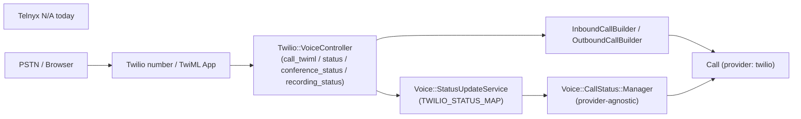
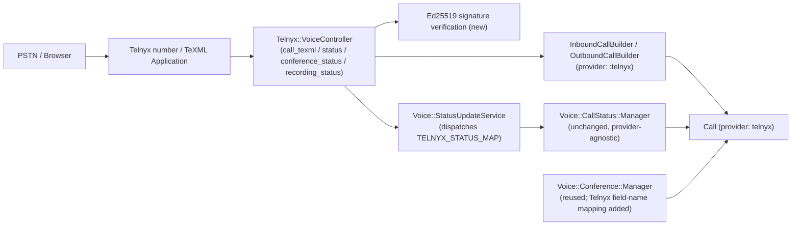
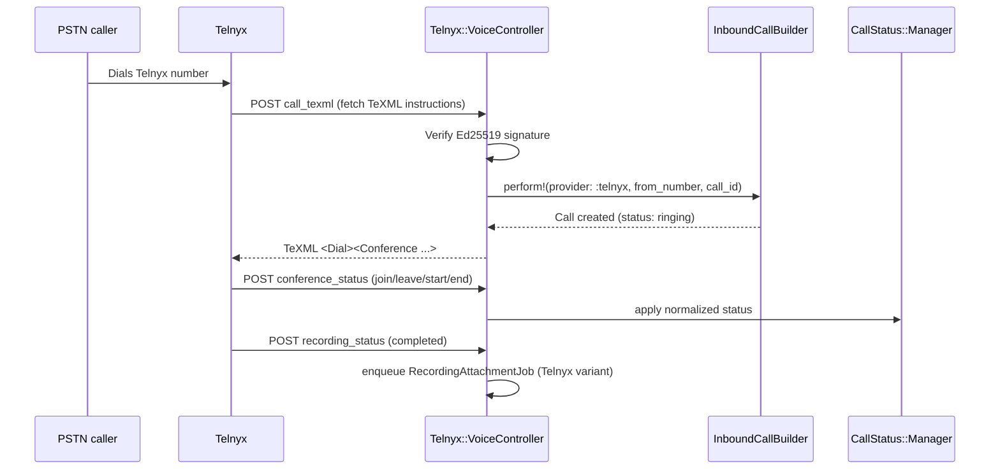
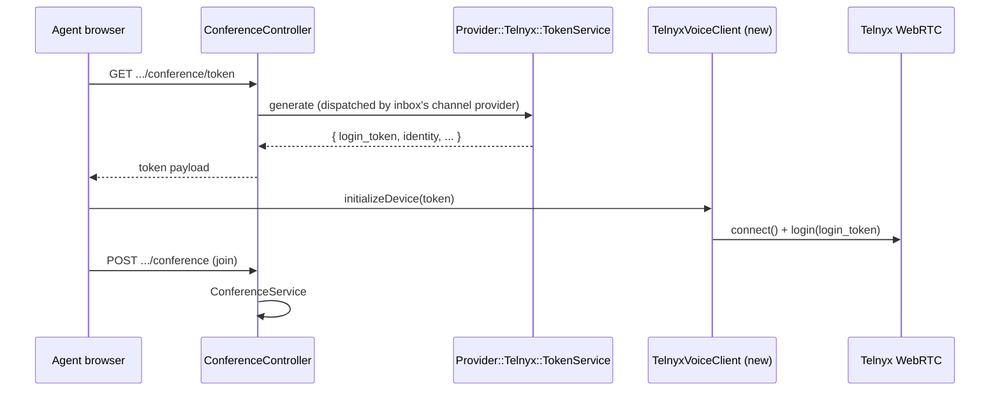

# Architecture Design — Telnyx as an Alternative Provider for Enterprise Voice

> Notion note: same publishing blocker as the source FRD — this workspace has used all its free blocks and needs a plan upgrade before new Notion pages can be created. This follows the NewRelay HQ "Architecture & System Design Template — Complex / Cross-Module" (`Playground / 01 · Product & Strategy / 01 · Product Planning & Specs`). Move into Notion once that's resolved.
>
> **Scope note:** this document covers only PRD-10 (Twilio-parity enterprise Voice). It does **not** cover the FRD's §6b "AI Voice Agent" (Telnyx number + ElevenLabs Conversational AI via SIP trunking) — that's a separate, architecturally unrelated integration (ElevenLabs handles the call directly, NR is not in the call-control loop) that needs its own design if/when it's scoped.

## Header

| Field | Value |
|---|---|
| Status | Draft |
| Technical owner | TBD |
| Reviewers | TBD |
| Source PRD | [telnyx-twilio-parity-frd.md](telnyx-twilio-parity-frd.md) — §6 PRD-10, §14 Phase 3 |
| Technical Implementation Spec | Not yet written — this document precedes it |
| Related ADRs | None yet — two candidate ADRs identified in §12 |
| Last updated | 2026-09-23 |

## 1. Context & problem

The FRD commits to Telnyx as an additional Voice provider (PRD-10), at functional parity with NR's existing, Twilio-only enterprise Voice feature — without changing how any existing Twilio-backed inbox or call behaves (PRD-12). That existing feature is deeply coupled to Twilio's SDKs at exactly two points: **outbound-call TwiML generation + Conference bridging** (server-side), and **the browser-calling JWT/token model** (Twilio Access Token + VoiceGrant, consumed by the Twilio Voice JS SDK). Everything else — the `Call` model, call-status normalization, conference-event handling, message building, and recording transcription — is either already provider-parameterized or trivially made so.

This document decides the system shape *before* a Telnyx adapter/token-service/controller are coded: where the new provider plugs in, what gets reused unchanged, what gets refactored to be reusable, and what is a genuinely open technical unknown that must be spiked (FRD Phase 0) before implementation starts.

## 2. Scope, constraints & non-goals

**Systems/modules affected:** `enterprise/app/models/call.rb` (enum only); `enterprise/app/services/voice/**` (new `Provider::Telnyx::*` namespace + one shared-service refactor); a new `enterprise/app/controllers/telnyx/voice_controller.rb`; `config/routes.rb`; `enterprise/app/controllers/enterprise/api/v1/accounts/inboxes_controller.rb`; frontend `dashboard/api/channel/voice/*`, `dashboard/composables/useCallSession.js`, `dashboard/stores/calls.js`.

**Hard constraints:**
- Depends on the Phase 1 Telnyx channel model existing first (FRD PRD-02) — this design assumes a Telnyx-backed channel ActiveRecord model (encrypted-credential storage, same pattern as `Channel::TwilioSms`) is already merged before Voice work starts.
- `channel_voice` feature flag must keep gating both providers identically — no Twilio-only fork of the flag (`config/features.yml`).
- Zero behavior change to existing Twilio-backed `Call`/inbox rows or flows (FRD PRD-12) — nothing in this design touches `Twilio::VoiceController`, `Voice::Provider::Twilio::*`, or the `channel_twilio_sms` table.
- No customer-owned PBX/SIP-trunk model **for the scope of this document** — NR stays on the vendor-hosted "call-control + webhook" model for PRD-10 (this Voice feature). **Correction:** an earlier draft of this design and the source FRD both said SIP Trunking was entirely out of scope for Telnyx. That was wrong — the FRD's §6b (AI Voice Agent, Telnyx number + ElevenLabs Conversational AI, added after this design's first pass) does use SIP trunking, but it is architecturally unrelated to PRD-10: it doesn't touch `Call`, `Voice::*`, or any component in this document, since ElevenLabs handles the call directly over the trunk with NR out of the call-control loop. That use case needs its own, separate Architecture Design if/when it's built — not folded into this one.

**Compatibility requirements:** `Call#provider` enum is additive only (`telnyx: 2`) — `twilio: 0` / `whatsapp: 1` are never renumbered. Existing `/twilio/voice/*` routes and all Twilio provider services are untouched.

**Explicit non-goals:**
- Migrating existing Twilio numbers/inboxes to Telnyx.
- Building a unified, provider-agnostic `VoiceChannel` abstraction that collapses Twilio + Telnyx + WhatsApp-calling into one polymorphic model. The codebase's existing pattern is duplication-per-provider (Twilio vs WhatsApp calling already coexist as separate service trees), and this design follows that precedent rather than introducing a premature abstraction (see §12).
- Telnyx's imperative Call Control API (webhook → issue commands back). This design uses **TeXML** — Telnyx's declarative, URL-fetched markup — to mirror NR's existing TwiML-based architecture as closely as possible.

## 3. Current state

`Channel::TwilioSms` (base model, SMS/WhatsApp table `channel_twilio_sms`) gets voice capability via an enterprise `prepend`ed concern: a `voice_enabled` flag, a `twiml_app_sid` column, and lifecycle hooks that provision/tear down a Twilio TwiML Application on save. Voice-specific logic is split into small, single-purpose services under `Voice::Provider::Twilio::`:

- **`Adapter`** — places outbound calls via `Twilio::REST::Client#calls.create`, pointing Twilio at NR's own TwiML-fetch and status-callback URLs.
- **`TokenService`** — mints a Twilio Access Token (JWT) with a `VoiceGrant` tied to the channel's TwiML App SID; consumed directly by the Twilio Voice JS SDK's `Device` in the browser.
- **`ConferenceService`** — claims a call for an agent (row-locked, anti-double-accept), assigns the conversation, and ends the Twilio conference via REST.
- **`RecordingAttachmentService`** — downloads a completed recording (HTTP Basic Auth with the channel's `account_sid`/`auth_token`), attaches it to the `Call` via ActiveStorage, and optionally transcribes it through OpenAI (provider-agnostic — operates on the attached blob, not on Twilio-specific data).
- **`VoiceWebhookSetupService` / `VoiceTeardownService`** — provision/deprovision the TwiML App and the phone number's `voice_url`/`status_callback` on Twilio.

All inbound webhook traffic lands on **one controller**, `Twilio::VoiceController`, under `namespace :twilio` (4 POST routes: `call_twiml`, `status`, `conference_status`, `recording_status`), resolved by reconstructing the channel's phone number from a `:phone` path segment. **No Twilio request-signature verification is implemented today** — the `:phone` segment matching an existing channel is the only gate.

Two pieces are already provider-agnostic by design, and are the seams this document builds on:
- **`Voice::CallStatus::Manager`** applies a normalized status (`ringing` / `in_progress` / `completed` / `no_answer` / `failed`) to a `Call` row, with terminal-status-is-sticky and duplicate-update guards — it takes an already-normalized status string, not a Twilio one. The Twilio→normalized mapping lives in a separate constant, `Voice::StatusUpdateService::TWILIO_STATUS_MAP`.
- **`Voice::OutboundCallBuilder` / `InboundCallBuilder` / `CallMessageBuilder`** already create `Call`/`Conversation`/`Message` rows keyed by a `provider:` value (currently always `:twilio` in practice, but the parameter exists).

On the frontend, `TwilioVoiceClient` wraps `@twilio/voice-sdk`'s `Device`, and there are exactly two provider-dispatch points: `useCallSession.js`'s `isWhatsappCall` check and `calls.js`'s `teardownByProvider` — both currently branch only on `VOICE_CALL_PROVIDERS.WHATSAPP` vs. "everything else is Twilio."

## 4. Proposed architecture

Mirror the existing Twilio shape rather than unify it: a parallel `Voice::Provider::Telnyx::*` service namespace, a parallel `Telnyx::VoiceController`, and voice columns added to the Phase 1 Telnyx channel model the same way they were added to `Channel::TwilioSms`. Everything already provider-agnostic is reused unmodified; the one required refactor is extracting `Voice::StatusUpdateService`'s status-map into a per-provider, dispatched form (it's a Twilio-named constant today, not yet a seam).

### Component responsibilities

| Component | Owns | Does not own | Key dependencies |
|---|---|---|---|
| `Telnyx-backed channel model` (Phase 1, extended) | Telnyx API Key/credential storage, `voice_enabled`, TeXML App identifier, SIP-credential reference | Call-status logic, message building | Telnyx REST API |
| `Voice::Provider::Telnyx::Adapter` | Placing outbound calls via Telnyx | Call-status normalization | Telnyx Call/TeXML API |
| `Voice::Provider::Telnyx::TokenService` | Minting the browser-calling credential (SIP-credential/JWT model) | Twilio's Access Token/VoiceGrant (untouched) | Telnyx Telephony Credentials API |
| `Voice::Provider::Telnyx::RecordingAttachmentService` | Downloading a Telnyx recording (Bearer auth) and attaching it | Transcription (delegates to the existing shared step) | Telnyx Call Recordings API |
| `Telnyx::VoiceController` | Parsing Telnyx webhook payloads, verifying signatures, returning TeXML | Status normalization, conference-event semantics | `Voice::InboundCallBuilder`/`OutboundCallBuilder`, `Voice::StatusUpdateService` |
| `Voice::StatusUpdateService` (refactored) | Dispatching to the correct provider status-map | The normalized-status application itself | `Voice::CallStatus::Manager` |
| `Voice::CallStatus::Manager` (unchanged) | Applying a normalized status to `Call`, terminal-state stickiness | Provider-specific webhook parsing | `Call` model |
| `Voice::Conference::Manager` (extended) | Conference join/leave/start/end semantics, anti-spoofing participant validation | TwiML/TeXML markup generation | `Call` model |

## 5. Critical flows

**Inbound PSTN call, Telnyx-backed inbox:**

**Agent browser calling:**

## 6. Data architecture & database decisions

| Decision | Choice | Reason | Consequence |
|---|---|---|---|
| `Call.provider` enum | Add `telnyx: 2` | Enum is integer-backed and additive; no migration touches existing `twilio`/`whatsapp` rows | Every place that pattern-matches on `provider` (status manager, message builder, frontend dispatch) needs a `:telnyx` branch added — enumerated in §12/§15, not silently missed |
| Voice columns on the Telnyx channel model | Mirror `channel_twilio_sms`: `voice_enabled:boolean`, a TeXML-App-identifier column, plus a new SIP-credential/telephony-credential reference column (Twilio's channel has no equivalent — this is a genuinely new concept) | Keeps the same "voice piggybacks on the messaging channel record" shape already used for Twilio, avoiding a second channel table | The new credential-reference column has no Twilio precedent to copy verbatim from; its exact shape depends on resolving the open JWT-minting question in §15 |
| `Call#meta` conference-id key | Add a **new**, Telnyx-specific jsonb key (not a reuse of `twilio_conference_sid`) | `by_twilio_conference_sid` and the `twilio_conference_sid` accessor are Twilio-named and used by Twilio-specific lookup code (`RecordingStatusService`); reusing the same key for a different provider's ID would conflate two unrelated identifier spaces | A parallel `by_telnyx_conference_id`-style scope is needed; this is a small, mechanical addition, not a redesign |
| Tenant/data ownership | Unchanged — `Call` rows still belong to `account_id`/`inbox_id`/`conversation_id`/`contact_id` | No new tenant boundary is introduced by adding a provider | None |

## 7. API, event & integration contracts

| Interface | Producer / caller | Consumer / owner | Auth / scope | Idempotency | Failure behaviour |
|---|---|---|---|---|---|
| Inbound call webhook (`call_texml`) | Telnyx | `Telnyx::VoiceController` | Ed25519 signature verification (**new** — Twilio's equivalent route has none today; see §8) | Must tolerate Telnyx retrying the TeXML fetch — `InboundCallBuilder` already has a `find_existing_call` short-circuit + `RecordNotUnique` race rescue, reused as-is | Invalid signature → reject with 4xx, no `Call` created; malformed payload → 4xx, logged |
| Call status webhook | Telnyx | `Telnyx::VoiceController#status` → `Voice::StatusUpdateService` (dispatched) | Same signature verification | `Call::STATUSES` inclusion check + terminal-status-is-sticky guard in `CallStatus::Manager`, reused unchanged | Unrecognized status string → no-op, logged (mirrors current Twilio behavior) |
| Conference status webhook | Telnyx | `Telnyx::VoiceController#conference_status` → `Voice::Conference::Manager` | Same signature verification | Manager already no-ops on an unmapped event type | Same as above |
| Recording status webhook | Telnyx | `Telnyx::VoiceController#recording_status` → enqueues a Telnyx `RecordingAttachmentJob` | Same signature verification | `already_attached?` guard in the shared attachment-service pattern, reused | Download failure retried via `Down::Error` `retry_on`, same pattern as the Twilio job |
| Outbound call initiation | `Voice::OutboundCallBuilder` | Telnyx Voice/TeXML API | Channel's stored Telnyx API Key | Not naturally idempotent (each call is a new resource) — matches Twilio's behavior today, no new risk introduced | Adapter raises; `OutboundCallBuilder`'s existing transaction rolls back the `Call`/message rows it already created in this attempt, same as the Twilio path |
| Browser-token minting | `Voice::Provider::Telnyx::TokenService` | Telnyx Telephony Credentials API | Channel's stored Telnyx API Key | N/A (read-style mint) | Exact endpoint/payload unconfirmed — flagged as an open risk in §15, not assumed here per the "no implementation-level code" scope of this document |
| Recording download | `Voice::Provider::Telnyx::RecordingAttachmentService` | Telnyx Call Recordings API | Bearer token (single API Key) — **different secret shape than Twilio's Basic Auth**, same "channel's own stored credential" trust model | `already_attached?` guard, reused | Same `SafeFetch`-style content-type-checked download pattern as Twilio, adapted for Bearer auth |

## 8. Authorization, security & tenant isolation

- **Existing gap, not extended:** Twilio's 4 webhook routes have no request-signature verification today — security rests entirely on the unguessable `:phone` path segment matching an existing channel. This design does not retrofit that (out of scope, "one fix at a time" — the FRD already scopes Telnyx SMS webhook signature verification as PRD-03, and this design applies the same standard to Voice) but does **not** carry the gap forward into the new Telnyx routes.
- **New:** `Telnyx::VoiceController`'s 4 actions verify Telnyx's Ed25519 webhook signature (`telnyx-signature-ed25519` / `telnyx-timestamp` headers, already established as a requirement in the FRD for the SMS webhook) before any `Call`/status mutation. This is new code with no existing behavior to preserve, so there's no compatibility cost to doing it right from the start.
- **Recording download secret shape differs:** Telnyx uses a single Bearer API Key rather than Twilio's Account SID + Auth Token pair — encrypted at rest using the same `encrypts ... if Chatwoot.encryption_configured?` pattern already applied to Twilio's `auth_token`/`api_key_secret`.
- **Tenant isolation:** identical model to Twilio — every `Call` lookup is scoped by `account_id` first, and the anti-spoofing participant-identity check in `Voice::Conference::Manager` (embedding + validating `agent-{user_id}-account-{account_id}` against the call's own `account_id`) is provider-agnostic *logic* that is reused unchanged. Telnyx's own conference/participant webhook field names differ from Twilio's `ParticipantLabel`/`FriendlyName`, so the *parsing* of those fields needs a parallel (not shared) implementation — only the validation logic is shared.

## 9. Failure modes & reliability

| Failure | User/system impact | Detection | Fallback / recovery |
|---|---|---|---|
| TeXML doesn't support every attribute NR's `conference_twiml` relies on (`startConferenceOnEnter`, `endConferenceOnExit`, `participantLabel`, callback attributes) | Broken call bridging for Telnyx-backed calls in production | FRD Phase 0 spike, before any Telnyx voice code ships | Feature-flagged, beta-only rollout (FRD §14); flag stays off for Voice specifically until the spike is green |
| Telnyx browser-calling credential/JWT expires mid-call | Agent's in-progress call drops or can't reconnect | Telnyx WebRTC SDK's own expiry event (exact event name TBD — needs confirming against `@telnyx/webrtc`'s API, analogous to Twilio's `tokenWillExpire`) | Mirror `TwilioVoiceClient`'s existing `tokenWillExpire` → re-fetch → `device.updateToken` pattern once the Telnyx SDK's equivalent event is confirmed |
| Webhook retried/delivered out of order or twice | Duplicate `Call` rows, or a stale status overwriting a newer one | `Call.find_by_provider_call_id` short-circuit in `InboundCallBuilder`; terminal-status-is-sticky + duplicate-update no-op in `CallStatus::Manager` | Both are provider-agnostic and reused unchanged — no new logic needed |
| Recording download fails (network, Telnyx-side delay) | Recording never attaches to the conversation | `Down::Error` on fetch | `retry_on ..., wait: 5.seconds, attempts: 3`, same pattern as the existing Twilio job, applied to the Telnyx variant |
| Invalid/expired Telnyx API Key at call time (not just inbox-creation time) | Outbound call placement fails | `Adapter#initiate_call` raises | `OutboundCallBuilder`'s existing transaction rollback applies unchanged; surfaced to the agent the same way a Twilio API error is today |

## 10. Performance & scalability

Not materially different from the existing Twilio Voice volume — same webhook-driven model, same background-job queue (`:low` priority), no new hot path or batching requirement introduced. Not covered further; nothing here is scale-material beyond what Twilio's voice feature already handles.

## 11. External dependencies

| Dependency | Purpose | Ownership / failure implication |
|---|---|---|
| Telnyx Voice API / TeXML | Call bridging, conferencing, recording | Same BYO-credential ownership model as Twilio — NR holds no platform-level Telnyx account; a customer's Telnyx outage affects only their own Telnyx-backed inboxes |
| Telnyx WebRTC JS SDK (`@telnyx/webrtc`) | Browser-based agent calling | New frontend dependency, additive to `package.json` (per FRD Appendix C) |
| `telnyx` Ruby gem | REST API access | New backend dependency, additive to `Gemfile` (per FRD Appendix C); requires Ruby ≥ 3.2.0 — confirm against `.ruby-version` before adding |
| Telnyx Telephony Credentials / SIP Connection API | Minting browser-calling JWTs | **Not previously listed in the FRD's dependency appendix** — added here because `TokenService`'s Telnyx equivalent needs it; exact endpoint unconfirmed, see §15 |

## 12. Architecture decisions & alternatives

| Decision | Options considered | Chosen approach | Why | ADR required? |
|---|---|---|---|---|
| Provider integration shape | (A) Parallel `Voice::Provider::Telnyx::*` namespace mirroring Twilio's, duplicating structure. (B) Refactor to a unified `Voice::Provider::Base` interface first, then implement both providers against it. | (A) — mirror now | Matches the codebase's existing precedent (Twilio voice and WhatsApp calling already coexist as separate, non-unified service trees); a premature shared interface risks guessing the wrong abstraction before a second real implementation (Telnyx) exists to validate it | No — additive, reversible; a later unification is a pure refactor with no external contract change |
| Call-bridging model | (A) TeXML (declarative, URL-fetched markup — mirrors TwiML). (B) Telnyx Call Control API (imperative, webhook-then-command). | (A) — TeXML | Minimal change to `VoiceController`'s existing shape (return markup from an HTTP action, same as today); Call Control's imperative model would require a structurally different controller and command-issuing service layer | **Yes** — this is a Telnyx-specific integration-pattern choice that's expensive to reverse once webhook contracts and TeXML markup generation are live in production |
| Conference-ID storage | (A) New Telnyx-specific `meta` jsonb key. (B) Reuse the existing `twilio_conference_sid` key for both providers. | (A) — new key | (B) would conflate two unrelated provider-specific identifier spaces behind one Twilio-named key, silently coupling Telnyx lookups to a Twilio-named accessor | No — low-risk, mechanical, reversible |
| Webhook signature verification | (A) Verify Telnyx's Ed25519 signature on all 4 new routes. (B) Match Twilio's current no-verification posture for consistency. | (A) — verify | This is new code with no existing behavior to match; verifying costs nothing extra and closes a security gap the Twilio path happens to have, without touching or restyling the Twilio controller | No — additive safety improvement, not a reversal of a prior decision |

## 13. Compatibility, rollout & rollback architecture

Gated by the FRD's single feature flag (`channel_provider_telnyx`); Voice specifically only ships if the Phase 0 TeXML spike (§9, §15) is green — this is the FRD's own gate, not a new one. Rollback is flag-off: because every schema change here is additive (new enum value, new columns, new jsonb key), disabling the flag requires no destructive migration or data cleanup — a disabled Telnyx-backed inbox simply stops accepting new calls, and its existing `Call` rows remain queryable history exactly like a deactivated Twilio inbox's would. Dual-provider coexistence is the permanent target state (FRD PRD-12), not a temporary migration bridge.

## 14. Observability

- Extend the FRD's existing `channel_provider: telnyx | twilio` tagging (FRD §12) down to `Call`-level events, not just inbox-creation events.
- New alertable signal with no Twilio precedent: Ed25519 signature-verification failures on the Telnyx voice webhooks, logged distinctly so a mass-invalid-signature pattern (misconfigured webhook, compromised endpoint) is visible rather than blending into generic 4xx noise.
- Reuse the existing structured error-logging pattern from `Twilio::VoiceWebhookSetupService`'s `log_twilio_error` (context/phone_number/account_sid/error_class/message) for the new `Voice::Provider::Telnyx::*` services, adapted for Telnyx's own error response shape.

## 15. Risks & open questions

| Risk / question | Owner | Resolution / mitigation | Status |
|---|---|---|---|
| TeXML's `<Dial><Conference>` may not support every attribute `conference_twiml` relies on today (`startConferenceOnEnter`, `endConferenceOnExit`, `participantLabel`). Public docs confirm `statusCallback`/`recordingStatusCallback`-family attributes exist; the other three were not confirmed during this design pass. | TBD | FRD Phase 0 spike (already scheduled) | Open |
| Exact REST endpoint/payload for minting a Telnyx WebRTC `login_token` JWT tied to a specific SIP Connection/telephony credential was not confirmed from public docs during this pass. | TBD | Confirm via Telnyx's API reference or support before implementing `Provider::Telnyx::TokenService` | Open |
| No confirmed Ruby TeXML-building library equivalent to `Twilio::TwiML::VoiceResponse` — NR may need to hand-build TeXML XML (e.g. via the `builder` gem already available through Rails) instead of a typed builder API. | TBD | Confirm during the Phase 0 spike; low risk either way, but affects the `call_texml` action's implementation approach | Open |
| `Voice::StatusUpdateService::TWILIO_STATUS_MAP` is a Twilio-named constant — it must be refactored into a dispatched, per-provider form before a `TELNYX_STATUS_MAP` can coexist cleanly. | TBD | Do this refactor as part of this feature's Technical Implementation Spec, not deferred | Open, low-risk |
| Should the participant-label anti-spoofing pattern be reused verbatim for Telnyx's conference webhook field names, or does it need a parallel implementation? | TBD | Lean: reuse the *validation logic*, parallel-implement the *field parsing* (Telnyx's field names differ from Twilio's `ParticipantLabel`/`FriendlyName`) | Open — decide in the Technical Implementation Spec |

## 16. Approval

| Gate | Who | Date |
|---|---|---|
| Architecture approved | TBD | TBD |
