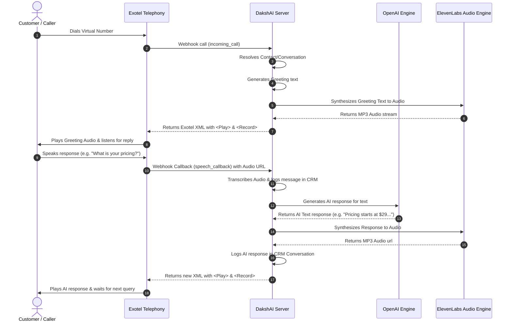

# Voice, Video, and Voice AI Agent Integrations Specification

This document details the design specifications, file architecture, database integration hooks, webhook configurations, and local testing instructions for the voice/video calling features (via Dyte) and the Voice AI Agent (via Exotel and ElevenLabs) in DakshAI.

---

## 1. System Architecture Diagram



---

## 2. Integration Configuration Properties

### Exotel Integration App
- **App ID**: `exotel`
- **Hook Type**: `account`
- **Settings Form Schema**:
  - `account_sid`: Exotel Account string identifier.
  - `api_key`: Exotel API Key.
  - `api_token`: Exotel API Token.
  - `subdomain`: Exotel Subdomain (e.g., `api.exotel.com`).
  - `virtual_number`: Exotel Virtual Number assigned to receive calls.

### ElevenLabs Integration App
- **App ID**: `elevenlabs`
- **Hook Type**: `account`
- **Settings Form Schema**:
  - `api_key`: ElevenLabs API Key.
  - `voice_id`: ElevenLabs voice model identifier (e.g., `21m00Tcm4TlvDq8ikWAM`).

---

## 3. Webhook Controller Endpoints

### Initial Call Webhook
- **Route**: `POST /api/v1/accounts/:account_id/integrations/exotel/incoming_call`
- **Payload Parameters**:
  - `CallSid`: Unique call identifier.
  - `From`: Caller's phone number.
  - `To`: Virtual number dialed.
- **Telephony Action**: Returns XML to play the greeting message and capture the customer's initial response.

### Speech Callback Loop Webhook
- **Route**: `POST /api/v1/accounts/:account_id/integrations/exotel/speech_callback`
- **Payload Parameters**:
  - `CallSid`: Unique call identifier.
  - `From`: Caller's phone number.
  - `To`: Virtual number.
  - `RecordingUrl`: URL hosting the Exotel call recording.
  - `Transcription` *(Optional)*: Speech text (for local manual verification).
- **Telephony Action**: Returns XML with the synthesized AI reply and loops back to capture the next input.

---

## 4. Local Testing Setup

### 1. Stage simulated call events:
```bash
# Initial incoming ring
curl -X POST http://localhost:3000/api/v1/accounts/1/integrations/exotel/incoming_call \
  -d "CallSid=call_exotel_101" -d "From=+919876543210" -d "To=+919999999999"

# Customer reply callback
curl -X POST http://localhost:3000/api/v1/accounts/1/integrations/exotel/speech_callback \
  -d "CallSid=call_exotel_101" \
  -d "From=+919876543210" \
  -d "To=+919999999999" \
  -d "Transcription=What are the features of Daksh AI?"
```

### 2. Live Transcript in CRM:
Select **Exotel Voice Agent** inbox from the sidebar to inspect the real-time call log and transcript inside the CRM conversation portal.
