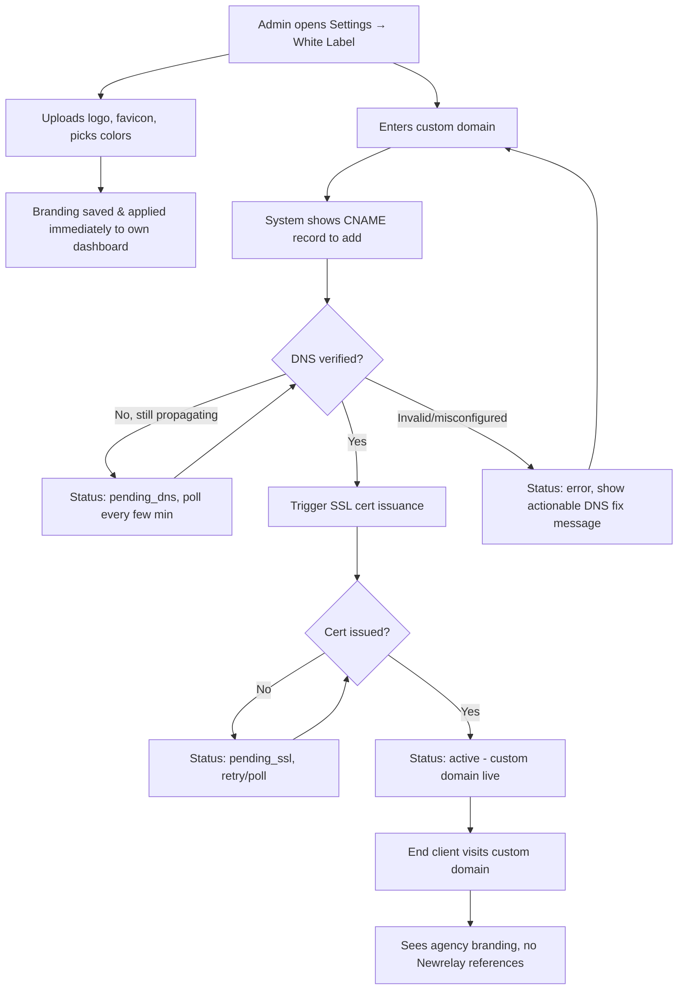

# 📖 FEATURE BIBLE: White Label (Custom Branding)

**Status:** Draft
**Owner:** Chandresh
**Last updated:** July 14, 2026
**Related module:** Newrelay — Account/Workspace Settings

---

## 1. WHAT — Feature Summary

**One-liner:** SaaS users can rebrand their Newrelay instance with their own custom domain, logo, favicon, and color scheme — so the platform looks like their own product.

**Elevator pitch:** Agencies reselling Newrelay to their own clients don't want "Newrelay" branding visible. White-label lets them use their own domain (e.g., app.theiragency.com), their logo/favicon in the browser tab and dashboard, and their brand colors across the UI — same pattern as GoHighLevel's agency white-label.

---

## 2. WHY — Problem & Justification

**Problem statement:** Agencies reselling the platform to end clients need it to look like their own product, not a visibly third-party tool — otherwise clients question why they're paying the agency instead of going direct.

**Who needs this:** Agency-tier subscribers who resell Newrelay under their own brand to their clients.

**What happens without it:** Agencies can't credibly resell; Newrelay branding leaks trust away from the agency; competitive gap vs GoHighLevel/Vendasta who both offer this.

**Business value:** Enables higher-tier "Agency/Reseller" pricing plan; key retention/upsell lever.

---

## 3. USER STORIES

- As an **agency owner**, I want to **connect my own domain**, so that **clients access the platform under my brand, not Newrelay's**.
- As an **agency owner**, I want to **upload my logo and favicon**, so that **the dashboard and browser tab show my branding**.
- As an **agency owner**, I want to **set my brand colors**, so that **the UI matches my company's visual identity**.
- As an **end client** (of the agency), I want to **see a seamless branded experience**, so that **I don't realize it's a third-party platform**.

---

## 4. SCOPE

### ✅ In Scope
- Custom domain mapping (CNAME) with SSL
- Logo upload (header/dashboard)
- Favicon upload
- Primary/secondary/accent color customization
- Settings page to manage all of the above

### ❌ Out of Scope (explicitly excluded)
- *[Need input — e.g., custom email sending domain (SPF/DKIM)? Custom login page copy/text? White-labeled mobile app?]*

### 🔮 Future / Phase 2
- *[e.g., custom CSS injection, white-labeled email templates, custom login page background image]*

---

## 5. HOW IT ACTIVATES — Trigger & Lifecycle

**Activation trigger:** User goes to Settings → White Label → enters domain + uploads assets → saves.

**Preconditions:** *[Which plan tier unlocks this — Agency tier only? Add-on purchase?]*

**Lifecycle states:**
| State | Meaning | Next state trigger |
|---|---|---|
| `not_configured` | Default Newrelay branding shown | User starts setup |
| `pending_dns` | Domain entered, waiting for CNAME to propagate | DNS verified |
| `pending_ssl` | DNS verified, SSL cert being issued | Cert issued |
| `active` | Custom domain + branding fully live | — |
| `error` | DNS misconfigured / SSL failed | User fixes DNS, retries |

**Deactivation/rollback:** User can revert to default Newrelay domain/branding anytime; custom domain mapping removed but settings (logo/colors) retained for re-use.

---

## 6. EXTERNAL DEPENDENCIES & LEAD TIME

> ⚠️ Critical: this feature depends heavily on things outside your control — and one key assumption below needed correcting after verification (see Section 7).

| Dependency | Needed for | Who applies | Approval/setup time | Status | Blocker risk |
|---|---|---|---|---|---|
| Multi-tenant SSL/routing provider decision | Serving custom domains over HTTPS at scale | Chandresh (infra) | **See Section 7 — Cloudflare's native "Custom Hostnames" (SSL for SaaS) is Enterprise-plan only; confirm current pricing/plan tier before assuming it's available, or evaluate a third-party wrapper service instead** | *[fill status]* | High |
| DNS CNAME propagation | User's custom domain to resolve to Newrelay | End user (agency) sets DNS record | Minutes to 48hrs depending on user's DNS provider/TTL | N/A — per-user, ongoing | **High — outside your control, common support burden** |
| Multi-tenant routing / reverse proxy config | Routing incoming custom domains to correct tenant | Chandresh (infra) | One-time build: days, depends on chosen provider from row 1 | *[fill status]* | Medium — architectural decision needed upfront |
| Domain ownership verification (optional but recommended) | Prevent domain hijacking/spoofing | Built into your flow | N/A | *[fill status]* | Low |

**Action item:** Before writing feature code, confirm actual Cloudflare plan-tier pricing for Custom Hostnames (it has historically required Enterprise), or evaluate lower-cost alternatives — self-managed ACME/Let's Encrypt automation, or third-party wrapper services built on top of Cloudflare's API that offer per-domain pricing without requiring Enterprise. This decision changes both cost and build complexity.

**Fallback plan if SSL/DNS setup delayed or too costly:** Launch with subdomain-based branding first (e.g., `clientname.newrelay.app` with logo/colors only), and add full custom-domain support in a follow-up phase once the SSL provider decision is finalized.

---

## 7. FACT VERIFICATION (AI Knowledge Freshness Check)

| Claim / Assumption | Where used | Source | Verified via web search? | Current status (as of July 2026) | Link |
|---|---|---|---|---|---|
| "Cloudflare for SaaS supports custom domains + auto SSL" — implied freely available | Section 6 (original draft) | AI memory | ✅ Yes | **Correction needed:** Cloudflare's Custom Hostnames ("SSL for SaaS") documentation states this is an **Enterprise-plan feature** — non-Enterprise accounts must contact sales to request it. Newer product pages describe broader availability but plan-tier gating should be confirmed directly with Cloudflare before committing to this as the architecture. | support.cloudflare.com (Custom Hostnames), developers.cloudflare.com/cloudflare-for-platforms |
| SSL cert issuance is automatic once DNS is configured | Section 6 | AI memory | ✅ Yes | Confirmed as a general capability of the underlying feature (Cloudflare or equivalent) — certs provision and renew automatically per custom hostname with no manual steps once properly configured. | developers.cloudflare.com/use-cases/saas/custom-domains |
| Third-party wrapper services exist as lower-cost alternatives to native Cloudflare Enterprise pricing | Not in original draft | Not in original draft | ✅ Yes (new finding) | Confirmed — third-party tools exist that wrap Cloudflare's Custom Hostnames API and offer smaller-scale, non-Enterprise pricing (e.g., free tiers for a limited number of domains, then low per-domain monthly cost). Worth evaluating for Newrelay's expected scale before committing to Enterprise-only path. | domainee.dev |

**Note:** This is exactly the kind of assumption that would have caused a costly surprise mid-build — planning around free/self-serve Cloudflare Custom Hostnames only to discover an Enterprise sales conversation is required. Confirm current plan-tier requirements or pick a wrapper/alternative before finalizing Section 6's architecture spike (Jira ticket WL-1).

---

## 8. CLOUDFLARE SETUP & CONFIGURATION (Zone ID & API Key)

To integrate custom domains using Cloudflare's Custom Hostnames (SSL for SaaS), the server requires access to a target Cloudflare Zone. Follow these steps to retrieve the necessary configuration values:

### 8.1. Retrieve the Zone ID (`CLOUDFLARE_ZONE_ID`)
The **Zone ID** represents the specific domain name (or website) in Cloudflare that will act as the CNAME target wrapper for client domains.
1. Log in to the [Cloudflare Dashboard](https://dash.cloudflare.com/).
2. On the home page, select the domain/website you wish to use as the base routing target (e.g., `yourdomain.com`).
3. Under the **Overview** tab (the default landing page for the site), scroll down to the right-hand sidebar.
4. Locate the **API** section.
5. Copy the **Zone ID** (a 32-character hexadecimal string).

### 8.2. Generate the API Token (`CLOUDFLARE_API_KEY`)
The application needs an authorized API token to create, check, and edit custom hostnames dynamically under your zone.
1. In the top right corner of the Cloudflare Dashboard, click your profile icon and select **My Profile**.
2. Select **API Tokens** from the left-hand sidebar.
3. Click the **Create Token** button.
4. Click **Create Custom Token** (at the bottom of the templates list).
5. Name your token (e.g., `Newrelay Custom Hostnames Manager`).
6. Under **Permissions**, add the following:
   - **Zone** -> **Zone** -> **Read**
   - **Zone** -> **Custom Hostnames** -> **Edit**
7. Under **Zone Resources**, filter by your specific zone:
   - **Include** -> **Specific zone** -> select your domain.
8. Click **Continue to summary**, verify the configurations, and click **Create Token**.
9. Copy the generated token immediately (this will be used as `CLOUDFLARE_API_KEY` in your `.env` or application config).

---

## 9. DATA MODEL

**New/modified tables:**
```
white_label_settings
  - id
  - account_id (FK → accounts)
  - custom_domain: string, nullable
  - domain_status: enum (not_configured, pending_dns, pending_ssl, active, error)
  - logo_url: string, nullable
  - favicon_url: string, nullable
  - primary_color: string (hex)
  - secondary_color: string (hex)
  - accent_color: string (hex)
  - ssl_cert_ref: string, nullable (reference to cert in ACM/Cloudflare/etc.)
  - verified_at: datetime, nullable
  - created_at / updated_at
```

**Relationships:** belongs_to account (one white-label config per account/tenant)

**Migration notes:** Default branding (Newrelay logo/colors) should apply for all existing accounts until they configure their own — no backfill needed, just sensible defaults.

---

## 10. BACKEND / API

**Endpoints:**
| Method | Route | Purpose | Auth |
|---|---|---|---|
| GET | /settings/white_label | Fetch current branding config | Account admin |
| PUT | /settings/white_label | Update domain/logo/favicon/colors | Account admin |
| POST | /settings/white_label/verify_domain | Trigger DNS/SSL verification check | Account admin |
| DELETE | /settings/white_label/domain | Remove custom domain, revert to default | Account admin |

**Background jobs:** Domain verification job (polls DNS + SSL status periodically until active or timeout, then notifies user).

**External integrations:** SSL/CDN provider API (e.g., Cloudflare for SaaS API, or AWS ACM) for dynamic cert issuance and domain routing.

**Existing patterns to follow:** Match existing Sidekiq job structure for the domain-verification polling job.

---

## 11. FRONTEND / UI

**Screens/components touched:** New "White Label" settings page, logo/favicon upload widgets, color pickers, domain input with live verification status indicator.

**States to handle:** not configured (show defaults), pending DNS/SSL (progress indicator + instructions), active (confirmation + preview), error (clear DNS troubleshooting message).

**Design reference:** *[Match existing Newrelay/Chatwoot settings page style — confirm]*

---

## 12. FLOW — Step by Step

1. Agency admin goes to Settings → White Label
2. Uploads logo + favicon, picks brand colors → saved immediately, applied to their own dashboard view
3. Enters custom domain (e.g., app.theiragency.com) → shown a CNAME record to add at their DNS provider
4. Backend job polls for DNS propagation → once resolved, triggers SSL cert issuance
5. Once cert active, domain status flips to `active` → user's end clients can now access via the custom domain with full branding

**Acceptance criteria:**
- [ ] Given a logo/favicon upload, when saved, then it reflects across dashboard and browser tab immediately
- [ ] Given a custom domain entered, when DNS + SSL are correctly configured, then status becomes `active` within the expected window
- [ ] Given an active custom domain, when an end client visits it, then they see the agency's branding with no visible Newrelay references
- [ ] Given incorrect DNS setup, when verification runs, then user sees a specific, actionable error message

---

## 13. EDGE CASES & FAILURE MODES

| Scenario | Expected behavior |
|---|---|
| User enters a domain already in use by another tenant | Reject with clear error, no silent overwrite |
| DNS never gets configured (user abandons setup) | Stay in `pending_dns` indefinitely, periodic reminder email, no impact on default domain access |
| SSL cert issuance fails repeatedly | Show error with support contact option, retry mechanism |
| Logo/favicon file too large or wrong format | Client + server-side validation, clear size/format guidance |
| User removes custom domain while active | Immediately revert routing to default domain, don't break their access |
| Color contrast makes UI unreadable (e.g., white text on white bg) | *[Decide: enforce min contrast validation, or trust user's choice?]* |

---

## 14. NON-FUNCTIONAL REQUIREMENTS

- **Performance:** Domain verification polling shouldn't hammer DNS — reasonable interval (e.g., every 2-5 min, capped retries).
- **Security:** Validate domain ownership before activating routing; sanitize uploaded logo/favicon files (prevent malicious SVG/script injection); enforce HTTPS only.
- **Scalability:** *[Expected number of custom domains at launch — infra must support dynamic multi-domain SSL at that scale]*
- **Logging/monitoring:** Track DNS/SSL verification failures per account for support visibility.

---

## 15. AI IMPLEMENTATION INSTRUCTIONS

**Tech stack constraints:** Rails + Vue (Chatwoot base), Sidekiq for background jobs, multi-tenant routing needs to integrate with existing tenant resolution logic.

**Files likely to touch:** *[fill once known — e.g., app/models/white_label_setting.rb, app/jobs/domain_verification_job.rb, existing tenant-resolution middleware]*

**Step-by-step build order:**
1. Data model + settings CRUD (logo/favicon/colors — no domain yet, ship this first as it's low-risk)
2. Domain input + DNS instructions UI
3. Domain verification background job
4. SSL/CDN provider integration for dynamic cert issuance
5. Multi-tenant request routing to resolve custom domain → correct account
6. Apply branding (logo/colors/favicon) dynamically based on resolved tenant

**Do NOT:** Don't hardcode a single SSL cert per domain manually — use a dynamic/automated cert issuance flow, since this needs to scale to many tenants without manual ops work per customer.

**Test expectations:** Unit tests for domain validation/uniqueness; integration test for full DNS→SSL→active flow (can mock the SSL provider); visual/manual test for branding application across dashboard.

---

## 16. DESIGN FLOW (Visual)



**Notes:** Two parallel tracks exist — branding (logo/colors, instant) and domain (DNS/SSL, async/delayed). Build and ship branding-only first since it has no external wait time; domain mapping is the higher-risk, slower track.

---

## 17. JIRA TASK BREAKDOWN

**Epic:** White Label / Custom Branding

| Key | Type | Title | Description | Depends on | Estimate | Priority |
|---|---|---|---|---|---|---|
| WL-1 | Spike | Choose multi-tenant SSL/routing architecture | Evaluate Cloudflare for SaaS (confirm current Enterprise-plan pricing/requirement per Section 7) vs AWS ACM+ALB vs third-party wrapper services vs self-managed ACME; decide before any domain-routing code starts | — | 2d | Highest |
| WL-2 | Task | Data model: `white_label_settings` table | Migration + model with domain, logo, favicon, colors, status fields | — | 0.5d | High |
| WL-3 | Story | Settings UI — logo/favicon/color upload | Upload widgets + color pickers, save via API, applies instantly to own dashboard | WL-2 | 2d | High |
| WL-4 | Task | API: branding CRUD endpoints | GET/PUT white_label settings (logo, favicon, colors only — no domain yet) | WL-2 | 1d | High |
| WL-5 | Story | Domain input UI + CNAME instructions | UI for entering custom domain, showing DNS record to add, live status indicator | WL-2, WL-1 | 1.5d | Medium |
| WL-6 | Task | Background job: DNS verification polling | Sidekiq job checks CNAME resolution, updates status | WL-1 | 1.5d | Medium |
| WL-7 | Task | SSL/CDN provider integration | Dynamic cert issuance via chosen provider (from WL-1) | WL-1, WL-6 | 3d | Medium |
| WL-8 | Task | Multi-tenant request routing | Resolve incoming custom domain → correct account/tenant | WL-1, WL-7 | 3d | Medium |
| WL-9 | Task | Apply dynamic branding on resolved tenant | Logo/colors/favicon rendered based on routed tenant, not just logged-in account | WL-8 | 1d | Medium |
| WL-10 | Story | Error states + reconnect/retry flows | Handle DNS misconfig, SSL failure, domain-already-in-use, with clear messaging | WL-5, WL-6, WL-7 | 1.5d | Medium |
| WL-11 | Task | Tests: domain validation, uniqueness, full flow | Unit + integration tests, mock SSL provider for CI | WL-2 through WL-9 | 2d | Medium |

**Sequencing rule applied:** WL-1 (architecture spike) is scheduled first since WL-6 through WL-9 all depend on it — this is the Section 6 external-dependency risk made concrete as a ticket.

---

## 18. ROLLOUT PLAN

- **Feature flag:** Yes — recommended, given infra risk of multi-tenant domain routing.
- **Rollout order:** Internal test domain → 1-2 friendly agency beta users → all Agency-tier accounts.
- **Success metric:** *[e.g., "X agencies successfully activate custom domain within first month"]*

---

## 19. OPEN QUESTIONS

- [ ] Which plan tier unlocks white-label — Agency tier only, or paid add-on for any tier?
- [ ] What's the multi-tenant SSL/routing architecture — Cloudflare for SaaS, AWS ACM + ALB, or something else already in your infra?
- [ ] Is custom email-sending domain (SPF/DKIM for outbound emails) part of this feature or a separate future feature?
- [ ] Should there be a subdomain fallback (e.g., clientname.newrelay.app) for agencies who don't want to deal with DNS at all?
- [ ] Any color contrast/accessibility validation needed, or is it fully up to the user's choice?
- [ ] Expected number of white-labeled tenants at launch (affects SSL/infra scaling decision)?
