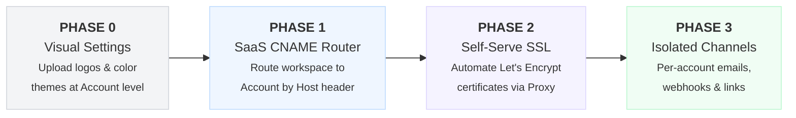

# White Labeling & SaaS Custom Domains — Solution Note

**Date:** 25 Jun 2026  
**Author/Owner:** Antigravity AI

---

## 1. Overview

The **White Labeling and SaaS Custom Domain** feature enables a multi-tenant SaaS model where customers can access their entire Chatwoot workspace, login screens, chat widgets, and help portals under their own brand and domain (e.g., `chat.clientdomain.com`). 

This goes beyond global/installation-level configurations by allowing dynamic, account-level customization.

### What we are building

To make this fully self-serve and automated:
1. **Account-level Branding UI:** Settings panel under *Settings ➔ Account Settings ➔ Branding* where customers can:
   * Upload logo assets (header, footer, login, and favicon) saved to the `Account` model.
   * Customize brand colors (primary, secondary, background gradients).
   * Define custom domain (e.g. `support.mycompany.com`) and display verification parameters (CNAME/TXT records).
2. **Dynamic Request Router (Middleware/Controller):** An inspection layer in the boot route of Chatwoot that resolves the incoming `request.host` and maps it to either:
   * An **Account Workspace** (for agent dashboard, signup, login, inboxes).
   * A **Help Center Portal** (existing `Portal` model custom domain lookup).
3. **On-Demand Let's Encrypt SSL Provisioning:** Automated infrastructure utilizing a reverse proxy (e.g., Caddy or Nginx with Lua) to dynamically issue SSL certificates when requests hit mapped domains.

---

## 2. Codebase Discovery & Existing Context

Chatwoot already has pre-existing patterns for portal-level domains. We must build upon these patterns:

* **Portal Custom Domains**: Portals (knowledge base) currently support mapping a `custom_domain` field in the `portals` database table. The public request is intercepted in [app/controllers/public_controller.rb](file:///Users/deependrasankhala/Documents/chandresh/chatwoot/app/controllers/public_controller.rb#L9-L20) by looking up the host name.
* **Dashboard Interception**: In [app/controllers/dashboard_controller.rb](file:///Users/deependrasankhala/Documents/chandresh/chatwoot/app/controllers/dashboard_controller.rb#L58-L67), the `render_hc_if_custom_domain` filter checks if the host matches a portal domain and loads the Help Center portal in place:
  ```ruby
  def render_hc_if_custom_domain
    domain = request.host
    return if domain == URI.parse(ENV.fetch('FRONTEND_URL', '')).host

    @portal = Portal.find_by(custom_domain: domain)
    return unless @portal

    @locale = @portal.default_locale
    render 'public/api/v1/portals/show', layout: 'portal', portal: @portal and return
  end
  ```
* **Cloudflare SaaS SSL Automation**: Under `enterprise/`, Chatwoot integrates with Cloudflare dynamically for portals via:
  * [create_custom_hostname_service.rb](file:///Users/deependrasankhala/Documents/chandresh/chatwoot/enterprise/app/services/cloudflare/create_custom_hostname_service.rb)
  * [cloudflare_verification_job.rb](file:///Users/deependrasankhala/Documents/chandresh/chatwoot/enterprise/app/jobs/enterprise/cloudflare_verification_job.rb)

---

## 3. SaaS Domain Architecture

For the entire SaaS service to support client-owned custom domains, we expand the routing mapping:

```mermaid
flowchart TD
    Request["Incoming HTTP Request<br/>(Host: support.client.com)"] --> Proxy["Reverse Proxy (Caddy / Nginx)"]
    Proxy -->|On-Demand TLS verification| AuthAPI["Backend App API:<br/>/api/v1/whitelabel/verify_domain"]
    AuthAPI -->|200 OK (Domain exists)| Proxy
    Proxy -->|Forward Request| Rails["Rails Router & Middlewares"]
    
    Rails --> CheckDomain{"Lookup request.host"}
    
    CheckDomain -->|Matches Portal custom_domain| PortalRoute["Serve Help Center Portal"]
    CheckDomain -->|Matches Account custom_domain| AccountRoute["Serve Account Workspace (Dashboard & Login)"]
    CheckDomain -->|Matches Primary SaaS host| DefaultRoute["Serve Default SaaS Workspace"]
```

---

## 4. Key Engineering Challenges & Solutions

### A. Dynamic Host Lookup Cache
To prevent database lookups (`Account.find_by(custom_domain: host)`) on every incoming request, we cache mapped domains in **Redis**:
* When an account maps a domain and it is verified, we store `custom_domain:[host] -> account_id` in Redis.
* The routing constraint/middleware checks Redis first, ensuring sub-millisecond route resolution.

### B. Session Cookies Across Domains
Because users will access their workspaces on separate root domains (e.g. `support.brand.com` and `chatwoot.com` share no domain overlap):
* Default wildcard session cookies (`domain: :all`) will not work.
* We configure dynamic session serialization in Rails. When a user requests a custom domain, the session cookie domain is set dynamically to the specific host, isolating cookies to that client's domain.

### C. WebSockets & ActionCable CORS Policy
Chatwoot depends on ActionCable WebSockets for real-time messages. By default, ActionCable rejects websocket handshakes from unallowed origins.
* We implement a dynamic origin check in `ActionCable::Connection::Base`:
  ```ruby
  module ApplicationCable
    class Connection < ActionCable::Connection::Base
      def connect
        # Dynamically verify if request origin matches mapped account custom domains
      end
    end
  end
  ```

---

## 5. Phased SaaS Roadmap



### 5.1 Phase 0 — Account Visual Customization
* **Goal**: Add database support for account-level branding assets and themes.
* **Implementation Plan**:
  * Add migration:
    ```ruby
    add_column :accounts, :custom_logo_url, :string
    add_column :accounts, :custom_favicon_url, :string
    add_column :accounts, :brand_colors, :jsonb, default: {}
    ```
  * Create Vue components under `settings/accounts/Branding.vue` to upload images and configure palettes.
  * Override the Vue store `globalConfig/get` in [useBranding.js](file:///Users/deependrasankhala/Documents/chandresh/chatwoot/app/javascript/shared/composables/useBranding.js) to load account-specific brand data once authenticated.

### 5.2 Phase 1 — SaaS Workspace Routing
* **Goal**: Enable logging into the dashboard on custom domains.
* **Implementation Plan**:
  * Add a `custom_domain` string column to the `accounts` table.
  * Modify [app/controllers/dashboard_controller.rb](file:///Users/deependrasankhala/Documents/chandresh/chatwoot/app/controllers/dashboard_controller.rb#L58-L67):
    * If `request.host` is a custom domain, check if it belongs to a `Portal` or an `Account`.
    * If it belongs to an `Account`, bypass portal rendering, but restrict user logins/sessions to that specific account identifier.

### 5.3 Phase 2 — Automated SSL (On-Demand TLS)
* **Goal**: Automate SSL certificate creation so clients don't encounter security warnings.
* **Implementation Plan**:
  * Configure Caddy as our entry reverse proxy.
  * Enable **On-Demand TLS** in Caddy's configuration:
    ```caddy
    on_demand_tls {
        ask http://localhost:3000/api/v1/whitelabel/verify_domain
    }
    ```
  * Build the endpoint in Rails that receives a `domain` param, queries Redis/Database for accounts or portals mapped to that domain, and returns `200 OK` or `404 Not Found`.

### 5.4 Phase 3 — Residual Brand Removal (Emails & Webhooks)
* **Goal**: Complete white-labeling coverage.
* **Implementation Plan**:
  * Allow accounts to configure custom SMTP servers and verify SPF/DKIM keys for outbound mails.
  * Dynamically rewrite invite links, password reset URLs, and webhook payloads to use the account's `custom_domain` instead of the root SaaS host.

---

## 6. Verification & Infrastructure Config

### Caddy Server Configuration Example
For local testing and production deployments, the following Caddy config handles automated certificate generation dynamically:

```caddy
{
    on_demand_tls {
        ask http://localhost:3000/api/v1/whitelabel/verify_domain
    }
}

# Match wildcard domains and dynamically terminate SSL
:443 {
    tls {
        on_demand
    }

    reverse_proxy localhost:3000 {
        header_up Host {host}
        header_up X-Real-IP {remote}
    }
}
```

---

## 8. Hierarchical Multi-Tenancy & Sub-Account Restrictions

To support white-labeled reseller setups, we enforce a strict two-level hierarchical tenancy structure (Main Account ➔ Sub-Accounts):
- **Main Account (Parent)**: Represents the root tenant/reseller (where `parent_id` is `nil`).
- **Sub-Account (Child)**: Represents the client/sub-brand of the reseller (where `parent_id` points to the Main Account's ID).

To prevent multi-level nesting (sub-accounts of sub-accounts) and keep the switcher list clean:
1. **API Validation**: In [Api::V1::AccountsController#create](file:///Users/deependrasankhala/Documents/chandresh/chatwoot/app/controllers/api/v1/accounts_controller.rb), when a `parent_id` is specified, the controller validates that the parent account is itself a Main Account (i.e. has `parent_id: nil`). Attempting to nest an account under another sub-account raises a `404 Not Found` routing error.
2. **UI Controls**: In [SidebarAccountSwitcher.vue](file:///Users/deependrasankhala/Documents/chandresh/chatwoot/app/javascript/dashboard/components-next/sidebar/SidebarAccountSwitcher.vue), the "Add Account" button is hidden for administrators of sub-accounts (sub-admins), ensuring they cannot initiate the account creation flow.

---

## 9. Conclusion

By shifting custom domain lookup to both **Portals** and **Accounts** and utilizing **On-Demand TLS (Caddy/Cloudflare)**, we achieve a highly scalable, multi-tenant SaaS model. Clients can fully rebrand the system, map custom subdomains, and serve their agents/visitors with zero manual setup by the core engineering team.

---

## 10. Cloudflare SSL for SaaS Configuration

Chatwoot utilizes Cloudflare's **SSL for SaaS** feature to provision TLS certificates for custom domains. The following setup is required on the core infrastructure Cloudflare account.

### 10.1 Required Cloudflare Credentials
The Chatwoot `.env` requires the following credentials to authenticate with the Cloudflare API:

* `CLOUDFLARE_API_TOKEN`: Must be a **Custom API Token** (Global API Keys will fail with Auth Error 10000). The token requires the following permissions:
  * `Zone` -> `Zone` -> `Read`
  * `Zone` -> `Custom Hostnames` -> `Edit`
  * **Zone Resources**: Must include `Specific zone` -> `<Your SaaS Domain>`.
* `CLOUDFLARE_ZONE_ID`: The unique Zone ID found on the Cloudflare Dashboard overview page for your root SaaS domain.

### 10.2 Fallback Origin Configuration
Before Cloudflare will successfully issue certificates for custom hostnames, a **Fallback Origin** must be configured and active.

1. **DNS Setup**: In Cloudflare DNS, create an `A` or `CNAME` record for a subdomain (e.g. `proxy-fallback.yourdomain.com`) pointing to your Chatwoot server IP. Ensure the record is **Proxied (Orange Cloud ON)**.
2. **Fallback Origin Assignment**: Go to **SSL/TLS -> Custom Hostnames**. Enter `proxy-fallback.yourdomain.com` as the Fallback Origin and click **Add**.
3. **Verification**: Wait for the Fallback Origin Status to change to **Active**. If it remains in "Pending Deployment (Error)", it means the DNS record is either missing or not proxied. Custom hostnames added by users will throw the error `"fallback origin is not active yet"` until this is resolved.
