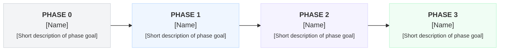
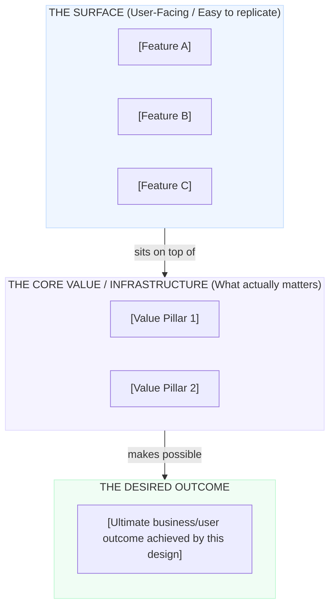
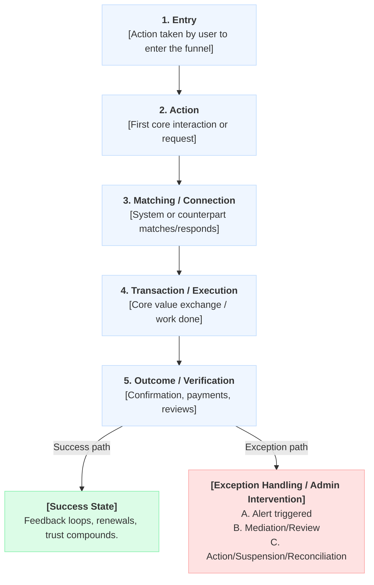

# [Feature/Project Name] — Solution Note Template

**Date:** [DD Mmm YYYY]  
**Author/Owner:** [Name/Role]

---

## 1. Overview

Provide a 2-3 sentence high-level description of the feature or product. Highlight **what** it is, **who** it serves, and **why** it is being introduced. 

### What we are building

Briefly describe the components that will be built (e.g., the member-facing web client, mobile view, admin console, integrations, etc.).
* **[Component 1 (e.g., Web App / Customer Interface)]**: Description of what end-users will do.
* **[Component 2 (e.g., Admin Panel / Backoffice Control)]**: Description of how operations or admins will manage it.

### Phased Roadmap

Outline the phased implementation plan. Splitting features into distinct, functional phases ensures incremental value delivery without half-finished releases.



* **Phase 0 Outcome:** [Immediate milestone/validation target]
* **Phase 1 Outcome:** [First functional iteration]
* **Phase 2 Outcome:** [Full feature set with core guardrails]
* **Phase 3 Outcome:** [Advanced optimization / AI / scale]

---

## 2. Business Understanding

Explain the business model, rules, compliance parameters, or legal requirements that dictate *why* the solution must operate in this specific way.

| Core Rule / Constraint | Business Implication / Rationale |
| :--- | :--- |
| **[Rule 1 Name]** | [Explain what this rule means in practice and the reasoning behind it.] |
| **[Rule 2 Name]** | [Explain what this rule means in practice and the reasoning behind it.] |
| **[Rule 3 Name]** | [Explain what this rule means in practice and the reasoning behind it.] |

> [!NOTE]
> Summarize the core business take-away or philosophy guiding this feature.

---

## 3. The Core Problem We Are Solving

Differentiate between the **surface-level features** (which are easy to copy or replace) and the **underlying infrastructure/value** (e.g., trust, security, efficiency) that the user is actually paying for or utilizing.



Describe the core problem statement in detail here. Why is a standard marketplace or simple feature list insufficient? What is the secret ingredient (trust, speed, unique data access) that makes this solution defensible?

---

## 4. The Product Architecture Block Diagram

Detail the interaction between the guest/public spaces, the logged-in user spaces, administration controls, and the shared backend or third-party integrations.

```
                  ┌──────────────────────────────────────────────┐
                  │              [USER FRONTEND]                 │
                  │        (e.g., Website, Client App)           │
                  └──────────────┬────────────────┬──────────────┘
                                 │                │
                  ┌──────────────▼──────┐  ┌──────▼──────────────┐
                  │     Public Area     │  │   Authenticated     │
                  │   (Guest/Marketing) │  │    (Member Area)    │
                  └──────────────┬──────┘  └──────┬──────────────┘
                                 │                │
  ┌──────────────────────────────┼────────────────┼──────────────────────────────┐
  │                              ▼                ▼                              │
  │                  ┌────────────────────────────────────────┐                  │
  │                  │             [ADMIN PANEL]              │                  │
  │                  │             (Operations Console)       │                  │
  │                  └────────────────────────────────────────┘                  │
  └──────────────────────────────────────┬───────────────────────────────────────┘
                                         │
┌────────────────────────────────────────▼───────────────────────────────────────┐
│                    BEHIND THE SCENES / SHARED SERVICES                         │
│  [Database] · [Authentication] · [Translation] · [Payout Rails] · [AI Engine]  │
└────────────────────────────────────────────────────────────────────────────────┘
```

1. **User Frontend:** Describe public vs. private states.
2. **Admin Panel:** Explain what metrics, settings, and approvals live here.
3. **Behind the scenes:** Describe database layouts, microservices, and external API integrations.

---

## 5. User Roles

Describe the exact actions and permissions of each actor in the system:

* **[Role 1 Name (e.g., Buyer/Customer)]** *(Uses [Interface])*
  * Action item 1
  * Action item 2
* **[Role 2 Name (e.g., Partner/Provider)]** *(Uses [Interface])*
  * Action item 1
  * Action item 2
* **[Role 3 Name (e.g., Admin/Operations)]** *(Uses [Interface])*
  * Action item 1
  * Action item 2

---

## 6. Phased Goals & Objectives

Specify the goals for each milestone and how they pave the way for the next phase.

* **Phase 0 ([Phase Name]):** [Goal description]
* **Phase 1 ([Phase Name]):** [Goal description]
* **Phase 2 ([Phase Name]):** [Goal description]
* **Phase 3 ([Phase Name]):** [Goal description]

---

## 7. The Happy Path — Sequential User Journey

Use a sequence or flow diagram to walk through the ideal scenario where everything goes right, along with key branching outcomes when exceptions occur.



---

## 8. Capability Matrix by Phase

Use this matrix to track what capabilities are introduced in each phase, preventing scope creep.

| Capability / Feature Area | Phase 0 | Phase 1 | Phase 2 | Phase 3 |
| :--- | :---: | :---: | :---: | :---: |
| **[Capability A]** | [— / Yes] | [— / Yes] | [— / Yes] | [— / Yes] |
| **[Capability B]** | [— / Yes] | [— / Yes] | [— / Yes] | [— / Yes] |
| **[Capability C]** | [— / Yes] | [— / Yes] | [— / Yes] | [— / Yes] |
| **[Capability D]** | [— / Yes] | [— / Yes] | [— / Yes] | [— / Yes] |

---

### 8.1 Phase 0 — [Phase 0 Name]

**Goal:** [Provide detail on the target goal of this phase.]

#### What gets built:
1. **[Feature 1]:** Description of sub-features, UI requirements, and rules.
2. **[Feature 2]:** Description of sub-features, UI requirements, and rules.

#### What does NOT get built in Phase 0:
* *Clearly define limits to protect timeline:*
* No [feature x]
* No [feature y]

---

### 8.2 Phase 1 — [Phase 1 Name]

**Goal:** [Provide detail on the target goal of this phase.]

#### What gets built:
1. **[Feature 1]:** Description.
2. **[Feature 2]:** Description.

#### What does NOT get built in Phase 1:
* No [feature x]

---

### 8.3 Phase 2 — [Phase 2 Name]

**Goal:** [Provide detail on the target goal of this phase.]

#### What gets built:
1. **[Feature 1]:** Description.
2. **[Feature 2]:** Description.

#### What does NOT get built in Phase 2:
* No [feature x]

---

### 8.4 Phase 3 — [Phase 3 Name]

**Goal:** [Provide detail on the target goal of this phase.]

#### What gets built:
1. **[Feature 1]:** Description.
2. **[Feature 2]:** Description.

---

## 9. Complete Solution Architecture

Use this section to compile a checklist of everything that will have been built once all phases are complete.

### 9.1 The Client Website / App
* **State 1 (Unauthenticated):**
  * Landing pages, signup flows, public visibility lists.
* **State 2 (Authenticated):**
  * Settings, dashboard, transactional panels, history logs.
* **Role-Specific views:**
  * Custom panels for [Role A] vs [Role B].

### 9.2 The Admin Control Center
* Approvals and moderation logs.
* Quota managers.
* Dispute resolution / ticketing desks.
* Analytics dashboards.

### 9.3 System Infrastructure & Integrations
* **Database Schema:** Description of core tables/entities needed.
* **Integrations:** Third-party APIs, webhooks, external microservices.

---

## 10. Conclusion

Summarize how this phased approach establishes customer confidence, validates product-market fit early, reduces risk, and scales up to a sustainable, automated product.
